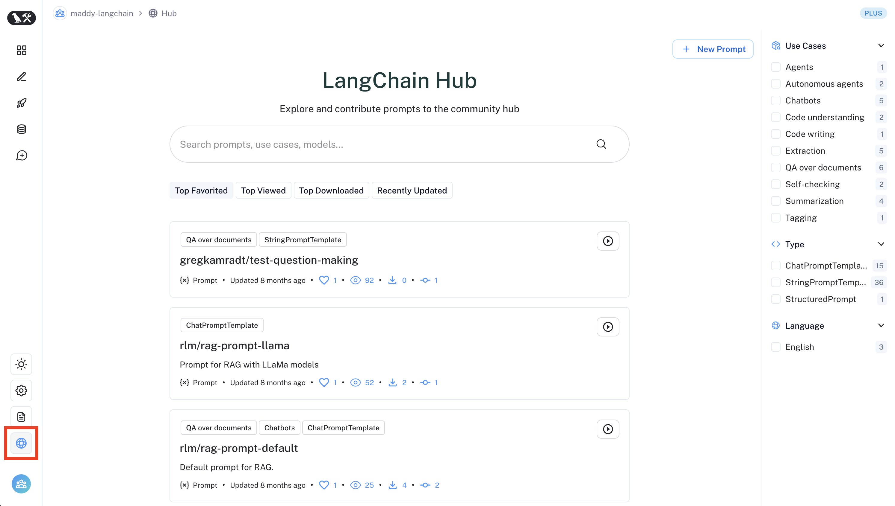

# LangChain Hub

Navigate to the **LangChain Hub** section of the left-hand sidebar.

Here you'll find all of the publicly listed prompts in the LangChain Hub.
You can search for prompts by name, handle, use cases, descriptions, or models. You can fork prompts to your personal organization, view the prompt's details, and run the prompt in the playground.
You can [pull any public prompt into your code](./manage_prompts_programatically.mdx) using the SDK.

To view prompts tied to your workspace, visit the Prompts tab in the sidebar.

