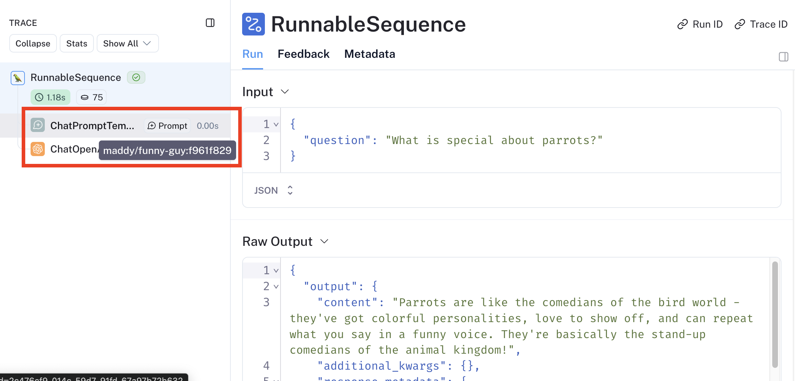
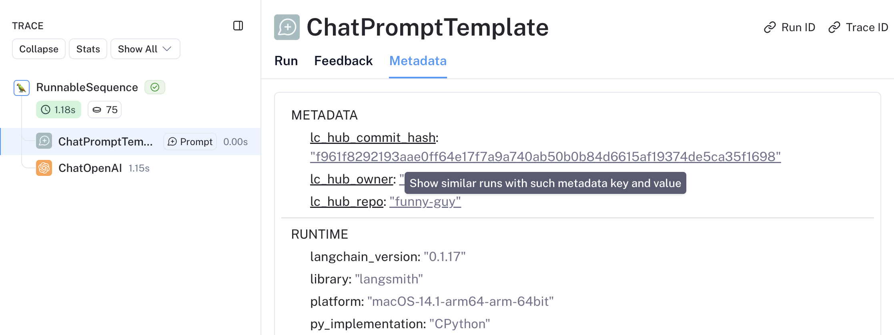

# Open a prompt from a trace

If you pull a prompt into your code and begin logging traces that use it, you can find a link to the prompt in the Trace UI.

In the run that used the prompt, hover over the Prompt tag. Clicking on this will take you to the prompt. (If you used a LangChain Hub prompt, this tag will say Hub)
]

In the metadata of the run, you can see more details. Click on an individual prompt metadata value to filter your traces by that attribute. You can filter by prompt handle, prompt name, or prompt commit hash.

