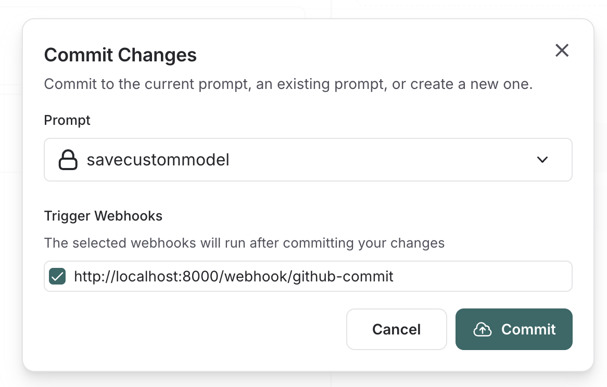

# Trigger a webhook on prompt commit

You can configure a webhook to be triggered whenever a commit is made to a prompt.

Some common use cases of this include:

- Triggering a CI/CD pipeline when prompts are updated
- Synchronizing prompts with a GitHub repository
- Notifying team members about prompt modifications

## Configure a webhook

Navigate to the **Prompts** section in the left-hand sidebar or from the application homepage.
In the top right corner, click on the `+ Webhook` button.

Add a webhook **url** and any required **headers**.

:::note
You can only configure one webhook per workspace. If you want to configure multiple per workspace or set up a different webhook for each prompt, let us know in the [LangChain Forum](https://forum.langchain.com/).
:::

To test out your webhook, click the "Send test notification" button. This will send a test notification to the webhook url you provided with a sample payload.

The sample payload is a JSON object with the following fields:

- `prompt_id`: The id of the prompt that was committed.
- `prompt_name`: The name of the prompt that was committed.
- `commit_hash`: The commit hash of the prompt.
- `created_at`: The date of the commit.
- `created_by`: The author of the commit.
- `manifest`: The manifest of the prompt.

## Trigger the webhook

Commit to a prompt to trigger the webhook you've configured.

### Using the Playground

If you do this in the Playground, you'll be prompted to deselect the webhooks you'd like to avoid triggering.

### Using the API

If you commit via the API, you can specify to skip triggering the webhook by setting the `skip_webhooks` parameter to `true` or to an array of webhook ids to ignore.
See API docs [here](https://api.smith.langchain.com/redoc#tag/commits/operation/create_commit_api_v1_commits__owner___repo__post) for more information.
