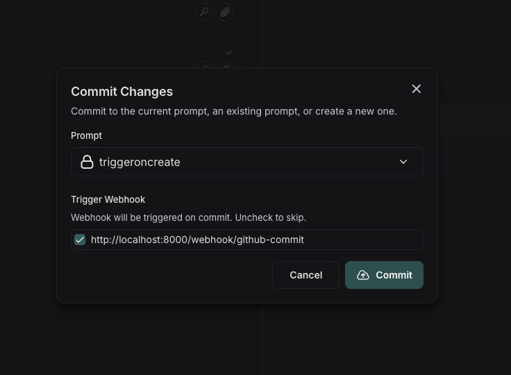

# Trigger a webhook on prompt commit

You can configure webhooks to be triggered whenever a prompt is committed.

Some common use cases of this include:

- Triggering a CI/CD pipeline when prompts are updated
- Synchronizing prompts with a GitHub repository
- Notifying team members about prompt modifications

## Create a webhook

Navigate to the **Prompts** section in the left-hand sidebar or from the application homepage.
In the top right corner, click on the `+ Webhook` button.
Here you'll see any previously created webhooks. Click on the "+ Webhook" button to create a new webhook.

## Configure your webhook

Add a webhook url and any headers you'd like to include.
To test out your webhook, click the "Send test notification" button. This will send a test notification to the webhook url you provided with a sample payload.

The sample payload is a JSON object with the following fields:

- `prompt_id`: The id of the prompt that was committed.
- `commit_hash`: The commit hash of the prompt.
- `created_at`: The date of the commit.
- `created_by`: The author of the commit.
- `manifest`: The manifest of the prompt.

## Trigger a webhook on prompt commit

Commit to a prompt to trigger the webhooks you've configured.

If you do this in the Playground, you'll be prompted to deselect any webhooks you'd like to avoid triggering.

If you commit via the API, you can specify to skip triggering all webhooks by setting the `skip_webhooks` parameter to `true` or to specify specific webhooks to trigger by setting the `ignore_webhook_ids` parameter to a list of webhook ids.
See API docs [here](https://api.smith.langchain.com/redoc#tag/commits/operation/create_commit_api_v1_commits__owner___repo__post) for more information.
