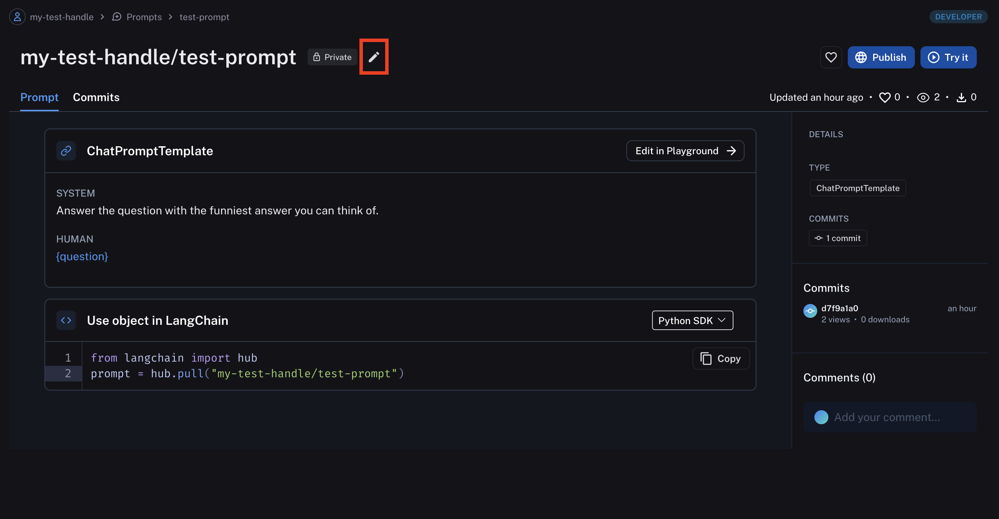
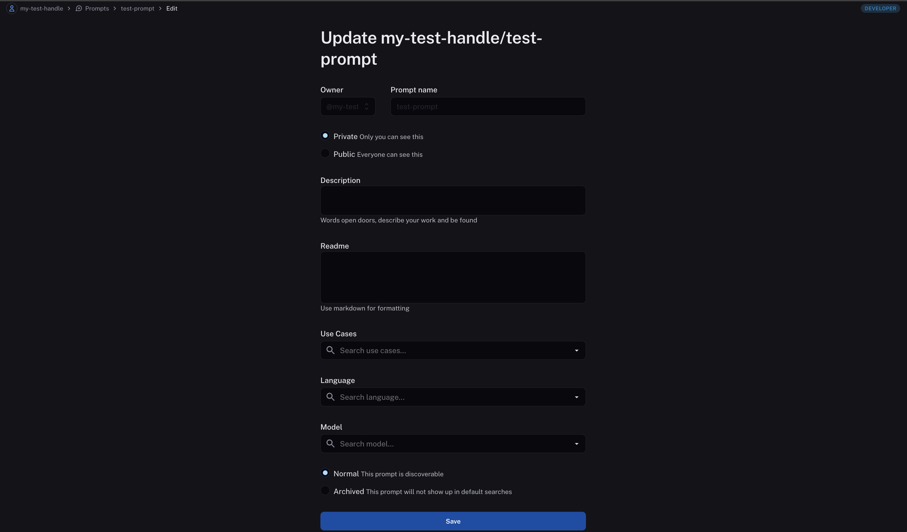
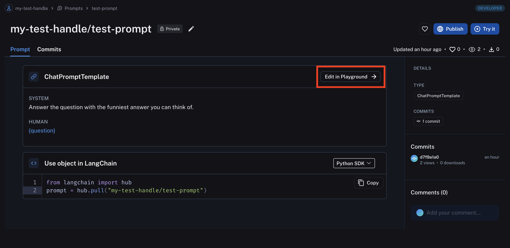
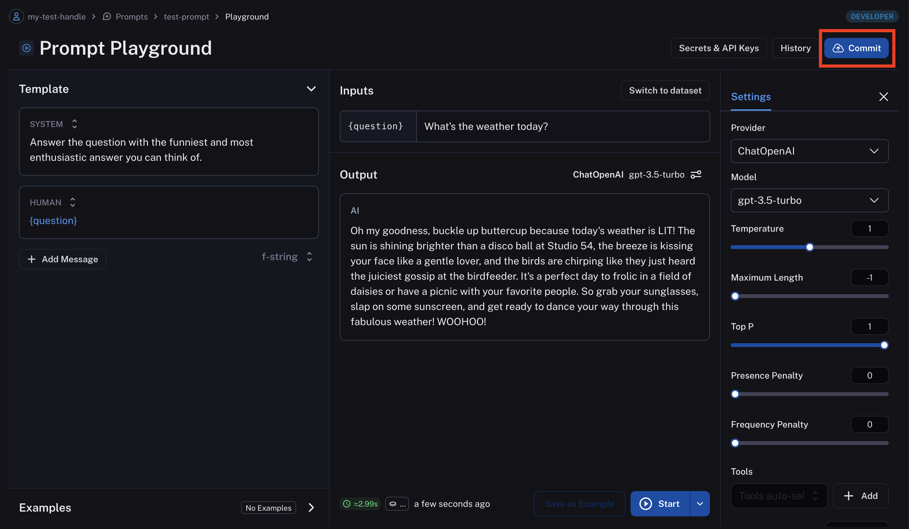
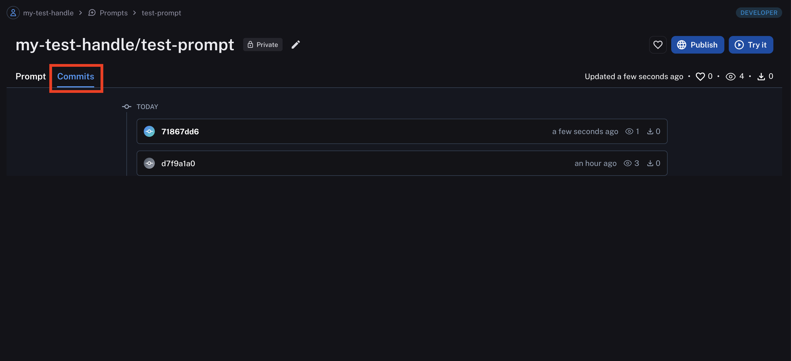

# Update a prompt

Navigate to the **Prompts** section in the left-hand sidebar or from the application homepage and click on the prompt you want to edit.

## Update metadata

To update the prompt metadata (description, use cases, etc.) click the "Edit" pencil icon.

Your prompt metadata will be updated upon save.

## Update the prompt content

To update the prompt content itself, you need to enter the prompt playground. Click "Edit in playground".
Now you can make changes to the prompt and test it with different inputs. When you're happy with the prompt, click "Commit" to save it.

## Version a prompt

When you add a commit to a prompt, a new version of the prompt is created. You can view all historical versions by clicking the "Commits" tab in the prompt view.

