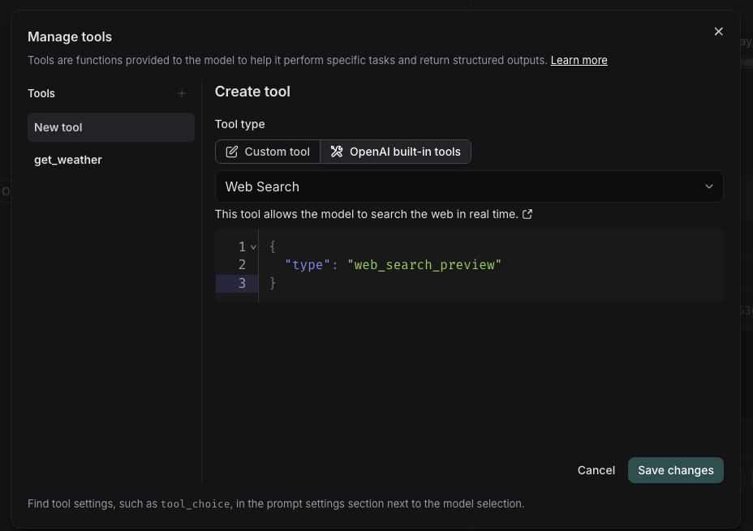
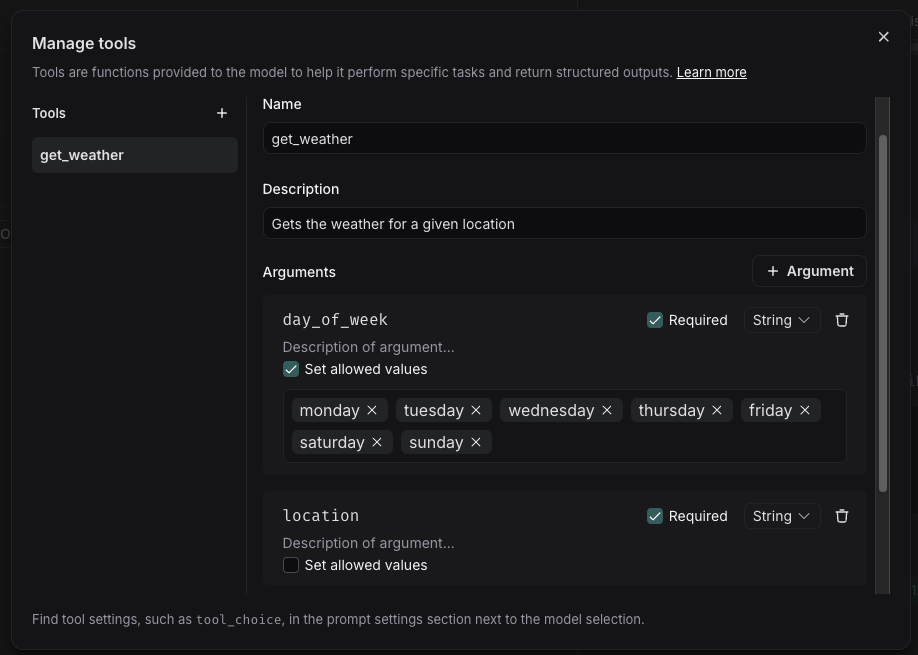

# Use tools in a prompt

Tools allow language models to interact with external systems and perform actions beyond just generating text. In the LangSmith playground, you can use two types of tools:

1. **Built-in tools**: Pre-configured tools provided by model providers (like OpenAI and Anthropic) that are ready to use. These include capabilities like web search, code interpretation, and more.

2. **Custom tools**: Functions you define yourself to perform specific tasks. These are useful when you need to integrate with your own systems or create specialized functionality.

## When to use tools

- Use **built-in tools** when you need common capabilities like web search or code interpretation. These are maintained by the model providers and are generally more reliable.
- Use **custom tools** when you want to test and validate your own tool designs, including:
  - Observing how a model would call your tools and what arguments it would pass
  - Simulating tool interactions

## Built-in tools

LangSmith supports built-in tools from various model providers:

### OpenAI Tools

- **Web search**: Search the web for real-time information
- **Image generation**: Generate images based on a text prompt
- **MCP**: Gives the model access to tools hosted on a remote MCP server
- [View all OpenAI tools](https://platform.openai.com/docs/guides/tools?api-mode=responses)

### Anthropic Tools

- **Web search**: Search the web for up-to-date information
- [View all Anthropic tools](https://docs.anthropic.com/en/docs/agents-and-tools/tool-use/overview)

## Adding and using tools

### Add a tool

To add a tool to your prompt, click the `+ Tool` button at the bottom of the prompt editor.

### Use a built-in tool

1. In the tool section, select the built-in tool you want to use
2. The model will automatically know how to use the tool
3. When the model calls the tool, the playground will display the response

If a tool is available but not listed in the Playground, you can still add it manually if it's supported by the LangChain open source library. Check the documentation for your specific provider's LangChain integration library to see all supported tools (e.g., [OpenAI support](https://python.langchain.com/docs/integrations/chat/openai/#built-in-tools)).

### Create a custom tool

To create a custom tool, you'll need to provide:

- Name: A descriptive name for your tool
- Description: Clear explanation of what the tool does
- Arguments: The inputs your tool requires

Note: When running a custom tool in the playground, the model will respond with a JSON object containing the tool name and the tool call. Currently, there's no way to connect this to a hosted tool via MCP.

## Tool choice settings

Some models allow you to force the use of specific tools. To configure this:

1. Go to prompt settings
2. Navigate to tool settings
3. Select tool choice

Each provider has different options for tool choice, so check their documentation for specific details.

