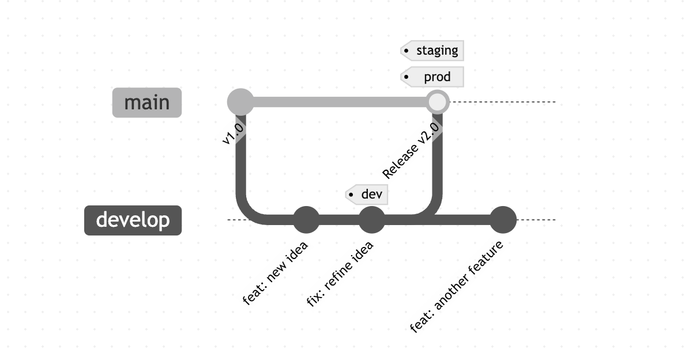
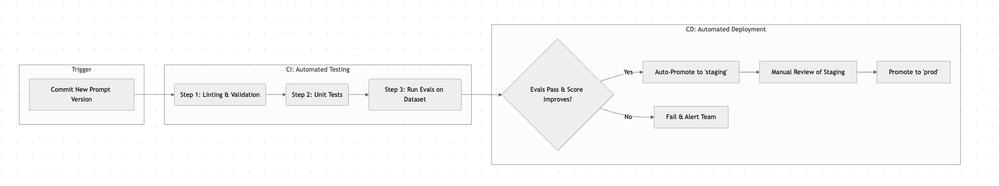
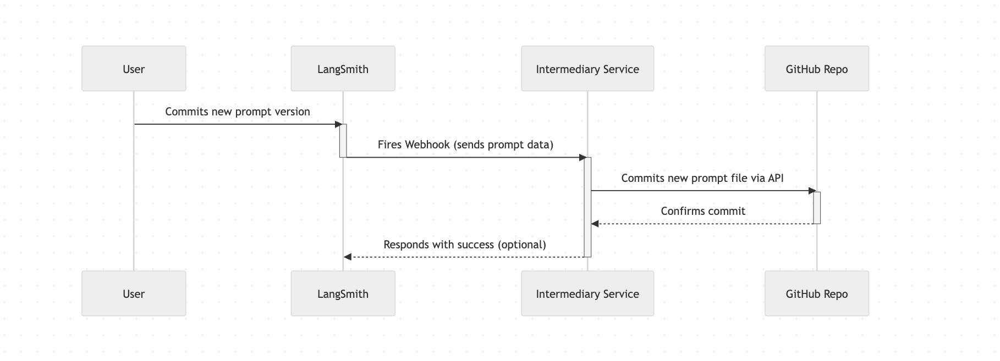

# Prompt management best practices
Here are our recommended best practices for managing your prompts. This guide will help you establish a robust workflow for developing, testing, and deploying prompts using LangSmith.

## The prompt development lifecycle: iterating in the playground

Before a prompt is versioned or deployed, it must be created. The best practice for prompt development is to treat it as an iterative, experimental process. The LangSmith Playground is the ideal environment for this initial "development" phase.

Using the Playground, you and your team can:

- **Rapidly iterate on prompts:** Modify prompt templates on the fly and immediately see how the changes affect the output.
- **Compare different LLMs:** Test the same prompt against various models (e.g., GPT-4o vs. Claude 3 Opus vs. Llama 3) side-by-side to find the best one for the job. This is crucial, as a prompt's effectiveness can vary significantly between models.
- **Test with diverse inputs:** Easily run the prompt and model configuration against a range of different inputs to check for edge cases and ensure reliability.
- **Optimize the prompt**: Use the Prompt Canvas feature to use an LLM to improve your prompt
  ➡️ **See the blog post:** [LangChain Changelog](https://changelog.langchain.com/announcements/prompt-canvas-for-streamlined-prompt-engineering)
- **Develop and test tool calling:** Configure tools and functions that the LLM can call, and test the full interaction within the Playground.
- **Refine your app:** Run experiments directly against your dataset in the Playground, seeing changes in real time as you iterate on prompts. Share these experiments with teammates to get feedback and collaboratively optimize performance.

Once you are satisfied with a prompt and its configuration in the Playground, you can save it as a new commit to your prompt's history. While the Playground UI is great for experimentation, you can also create and update prompts programmatically for more automated workflows using the LangSmith SDK.

**➡️ See the docs:** https://docs.smith.langchain.com/prompt_engineering/how_to_guides/manage_prompts_programatically

**➡️ See the SDK reference:** [client.create_prompt](https://docs.smith.langchain.com/reference/python/client/langsmith.client.Client#langsmith.client.Client.create_prompt)

## Managing prompts through different environments

Prompts are not static text; they are a fundamental component of your LLM application's logic, just like source code. A minor change can significantly alter an LLM's response or tool selection, making structured lifecycle management essential. The **LangSmith Prompt Hub** provides a central workspace to manage this complexity. This guide details the complete workflow for using the Hub to test prompts in development, validate them in staging, and deploy them confidently to production.

## Dynamically updating application prompts based on prompt tags

LangSmith provides a collaborative interface to iterate on prompts and share them with your team. After some initial testing in the Playground, you'll want to see how the prompt interacts within the context of your application. LangSmith’s Prompt Hub provides a way to do this without requiring code changes for every new version of the prompt. This is achieved by using **prompt commit tags**.

Think of prompt tags just like Git tags. You can assign a meaningful name (e.g., `dev`, `staging`, `prod`) to a specific version (commit) of your prompt. This allows you to create a dynamic reference to the prompt version you want to use in a particular environment.

For instance, you can have a `dev` tag pointing to the latest, most experimental version of your prompt, a `staging` tag for a more stable version undergoing final testing, and a `prod` tag for the version you trust to be in your live application. As you promote a prompt from development to production, you simply move the tag from one commit to another within the LangSmith UI.

To implement this workflow, you reference the tag in your application code instead of a static commit hash. This enables you to update the prompt in your application without a new code deployment.

### How to pull a prompt via commit tag in your staging/dev/test environments

LangSmith's Prompt Tags feature is designed for exactly this workflow. Instead of hardcoding a specific prompt version in your application, you reference the tag.

For example, your development environment could pull the prompt tagged `dev`, while your production application pulls the one tagged `prod`.

```python
# In your development environment, fetch the latest experimental prompt
prompt_dev = client.pull_prompt("your-prompt-name:dev")

# In your staging environment, fetch the release candidate
prompt_staging = client.pull_prompt("your-prompt-name:staging")

# In production, this code always fetches the stable prompt version currently tagged as "prod"
prompt_prod = client.pull_prompt("your-prompt-name:prod")
```

**➡️ Learn more in the official documentation:** [Prompt Tags](https://docs.smith.langchain.com/prompt_engineering/how_to_guides/prompt_tags)



### Evaluating prompt changes before promoting to production

A typical pipeline consists of several automated stages that run in sequence. If any stage fails, the pipeline stops and notifies the team.



- **Stage 1: Trigger**
  The pipeline starts automatically when a new prompt version is created.
  - **How:** This can be a `git push` to your main branch or, more powerfully, a **webhook** triggered from LangSmith on every new prompt commit.
- **Stage 2: Linting & unit tests**
  This stage performs quick, low-cost checks.
  - **Linting:** A simple script checks for basic syntax. For example, does the prompt template contain all the required input variables (e.g., `{question}`, `{context}`)?
  - **Unit Tests:** These verify the _structure_ of the output, not the quality. You can use a framework like `pytest` to make a few calls to the new prompt and assert things like:
    - "Does the output always return valid JSON?"
    - "Does it contain the expected keys?"
    - "Is the list length correct?"
- **Stage 3: Quality evaluation**
  This is the heart of the pipeline. The new prompt version is run against your evaluation dataset to ensure it meets quality standards.
  - **How:** This can be done in a few ways:
    - **Programmatic SDK Evals:** For checks against known ground truths, a script can use the LangSmith SDK's `evaluate` [function](https://docs.smith.langchain.com/evaluation#7-run-and-view-results). This executes the new prompt against every example in your dataset, and the results are automatically scored by your chosen programmatic evaluators (e.g., for JSON validity, string matching).
    - **Advanced Qualitative Evals with `openevals`:** For more nuanced quality checks (like helpfulness, style, or adherence to complex instructions), you can leverage the `openevals` library. This library integrates directly with `pytest` and allows you to define sophisticated, "LLM-as-a-judge" evaluations. You can create tests that use another LLM to score the quality of your prompt's output. Thanks to the [LangSmith integration](https://github.com/langchain-ai/openevals?tab=readme-ov-file#langsmith-integration), all these evaluation runs are automatically traced and can be visualized in LangSmith, giving you a detailed view of the results.
  - **The Check:** The pipeline then compares the new prompt's aggregate evaluation scores (e.g., average correctness, helpfulness score, latency, cost) against the current production prompt's scores.
- **Stage 4: Continuous deployment (promotion)**
  Based on the evaluation results, the prompt is automatically promoted.
  - **Pass/Fail Logic:** The pipeline checks if the new prompt is "better" than the current one (e.g., higher correctness score, no drop in helpfulness, within cost budget).
  - **Promotion to `staging`:** If it passes, a script uses the LangSmith SDK to move the `staging` tag to this new commit hash. Your staging application, which pulls the `your-prompt:staging` tag, will automatically start using the new prompt.
  - **Promotion to `prod`:** This is often a **manual step**. After the team has reviewed the performance in the staging environment and is confident in the results, a team member can manually move the `prod` tag in the LangSmith UI. This final human check is a crucial safety measure.

## Syncing prompts in production

For better version control, collaboration, and integration with your existing CI/CD pipelines, synchronizing your LangSmith prompts with an external source code repository will give you a full commit history alongside your application code.

### Best practice: use webhooks for synchronization

The most effective way to automate this is by using webhooks. You can configure LangSmith to send a notification to a service every time a new version of a prompt is saved. This creates a seamless bridge between the user-friendly prompt editing environment in LangSmith and your rigorous version control system.

### Webhook synchronization flow

This diagram shows the sequence of events when a prompt is updated in LangSmith and automatically synced to a GitHub repository.



### How to implement this with LangSmith

LangSmith allows you to configure a webhook for your workspace that will fire on every prompt commit. You can point this webhook to your own service (like an AWS Lambda function or a small server) to handle the synchronization logic.

**➡️ Learn more in the official documentation:** [Trigger a webhook on prompt commit](https://docs.smith.langchain.com/prompt_engineering/how_to_guides/trigger_webhook), [How to Sync Prompts with GitHub](https://docs.smith.langchain.com/prompt_engineering/tutorials/prompt_commit)

## How to use a prompt in production without repeated API calls

In a production application, making a network request to fetch a prompt every time a function is executed adds unnecessary latency and creates a dependency that could fail. The application should be resilient and fast.

### Best practice: cache prompts in your application

To avoid putting an API call to LangSmith in the "hot path" of your application, you should implement a caching strategy. The prompt doesn't change on every request, so you can fetch it once and reuse it. Caching not only improves performance but also increases resilience, as your application can continue to function using the last-known prompt even if it temporarily can't reach the LangSmith API.

### Caching strategies

There are two primary strategies for caching prompts, each with its own trade-offs.

- **1. Local in-memory caching**
  This is the simplest caching method. The prompt is fetched from LangSmith and stored directly in the memory of your application instance.
  - **How it works**: On application startup, or on the first request for a prompt, fetch it from LangSmith and store it in a global variable or a simple cache object. Set a Time-To-Live (TTL) on the cached item (e.g., 5-10 minutes). Subsequent requests use the in-memory version until the TTL expires, at which point it's fetched again.
  - **Pros**: Extremely fast access with sub-millisecond latency; no additional infrastructure required.
  - **Cons**: The cache is lost if the application restarts. Each instance of your application (if you have more than one server) will have its own separate cache, which could lead to brief inconsistencies when a prompt is updated.
  - **Best for**: Single-instance applications, development environments, or applications where ultimate consistency across all nodes is not critical.
- **2. Distributed caching**
  This approach uses an external, centralized caching service that is shared by all instances of your application.
  - **How it works**: Your application instances connect to a shared caching service like **Redis** or **Memcached**. When a prompt is needed, the application first checks the distributed cache. If it's not there (a "cache miss"), it fetches the prompt from LangSmith, stores it in the cache, and then uses it.
  - **Pros**: The cache is persistent and is not lost on application restarts. All application instances share the same cache, ensuring consistency. Highly scalable for large, distributed systems.
  - **Cons**: Requires setting up and maintaining an additional service (like Redis). There is slightly more network latency compared to in-memory caching, though it's still extremely fast.
  - **Best for**: Scalable, multi-instance production applications where consistency and resilience are top priorities. Using a service like Redis is the industry-standard approach for robust application caching.
