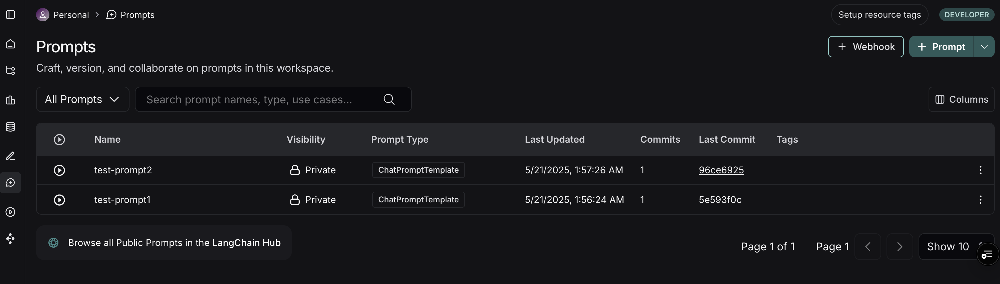
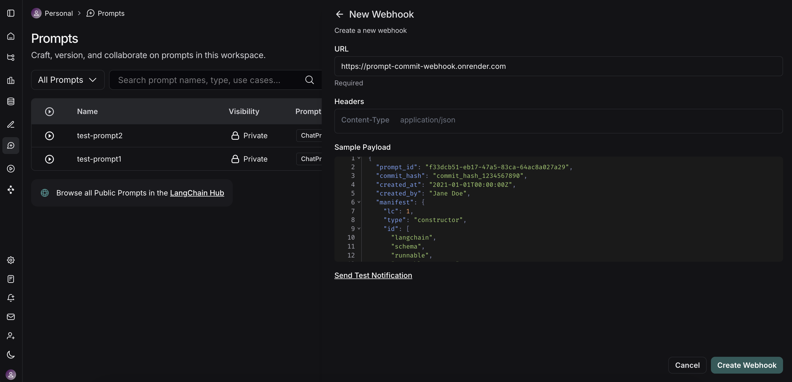
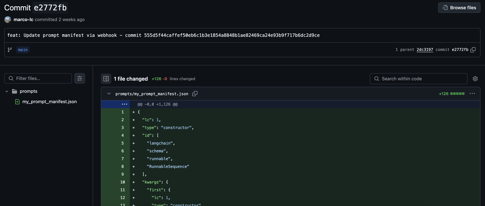

# How to Sync Prompts with GitHub

Langsmith empowers you to manage your LLM prompts effectively throughout the entire AI application lifecycle. You can create, version, and reuse prompts seamlessly—from initial testing and development, through production deployment, and into evaluation phases. This centralized approach ensures consistency and traceability.

A powerful feature to enhance this workflow is the ability to react to prompt modifications using **webhooks**. When a prompt is updated in Langsmith and a "prompt commit" is made, a webhook can trigger external actions. This tutorial will guide you through setting up a system to automatically commit your Langsmith prompt manifest to a GitHub repository whenever a prompt is updated.

**Why sync prompts with GitHub?**

* **Version Control:** Keep your prompts versioned alongside your application code in a familiar system.
* **CI/CD Integration:** Trigger automated staging or production deployments when critical prompts change.
* **Auditing & Collaboration:** Maintain a clear audit trail of who changed what and when, facilitating team collaboration even with non-technical members who might be editing prompts in the Langsmith UI.
* **Codebase Synchronization:** Ensure your application's codebase always has access to the latest approved prompt versions.
* **Automated Testing & Evaluation:** Automatically re-run evaluation datasets or integration tests when a prompt is modified to catch regressions or validate improvements.
* **Documentation:** Automatically update internal or external documentation related to prompt structures or purposes.

## Prerequisites

Before we begin, ensure you have the following set up:

1.  **Langsmith Account:** You'll need access to a [Langsmith](https://smith.langchain.com/) workspace.
2.  **GitHub Account:** A standard GitHub account.
3.  **GitHub Repository:** Create a new (or choose an existing) repository where your Langsmith prompt manifests will be stored. This could be the same repository as your application code or a dedicated one for prompts.
4.  **GitHub Personal Access Token (PAT):**
    * Langsmith webhooks themselves don't directly interact with GitHub; instead, they'll call an intermediary server that *you* create. This server will need a GitHub PAT to authenticate and make commits to your repository.
    * **Permissions:** The PAT needs the `repo` scope (or at least `public_repo` if your repository is public, and `repo:status`, `repo_deployment`, `public_repo` for full access to commit content).
    * **Generation:**
        * Go to your GitHub **Settings**.
        * Navigate to **Developer settings** &gt; **Personal access tokens** &gt; **Tokens (classic)**.
        * Click **"Generate new token"** (or "Generate new token (classic)").
        * Give it a descriptive name (e.g., "Langsmith Prompt Sync").
        * Set an expiration period.
        * Select the `repo` scope.
        * Click **"Generate token"**.
        * **Important:** Copy the token immediately. You won't be able to see it again. Store it securely, as we'll use it as an environment variable for our server.

5.  **Publicly Accessible Webhook Receiver (FastAPI Server):**
    * When a prompt is updated in Langsmith, it will send a webhook (an HTTP POST request) to a URL you specify. This URL must be publicly accessible on the internet.
    * **Localhost won't work:** Langsmith's servers need to be able to reach your server, so `http://localhost:8000` is not suitable for this.
    * **Deployment Platform:** For this tutorial, we recommend using a service like [Render.com](https://render.com/), which offers a free tier suitable for hosting a simple FastAPI application and provides a public URL. Other alternatives include Vercel, Fly.io, or any cloud provider (AWS, GCP, Azure).
    * We will build a simple FastAPI server to receive these webhooks. The code is provided below.

<details>
<summary>Minimal FastAPI Server Code (<code>main.py</code>)</summary>

This server will listen for incoming webhooks from Langsmith and commit the received prompt manifest to your GitHub repository.

```python
import base64
import json
from typing import Any, Dict

import httpx
from fastapi import FastAPI, HTTPException, Body
from pydantic import BaseModel, Field
from pydantic_settings import BaseSettings, SettingsConfigDict

# --- Configuration ---
class AppConfig(BaseSettings):
    """
    Application configuration model.
    Loads settings from environment variables.
    """
    GITHUB_TOKEN: str
    GITHUB_REPO_OWNER: str
    GITHUB_REPO_NAME: str
    GITHUB_FILE_PATH: str = "prompt_manifest.json"
    GITHUB_BRANCH: str = "main"

    model_config = SettingsConfigDict(
        env_file=".env",
        env_file_encoding='utf-8',
        extra='ignore'
    )

settings = AppConfig()

# --- Pydantic Models ---
class WebhookPayload(BaseModel):
    """
    Defines the expected structure of the incoming webhook payload.
    """
    manifest: Dict[str, Any] = Field(
        ...,
        description="The main content or configuration data to be committed to GitHub."
    )
    commit_hash: str = Field(
        ...,
        description="An identifier for the commit event that triggered the webhook."
    )
    created_at: str = Field(
        ...,
        description="Timestamp indicating when the event was created (ISO format preferred)."
    )

# --- GitHub Helper Function ---
async def commit_manifest_to_github(payload: WebhookPayload) -> Dict[str, Any]:
    """
    Helper function to commit the manifest directly to the configured branch.
    """
    github_api_base_url = "https://api.github.com"
    repo_file_url = (
        f"{github_api_base_url}/repos/{settings.GITHUB_REPO_OWNER}/"
        f"{settings.GITHUB_REPO_NAME}/contents/{settings.GITHUB_FILE_PATH}"
    )

    headers = {
        "Authorization": f"Bearer {settings.GITHUB_TOKEN}",
        "Accept": "application/vnd.github.v3+json",
        "X-GitHub-Api-Version": "2022-11-28",
    }

    manifest_json_string = json.dumps(payload.manifest, indent=2)
    content_base64 = base64.b64encode(manifest_json_string.encode('utf-8')).decode('utf-8')
    commit_message = f"feat: Update {settings.GITHUB_FILE_PATH} via webhook - commit {payload.commit_hash}"

    data_to_commit = {
        "message": commit_message,
        "content": content_base64,
        "branch": settings.GITHUB_BRANCH,
    }

    async with httpx.AsyncClient() as client:
        current_file_sha = None
        try:
            params_get = {"ref": settings.GITHUB_BRANCH}
            response_get = await client.get(repo_file_url, headers=headers, params=params_get)
            if response_get.status_code == 200:
                current_file_sha = response_get.json().get("sha")
            elif response_get.status_code != 404: # If not 404 (not found), it's an unexpected error
                response_get.raise_for_status()
        except httpx.HTTPStatusError as e:
            error_detail = f"GitHub API error (GET file SHA): {e.response.status_code} - {e.response.text}"
            print(f"[ERROR] {error_detail}")
            raise HTTPException(status_code=e.response.status_code, detail=error_detail)
        except httpx.RequestError as e:
            error_detail = f"Network error connecting to GitHub (GET file SHA): {str(e)}"
            print(f"[ERROR] {error_detail}")
            raise HTTPException(status_code=503, detail=error_detail)

        if current_file_sha:
            data_to_commit["sha"] = current_file_sha

        try:
            response_put = await client.put(repo_file_url, headers=headers, json=data_to_commit)
            response_put.raise_for_status()
            return response_put.json()
        except httpx.HTTPStatusError as e:
            error_detail = f"GitHub API error (PUT content): {e.response.status_code} - {e.response.text}"
            if e.response.status_code == 409: # Conflict
                error_detail = (
                    f"GitHub API conflict (PUT content): {e.response.text}. "
                    "This might be due to an outdated SHA or branch protection rules."
                )
            elif e.response.status_code == 422: # Unprocessable Entity
                 error_detail = (
                    f"GitHub API Unprocessable Entity (PUT content): {e.response.text}. "
                    f"Ensure the branch '{settings.GITHUB_BRANCH}' exists and the payload is correctly formatted."
                )
            print(f"[ERROR] {error_detail}")
            raise HTTPException(status_code=e.response.status_code, detail=error_detail)
        except httpx.RequestError as e:
            error_detail = f"Network error connecting to GitHub (PUT content): {str(e)}"
            print(f"[ERROR] {error_detail}")
            raise HTTPException(status_code=503, detail=error_detail)

# --- FastAPI Application ---
app = FastAPI(
    title="Minimal Webhook to GitHub Commit Service",
    description="Receives a webhook and commits its 'manifest' part directly to a GitHub repository.",
    version="0.1.0",
)

@app.post("/webhook/commit", status_code=201, tags=["GitHub Webhooks"])
async def handle_webhook_direct_commit(payload: WebhookPayload = Body(...)):
    """
    Webhook endpoint to receive events and commit DIRECTLY to the configured branch.
    """
    try:
        github_response = await commit_manifest_to_github(payload)
        return {
            "message": "Webhook received and manifest committed directly to GitHub successfully.",
            "github_commit_details": github_response.get("commit", {}),
            "github_content_details": github_response.get("content", {})
        }
    except HTTPException:
        raise # Re-raise if it's an HTTPException from the helper
    except Exception as e:
        error_message = f"An unexpected error occurred: {str(e)}"
        print(f"[ERROR] {error_message}")
        raise HTTPException(status_code=500, detail="An internal server error occurred.")

@app.get("/health", status_code=200, tags=["Health"])
async def health_check():
    """
    A simple health check endpoint.
    """
    return {"status": "ok", "message": "Service is running."}

# To run this server (save as main.py):
# 1. Install dependencies: pip install fastapi uvicorn pydantic pydantic-settings httpx python-dotenv
# 2. Create a .env file with your GitHub token and repo details.
# 3. Run with Uvicorn: uvicorn main:app --reload
# 4. Deploy to a public platform like Render.com.
```

**Key aspects of this server:**
* **Configuration (`.env`):** It expects a `.env` file with your `GITHUB_TOKEN`, `GITHUB_REPO_OWNER`, and `GITHUB_REPO_NAME`. You can also customize `GITHUB_FILE_PATH` (default: `langsmith_prompt_manifest.json`) and `GITHUB_BRANCH` (default: `main`).
* **GitHub Interaction:** The `commit_manifest_to_github` function handles the logic of fetching the current file's SHA (to update it) and then committing the new manifest content.
* **Webhook Endpoint (`/webhook/commit`):** This is the URL path your Langsmith webhook will target.
* **Error Handling:** Basic error handling for GitHub API interactions is included.

**Deploy this server to your chosen platform (e.g., Render) and note down its public URL (e.g., `https://prompt-commit-webhook.onrender.com`).**

</details>

## Understanding Langsmith "Prompt Commits" and Webhooks

In Langsmith, when you save changes to a prompt, you're essentially creating a new version or a "Prompt Commit." These commits are what can trigger webhooks.

The webhook will send a JSON payload containing the new **prompt manifest**.

<details>
<summary>Sample Webhook Payload</summary>

```json
{
  "prompt_id": "f33dcb51-eb17-47a5-83ca-64ac8a027a29",
  "commit_hash": "commit_hash_1234567890",
  "created_at": "2021-01-01T00:00:00Z",
  "created_by": "Jane Doe",
  "manifest": {
    "lc": 1,
    "type": "constructor",
    "id": [
      "langchain",
      "schema",
      "runnable",
      "RunnableSequence"
    ],
    "kwargs": {
      "first": {
        "lc": 1,
        "type": "constructor",
        "id": [
          "langchain",
          "prompts",
          "chat",
          "ChatPromptTemplate"
        ],
        "kwargs": {
          "messages": [
            {
              "lc": 1,
              "type": "constructor",
              "id": [
                "langchain_core",
                "prompts",
                "chat",
                "SystemMessagePromptTemplate"
              ],
              "kwargs": {
                "prompt": {
                  "lc": 1,
                  "type": "constructor",
                  "id": [
                    "langchain_core",
                    "prompts",
                    "prompt",
                    "PromptTemplate"
                  ],
                  "kwargs": {
                    "input_variables": [],
                    "template_format": "mustache",
                    "template": "You are a chatbot."
                  }
                }
              }
            },
            {
              "lc": 1,
              "type": "constructor",
              "id": [
                "langchain_core",
                "prompts",
                "chat",
                "HumanMessagePromptTemplate"
              ],
              "kwargs": {
                "prompt": {
                  "lc": 1,
                  "type": "constructor",
                  "id": [
                    "langchain_core",
                    "prompts",
                    "prompt",
                    "PromptTemplate"
                  ],
                  "kwargs": {
                    "input_variables": [
                      "question"
                    ],
                    "template_format": "mustache",
                    "template": "{{question}}"
                  }
                }
              }
            }
          ],
          "input_variables": [
            "question"
          ]
        }
      },
      "last": {
        "lc": 1,
        "type": "constructor",
        "id": [
          "langchain",
          "schema",
          "runnable",
          "RunnableBinding"
        ],
        "kwargs": {
          "bound": {
            "lc": 1,
            "type": "constructor",
            "id": [
              "langchain",
              "chat_models",
              "openai",
              "ChatOpenAI"
            ],
            "kwargs": {
              "temperature": 1,
              "top_p": 1,
              "presence_penalty": 0,
              "frequency_penalty": 0,
              "model": "gpt-4.1-mini",
              "extra_headers": {},
              "openai_api_key": {
                "id": [
                  "OPENAI_API_KEY"
                ],
                "lc": 1,
                "type": "secret"
              }
            }
          },
          "kwargs": {}
        }
      }
    }
  }
}
```

</details>

:::note Workspace Level Triggers
It's important to understand that Langsmith webhooks for prompt commits are generally triggered at the **workspace level**. This means if *any* prompt within your Langsmith workspace is modified and a "prompt commit" is saved, the webhook will fire and send the updated manifest of the prompt. The payloads are identifiable by prompt id. Your receiving server should be designed with this in mind.
:::

## Configuring the Webhook in Langsmith

Once your FastAPI server is deployed and you have its public URL, you can configure the webhook in Langsmith:

1.  Navigate to your Langsmith workspace.
2.  Go to the **Prompts** section. Here you'll see a list of your prompts.

    
    *(Illustrative image: Langsmith Prompts section)*

3.  On the top right of the Prompts page, click the **+ Webhook** button.

4.  You'll be presented with a form to configure your webhook:

    
    *(Illustrative image: Langsmith Webhook configuration modal)*

    * **Webhook URL:** Enter the full public URL of your deployed FastAPI server's endpoint. For our example server, this would be `https://your-app-name.onrender.com/webhook/commit`.
    * **Headers (Optional):**
        * You can add custom headers that Langsmith will send with each webhook request.

5.  **Test the Webhook:** Langsmith provides a "Send Test Notification" button. Use this to send a sample payload to your server. Check your server logs (e.g., on Render) to ensure it receives the request and processes it successfully (or to debug any issues).

6.  **Save** the webhook configuration.

## The Workflow in Action

Now, with everything set up, here's what happens:

1.  **Prompt Modification:** A user (developer or non-technical team member) modifies a prompt in the Langsmith UI and saves it, creating a new "prompt commit."
2.  **Webhook Trigger:** Langsmith detects this new prompt commit and triggers the configured webhook.
3.  **HTTP Request:** Langsmith sends an HTTP POST request to the public URL of your FastAPI server (e.g., `https://prompt-commit-webhook.onrender.com/webhook/commit`). The body of this request contains the JSON prompt manifest for the entire workspace.
4.  **Server Receives Payload:** Your FastAPI server's endpoint receives the request.
5.  **GitHub Commit:** The server parses the JSON manifest from the request body. It then uses the configured GitHub Personal Access Token, repository owner, repository name, file path, and branch to:
    * Check if the manifest file already exists in the repository on the specified branch to get its SHA (this is necessary for updating an existing file).
    * Create a new commit with the latest prompt manifest, either creating the file or updating it if it already exists. The commit message will indicate that it's an update from Langsmith.
6.  **Confirmation:** Your server sends a success response back to Langsmith. You should see the new commit appear in your GitHub repository.

    
    *(Illustrative image: Manifest commited to Github)*
    
You've now successfully synced your Langsmith prompts with GitHub!

## Beyond a Simple Commit

Our example FastAPI server performs a direct commit of the entire prompt manifest. However, this is just the starting point. You can extend the server's functionality to perform more sophisticated actions:

* **Granular Commits:** Parse the manifest and commit changes to individual prompt files if you prefer a more granular structure in your repository.
* **Trigger CI/CD:** Instead of (or in addition to) committing, have the server trigger a CI/CD pipeline (e.g., Jenkins, GitHub Actions, GitLab CI) to deploy a staging environment, run tests, or build new application versions.
* **Update Databases/Caches:** If your application loads prompts from a database or cache, update these stores directly.
* **Notifications:** Send notifications to Slack, email, or other communication channels about prompt changes.
* **Selective Processing:** Based on metadata within the Langsmith payload (if available, e.g., which specific prompt changed or by whom), you could apply different logic.