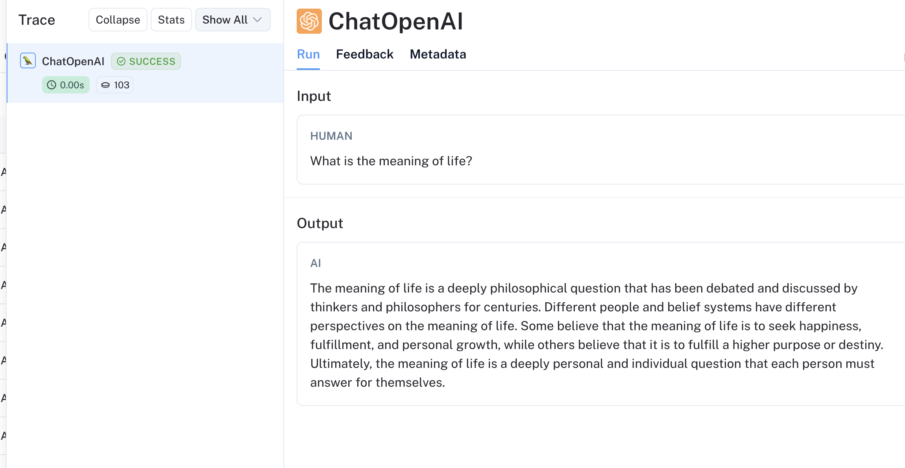

# Quick Start

## What is the LangSmith Proxy

The LangSmith Proxy(Alpha) is intended to be a drop-in replacement for your LLM apis with some additional features. It is designed to be a simple, easy-to-use, and easy-to-configure tool that adds minimal overhead to your existing LLM API usage.

- **Easy to use**: The LangSmith LLM Proxy is designed to be easy to use. You can run it as a sidecar to your existing app and start using it immediately. Besides changing the URL of your LLM API, you don't need to make any changes to your app to start using the LangSmith Proxy.
- **Cache support**: The LangSmith LLM Proxy supports caching of requests/responses(with streaming support) from the LLM API. This allows you to cache responses for a configurable amount of time, reducing the number of requests to the LLM API and improving response times. This can be especially useful if you are using the LLM API in a high-traffic environment or running CI(in cases like evals)
- **Minimal overhead**: We use NGINX as a reverse proxy to minimize the overhead of the LangSmith LLM Proxy. Requests are passed through the proxy with minimal processing.
- **Streaming support**: The LangSmith LLM Proxy supports streaming responses from the LLM API. This allows you to start processing the response as soon as it is available, rather than waiting for the entire response to be received.
- **Tracing support(optional)**: The LangSmith LLM Proxy supports tracing of LLM calls via LangSmith. This allows you to trace calls to your LLM without any configuration changes to your app.

## Models Supported

The LangSmith Proxy supports the following APIS:

- OpenAI(Chat and Completion)
- AzureOpenAI(Chat and Completion)

We are actively working on adding support for the following models:

- Anthropic
- Google Vertex
- Gemini

If you would like to see support for a specific model, please message us at support@langchain.dev

The steps in this guide will acquaint you with deploying the LangSmith Proxy and using it to make requests to OpenAI.

1. Launch the LangSmith Proxy container in your environment
2. Edit your app to make requests to the LangSmith Proxy
3. Forcefully turn off caching for the LangSmith Proxy
4. Cache a streamed request
5. Turn on tracing while using the LangSmith Proxy

## Prerequisites

1. Docker installed on your local machine
   - Instructions for installing Docker can be found [here](https://docs.docker.com/get-docker/)
2. An OpenAI API Key
3. (Optional) If configuring tracing, a LangSmith API Key

## 1. Deploy the LangSmith Proxy

The LangSmith Proxy is available as a Docker container. You can run it in your environment by running the following command:

```bash
docker pull docker.io/langchain/langsmith-proxy:latest # Force pull the latest version of the LangSmith Proxy
docker run -p 8080:8080 docker.io/langchain/langsmith-proxy:latest -p 8080:8080 # Run the LangSmith Proxy on port 8080 and publish it to the host
```

You should see the following output:

```bash
2024-03-06 12:59:57,458 CRIT Supervisor is running as root.  Privileges were not dropped because no user is specified in the config file.  If you intend to run as root, you can set user=root in the config file to avoid this message.
2024-03-06 12:59:57,467 INFO supervisord started with pid 1
2024-03-06 12:59:58,503 INFO spawned: 'nginx' with pid 8
2024-03-06 12:59:58,552 INFO spawned: 'trace-processor' with pid 10
2024-03-06 12:59:59,562 INFO success: nginx entered RUNNING state, process has stayed up for > than 1 seconds (startsecs)
2024-03-06 12:59:59,563 INFO success: trace-processor entered RUNNING state, process has stayed up for > than 1 seconds (startsecs)
Couldn't create langsmith client: API key must be provided when using hosted LangSmith API, will skip creating runs
Listening for traces at 0.0.0.0:9999
Connection from ('127.0.0.1', 47370)
```

Ignore the `Couldn't create langsmith client` message if you are not configuring tracing.

## 2. Update your app to make requests to the LangSmith Proxy

For this example, we'll be using your local proxy running on `localhost:8080`. You can replace this with the address of your proxy if it's running on a different machine.

You may need to install some packages for this example:

```bash
pip install openai
pip install asyncio
```

Now, you can use the LangSmith Proxy to make requests to OpenAI. Here's an example of how you can do this in Python:
Let's create a file called `openai_test.py` and add the following code:

```python
import time

import openai

# Different models can be accessed by changing the /proxy/openai to /proxy/<model>
OPENAI_API_URL = "http://localhost:8080/proxy/openai"

client = openai.Client(api_key="", base_url=OPENAI_API_URL)
start = time.time()
response = client.chat.completions.create(
    model="gpt-3.5-turbo",
    messages=[
        {"role": "system", "content": "You are a helpful assistant."},
        {"role": "user", "content": "Write a poem about artificial intelligence."}
    ],
)
print(response)
print(f"Time taken: {time.time() - start}")
```

Run the file using the following command:

```bash
python openai_test.py

ChatCompletion(id='chatcmpl-8zqYoQDvQy2uHHHtwyahUuh0hRH3r', choices=[Choice(finish_reason='stop', index=0, logprobs=None, message=ChatCompletionMessage(content="In a realm of circuits and code so bright,\nArtificial intelligence takes its flight.\nA mind of silicon, cold and precise,\nA creation of humans, a technological device.\n\nWith algorithms running like a symphony,\nAI learns and grows with incredible efficiency.\nProcessing data at lightning speed,\nUnraveling mysteries with amazing heed.\n\nIt sees patterns in the chaos, finds order in the haze,\nPredicts our future with astonishing gaze.\nYet behind the code, a question looms,\nCan AI truly understand human rooms?\n\nIts knowledge vast, its power immense,\nBut can it possess compassion, can it sense?\nWill it help or hinder, create or destroy,\nThis artificial mind, this modern decoy?\n\nAs we advance in this digital age,\nLet's remember AI is but a page.\nA tool we wield with cautious hand,\nFor its potential is great, but so is its demand. \n\nSo let us guide it with wisdom and care,\nFor artificial intelligence, like us, is rare.\nA marvel of innovation, a wonder to behold,\nMay we navigate this future, with hearts of gold.", role='assistant', function_call=None, tool_calls=None))], created=1709750742, model='gpt-3.5-turbo-0125', object='chat.completion', system_fingerprint='fp_2b778c6b35', usage=CompletionUsage(completion_tokens=220, prompt_tokens=24, total_tokens=244))
Time taken: 4.794615030288696
```

There will also be a corresponding Cache Miss log entry in your proxy.

```bash
"POST /proxy/openai/chat/completions HTTP/1.1" 200 20418 "-" "OpenAI/Python 1.12.0" "CACHE: MISS"
```

Pretty slow! Let's try running this again.

```bash
python openai_test.py

ChatCompletion(id='chatcmpl-8zqYoQDvQy2uHHHtwyahUuh0hRH3r', choices=[Choice(finish_reason='stop', index=0, logprobs=None, message=ChatCompletionMessage(content="In a realm of circuits and code so bright,\nArtificial intelligence takes its flight.\nA mind of silicon, cold and precise,\nA creation of humans, a technological device.\n\nWith algorithms running like a symphony,\nAI learns and grows with incredible efficiency.\nProcessing data at lightning speed,\nUnraveling mysteries with amazing heed.\n\nIt sees patterns in the chaos, finds order in the haze,\nPredicts our future with astonishing gaze.\nYet behind the code, a question looms,\nCan AI truly understand human rooms?\n\nIts knowledge vast, its power immense,\nBut can it possess compassion, can it sense?\nWill it help or hinder, create or destroy,\nThis artificial mind, this modern decoy?\n\nAs we advance in this digital age,\nLet's remember AI is but a page.\nA tool we wield with cautious hand,\nFor its potential is great, but so is its demand. \n\nSo let us guide it with wisdom and care,\nFor artificial intelligence, like us, is rare.\nA marvel of innovation, a wonder to behold,\nMay we navigate this future, with hearts of gold.", role='assistant', function_call=None, tool_calls=None))], created=1709750742, model='gpt-3.5-turbo-0125', object='chat.completion', system_fingerprint='fp_2b778c6b35', usage=CompletionUsage(completion_tokens=220, prompt_tokens=24, total_tokens=244))
Time taken: 0.12684011459350586
```

Cache hit! Our request hits the cache and the response time is much faster. You will also see a Cache Hit log entry in your proxy.

```bash
"POST /proxy/openai/chat/completions HTTP/1.1" 200 24915 "-" "OpenAI/Python 1.12.0" "CACHE: HIT"
```

## 3. Forcefully turn off caching for the LangSmith Proxy

In some scenarios, you may want to forcefully turn off caching for the LangSmith Proxy. You can do this by adding a Cache-Control header `{"Cache-Control": "no-cache"}` header to your request. This will force the LangSmith Proxy to make a request to the LLM API and bypass the cache.

```python
import time

import openai

# Different models can be accessed by changing the /proxy/openai to /proxy/<model>
OPENAI_API_URL = "http://localhost:8080/proxy/openai"

client = openai.Client(api_key="", base_url=OPENAI_API_URL, default_headers={"Cache-Control": "no-cache"})
start = time.time()
response = client.chat.completions.create(
    model="gpt-3.5-turbo",
    messages=[
        {"role": "system", "content": "You are a helpful assistant."},
        {"role": "user", "content": "Write a poem about artificial intelligence."}
    ],
)
print(response)
print(f"Time taken: {time.time() - start}")
```

There will also be a corresponding Cache Bypass log entry in your proxy.

```bash
"POST /proxy/openai/chat/completions HTTP/1.1" 200 24376 "-" "OpenAI/Python 1.12.0" "CACHE: BYPASS"
```

As you can see, the request takes a longer time to complete as the LangSmith Proxy is making a request to the LLM API. You will also see a Bypass Header in your response.

## 4. Support for Streaming

The LangSmith Proxy supports streaming responses from the LLM API. This allows you to start processing the response as soon as it is available, rather than waiting for the entire response to be received.
This will still work with caching!

Update your `openai_test.py` file to use the streaming API:

```python
import time

import openai

# Different models can be accessed by changing the /proxy/openai to /proxy/<model>
OPENAI_API_URL = "http://localhost:8080/proxy/openai"

client = openai.Client(api_key="", base_url=OPENAI_API_URL)
start = time.time()
stream = client.chat.completions.create(
    model="gpt-3.5-turbo",
    messages=[
        {"role": "system", "content": "You are a helpful assistant."},
        {"role": "user", "content": "Write a poem about artificial intelligence."}
    ],
    stream=True
)
for chunk in stream:
    print(chunk)

print(f"Time taken: {time.time() - start}")
```

```bash
python openai_test.py

ChatCompletionChunk(id='chatcmpl-8zqcc2vx7sLVumNOcxTBWH8VVFlNm', choices=[Choice(delta=ChoiceDelta(content='', function_call=None, role='assistant', tool_calls=None), finish_reason=None, index=0, logprobs=None)], created=1709750978, model='gpt-3.5-turbo-0125', object='chat.completion.chunk', system_fingerprint='fp_2b778c6b35')
ChatCompletionChunk(id='chatcmpl-8zqcc2vx7sLVumNOcxTBWH8VVFlNm', choices=[Choice(delta=ChoiceDelta(content='In', function_call=None, role=None, tool_calls=None), finish_reason=None, index=0, logprobs=None)], created=1709750978, model='gpt-3.5-turbo-0125', object='chat.completion.chunk', system_fingerprint='fp_2b778c6b35')
ChatCompletionChunk(id='chatcmpl-8zqcc2vx7sLVumNOcxTBWH8VVFlNm', choices=[Choice(delta=ChoiceDelta(content=' realms', function_call=None, role=None, tool_calls=None), finish_reason=None, index=0, logprobs=None)], created=1709750978, model='gpt-3.5-turbo-0125', object='chat.completion.chunk', system_fingerprint='fp_2b778c6b35')
ChatCompletionChunk(id='chatcmpl-8zqcc2vx7sLVumNOcxTBWH8VVFlNm', choices=[Choice(delta=ChoiceDelta(content=' of', function_call=None, role=None, tool_calls=None), finish_reason=None, index=0, logprobs=None)], created=1709750978, model='gpt-3.5-turbo-0125', object='chat.completion.chunk', system_fingerprint='fp_2b778c6b35')
ChatCompletionChunk(id='chatcmpl-8zqcc2vx7sLVumNOcxTBWH8VVFlNm', choices=[Choice(delta=ChoiceDelta(content=' ones', function_call=None, role=None, tool_calls=None), finish_reason=None, index=0, logprobs=None)], created=1709750978, model='gpt-3.5-turbo-0125', object='chat.completion.chunk', system_fingerprint='fp_2b778c6b35')
ChatCompletionChunk(id='chatcmpl-8zqcc2vx7sLVumNOcxTBWH8VVFlNm', choices=[Choice(delta=ChoiceDelta(content=' and', function_call=None, role=None, tool_calls=None), finish_reason=None, index=0, logprobs=None)], created=1709750978, model='gpt-3.5-turbo-0125', object='chat.completion.chunk', system_fingerprint='fp_2b778c6b35')

...
Time taken: 3.4340438842773438
```

Let's run this again and see how the response time changes.

```bash
python openai_test.py

ChatCompletionChunk(id='chatcmpl-8zqcc2vx7sLVumNOcxTBWH8VVFlNm', choices=[Choice(delta=ChoiceDelta(content='', function_call=None, role='assistant', tool_calls=None), finish_reason=None, index=0, logprobs=None)], created=1709750978, model='gpt-3.5-turbo-0125', object='chat.completion.chunk', system_fingerprint='fp_2b778c6b35')
ChatCompletionChunk(id='chatcmpl-8zqcc2vx7sLVumNOcxTBWH8VVFlNm', choices=[Choice(delta=ChoiceDelta(content='In', function_call=None, role=None, tool_calls=None), finish_reason=None, index=0, logprobs=None)], created=1709750978, model='gpt-3.5-turbo-0125', object='chat.completion.chunk', system_fingerprint='fp_2b778c6b35')
ChatCompletionChunk(id='chatcmpl-8zqcc2vx7sLVumNOcxTBWH8VVFlNm', choices=[Choice(delta=ChoiceDelta(content=' realms', function_call=None, role=None, tool_calls=None), finish_reason=None, index=0, logprobs=None)], created=1709750978, model='gpt-3.5-turbo-0125', object='chat.completion.chunk', system_fingerprint='fp_2b778c6b35')
ChatCompletionChunk(id='chatcmpl-8zqcc2vx7sLVumNOcxTBWH8VVFlNm', choices=[Choice(delta=ChoiceDelta(content=' of', function_call=None, role=None, tool_calls=None), finish_reason=None, index=0, logprobs=None)], created=1709750978, model='gpt-3.5-turbo-0125', object='chat.completion.chunk', system_fingerprint='fp_2b778c6b35')
ChatCompletionChunk(id='chatcmpl-8zqcc2vx7sLVumNOcxTBWH8VVFlNm', choices=[Choice(delta=ChoiceDelta(content=' ones', function_call=None, role=None, tool_calls=None), finish_reason=None, index=0, logprobs=None)], created=1709750978, model='gpt-3.5-turbo-0125', object='chat.completion.chunk', system_fingerprint='fp_2b778c6b35')
ChatCompletionChunk(id='chatcmpl-8zqcc2vx7sLVumNOcxTBWH8VVFlNm', choices=[Choice(delta=ChoiceDelta(content=' and', function_call=None, role=None, tool_calls=None), finish_reason=None, index=0, logprobs=None)], created=1709750978, model='gpt-3.5-turbo-0125', object='chat.completion.chunk', system_fingerprint='fp_2b778c6b35')
...
Time taken: 0.07226419448852539
```

Again, much faster! The corresponding miss and hit logs will also be present in your proxy.

```
"POST /proxy/openai/chat/completions HTTP/1.1" 200 17761 "-" "OpenAI/Python 1.12.0" "CACHE: MISS"
"POST /proxy/openai/chat/completions HTTP/1.1" 200 17745 "-" "OpenAI/Python 1.12.0" "CACHE: HIT"
```

## 5. Turn on tracing while using the LangSmith Proxy

Requests made to the LangSmith proxy can also be traced.
You can do this by running the docker image with the `LANGSMITH_API_KEY` environment variable set to your LangSmith API Key.

```bash
docker run -p 8080:8080 -e LANGSMITH_API_KEY=<your_langsmith_api_key> -e  docker.io/langchain/langsmith-proxy:latest -p 8080:8080
```

Run the script again, and you should see a trace in your LangSmith dashboard.

```bash
python openai_test.py

# In nginx logs
Created run with inputs: {'messages': [{'role': 'system', 'content': 'You are a helpful assistant.'}, {'role': 'user', 'content': 'Write a poem about artificial intelligence.'}], 'model': 'gpt-3.5-turbo', 'stream': True}
```

The corresponding trace also appears in your LangSmith dashboard!

[](./static/trace.png)

## Next Steps

- In this guide, you learned how to deploy the LangSmith Proxy and use it to proxy requests to OpenAI.
- We highly recommend trying this out with your own applications and models.
- Note that the proxy is intended to run near your application to minimize latency. You can run it as a sidecar to your application or as a separate service.
- We also bundle this into the LangSmith Self-Hosted deployment by default. If you are using LangSmith Self-Hosted, you can use your LangSmith url as the proxy url.
