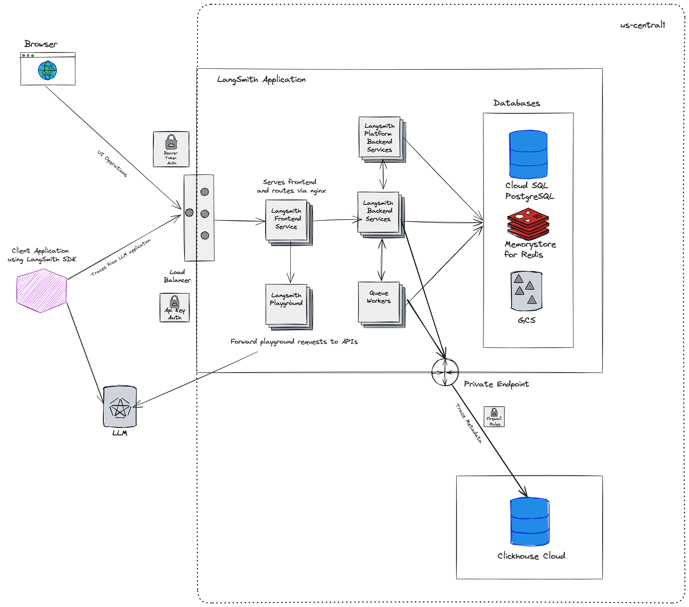

# Cloud architecture and scalability

:::note Cloud-managed solution
This section is only relevant for the cloud-managed LangSmith services available at https://smith.langchain.com and https://eu.smith.langchain.com.

For information on the self-hosted LangSmith solution, please refer to the [self-hosted documentation](../self_hosting/).
:::

LangSmith is deployed on Google Cloud Platform (GCP) and is designed to be highly scalable. Many customers run production workloads on LangSmith for both LLM application observability and evaluation.

## Architecture

The US-based LangSmith service is deployed in the `us-central1` (Iowa) region of GCP.

**NOTE:** The [EU-based LangSmith service](https://eu.smith.langchain.com) is now available (as of mid-July 2024) and is deployed in the `europe-west4` (Netherlands) region of GCP.
If you are interested in an enterprise plan in this region, please contact us at sales@langchain.dev.

### Regional storage

The resources and services in this table are stored in the location corresponding to the URL where sign-up occurred (either the US or EU).
Cloud-managed LangSmith uses [Supabase](https://supabase.com) for authentication/authorization and [ClickHouse Cloud](https://clickhouse.com/cloud) for data warehouse.

|                                       | US                              | EU                                 |
| ------------------------------------- | ------------------------------- | ---------------------------------- |
| URL                                   | https://smith.langchain.com     | https://eu.smith.langchain.com     |
| API URL                               | https://api.smith.langchain.com | https://eu.api.smith.langchain.com |
| GCP                                   | us-central1 (Iowa)              | europe-west4 (Netherlands)         |
| Supabase                              | AWS us-east-1 (N. Virginia)     | AWS eu-central-1 (Germany)         |
| ClickHouse Cloud                      | us-central1 (Iowa)              | europe-west4 (Netherlands)         |
| [LangGraph Cloud](../langgraph_cloud) | us-central1 (Iowa)              | europe-west4 (Netherlands)         |

See the [Regions FAQ](./regions_faq) for more information.

### Region-independent storage

Data listed here is stored exclusively in the US:

- Payment and billing information with Stripe and Metronome

### GCP services

LangSmith is composed of the following services, all deployed on Google Kubernetes Engine (GKE):

- LangSmith Frontend: serves the LangSmith UI.
- LangSmith Backend: serves the LangSmith API.
- LangSmith Platform Backend: handles authentication and other high-volume tasks. (Internal service)
- LangSmith Playground: handles forwarding requests to various LLM providers for the Playground feature.
- LangSmith Queue: handles processing of asynchronous tasks. (Internal service)

LangSmith uses the following GCP storage services:

- Google Cloud Storage (GCS) for runs inputs and outputs.
- Google Cloud SQL PostgreSQL for transactional workloads.
- Google Cloud Memorystore for Redis for queuing and caching.
- Clickhouse Cloud on GCP for trace ingestion and analytics. Our services connect to Clickhouse Cloud, which is hosted in the same GCP region, via a private endpoint.

Some additional GCP services we use include:

- Google Cloud Load Balancer for routing traffic to the LangSmith services.
- Google Cloud CDN for caching static assets.
- Google Cloud Armor for security and rate limits. For more information on rate limits we enforce, please refer to [this guide](../administration/concepts#rate-limits).

## Scalability

LangSmith is designed to be scalable and performant.

As of load testing done in February 2024, LangSmith can comfortably process 500K+ runs (spans) per minute.
We anticipate that LangSmith can process 750K+ runs per minute with the optimizations we've made since then.

## Whitelisting IP addresses

All traffic leaving LangSmith services will be routed through a NAT gateway. All traffic will appear to originate from the following IP addresses:

| US             | EU             |
| -------------- | -------------- |
| 34.59.65.97    | 34.13.192.67   |
| 34.67.51.221   | 34.147.105.64  |
| 34.46.212.37   | 34.90.22.166   |
| 34.132.150.88  | 34.147.36.213  |
| 35.188.222.201 | 34.32.137.113  |
| 34.58.194.127  | 34.91.238.184  |
| 34.59.97.173   | 35.204.101.241 |
| 104.198.162.55 | 35.204.48.32   |

It may be helpful to whitelist these IP addresses if connecting to your own AzureOpenAI service or other endpoints that may be required by the Playground or Online Evaluation.
