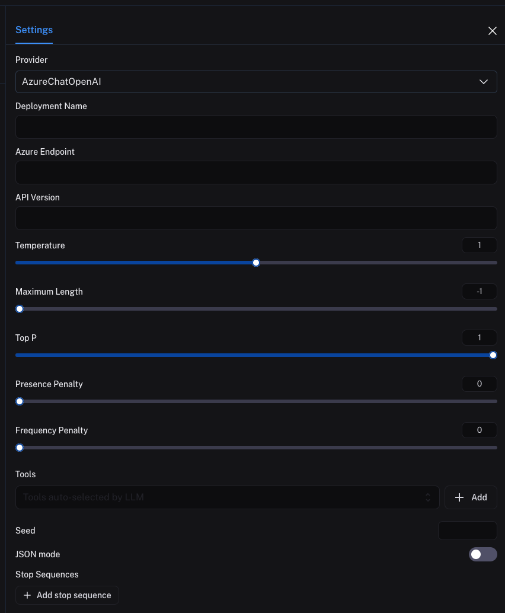

import {
  CodeTabs,
  DockerBlock,
  HelmBlock,
} from "../../../src/components/InstructionsWithCode";

# Use custom TLS certificates for model providers

## Using Truststore to utilize system CA certificates

:::note Helm v0.10.29 or later
This feature is available in LangSmith Helm chart version 0.10.29/app z
:::

If you are using a self-signed certificate or a certificate from a custom certificate authority (CA), you can use the system's truststore to configure the TLS settings for model providers. This is useful if you want to use the system's CA certificates instead of providing a custom CA certificate.
To use the system's truststore, you will need to mount the certificate authority (CA) certificates into the LangSmith application container. You can do this by adding a volume mount to the LangSmith deployment or Docker container.

## Requirements

- A self-signed certificate or a certificate from a custom CA that you want to use for the model provider.
- The certificate authority (CA) certificate in PEM format. This must be a config-map or

## Configuration

:::note Select providers only

This feature is currently only available for the following model providers:

- Azure OpenAI
- OpenAI
- Custom (our custom model server). Refer to the [custom model server documentation](/prompt_engineering/how_to_guides/custom_endpoint) for more information.

These TLS settings will apply to all invocations of the selected model providers including when used through Online Evaluation.
:::

You can use custom TLS certificates to connect to model providers in the LangSmith playground. This is useful if you are using a self-signed certificate, a certificate from a custom certificate authority or mutual TLS authentication.

To use custom TLS certificates, you need to set the following environment variables. See the [self hosted deployment section](/self_hosting) for more information on how to set up application configuration.

- `LANGSMITH_PLAYGROUND_TLS_MODEL_PROVIDERS`: A comma-separated list of model providers that require custom TLS certificates. Note that `azure_openai`, `openai` and `custom` are currently the only supported model provider that supports custom TLS certificates, but more providers will be supported in the future.
- `LANGSMITH_PLAYGROUND_TLS_CA`: The custom certificate authority (CA) certificate in PEM format. This must be a file path (for a mounted volume).
- [Optional] `LANGSMITH_PLAYGROUND_TLS_KEY`: The private key in PEM format. This must be a file path (for a mounted volume). This is usually only necessary for mutual TLS authentication.
- [Optional] `LANGSMITH_PLAYGROUND_TLS_CERT`: The certificate in PEM format. This must be a file path (for a mounted volume). This is usually only necessary for mutual TLS authentication.

Once you have set these environment variables, enter the playground and select the model provider that requires custom TLS certificates.
Set your model provider configuration as usual, and the custom TLS certificates will be used when connecting to the model provider.

