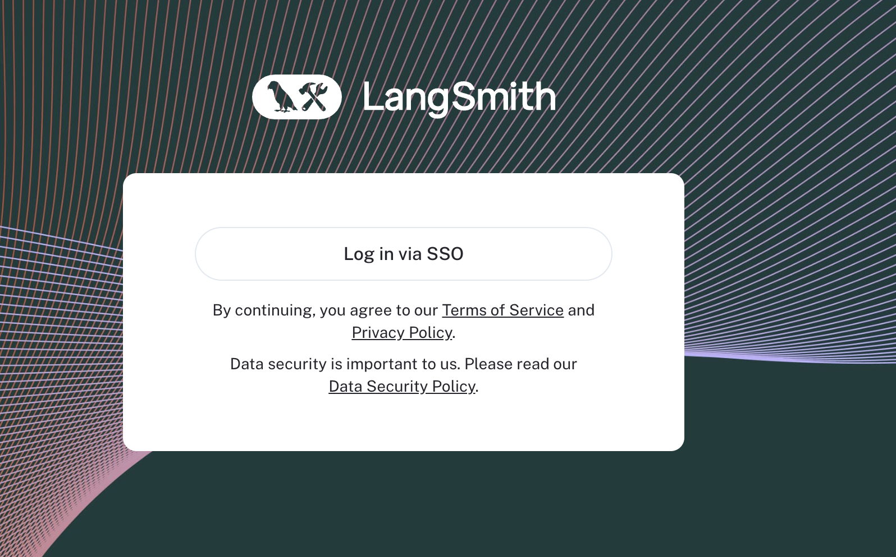

import { RegionalUrl } from "@site/src/components/RegionalUrls";
import {
  CodeTabs,
  DockerBlock,
  HelmBlock,
} from "../../../src/components/InstructionsWithCode";

# SSO with OAuth2.0 and OIDC

LangSmith Self-Hosted provides SSO via OAuth2.0 and OIDC. This will delegate authentication to your Identity Provider (IdP) to manage access to LangSmith.

Our implementation supports almost anything that is OIDC compliant, with a few exceptions.
Once configured, you will see a login screen like this:

## With Client Secret (Recommended) {#with-secret}

By default, LangSmith Self-Hosted supports the `Authorization Code` flow with `Client Secret`.
In this version of the flow, your client secret is stored security in the LangSmith platform (not on the frontend) and used for authentication and establishing auth sessions.

### Requirements

:::note
You may upgrade a [basic auth](./basic_auth.mdx) installation to this mode, but not a [none auth](/reference/authentication_authorization/authentication_methods.mdx#none) installation.
In order to upgrade, simply remove the basic auth configuration and add the required configuration parameters as shown below. Users may then login via OAuth _only_.
**In order to maintain access post-upgrade, you must have access to login via OAuth using an email address that previously logged in via basic auth.**
:::

:::warning
LangSmith does not support moving from SSO to basic auth mode in self-hosted at the moment.
We also do not support moving from OAuth Mode with client secret to OAuth mode without a client secret and vice versa.
Finally, we do not support having both basic auth and OAuth at the same time. Ensure you disable the basic auth configuration when enabling OAuth.
:::

- Your IdP must support the `Authorization Code` flow with `Client Secret`.
- Your IdP must support using an external discovery/issuer URL. We will use this to fetch the necessary routes and keys for your IdP.
- You must provide the `OIDC`, `email`, and `profile` scopes to LangSmith. We use these to fetch the necessary user information and email for your users.
- You will need to set the callback URL in your IdP to `https://<host>/api/v1/oauth/custom-oidc/callback`, where host is the domain or IP you have provisioned for your LangSmith instance. This is where your IdP will redirect the user after they have authenticated.
- You will need to provide the `oauthClientId`, `oauthClientSecret`, `hostname`, and `oauthIssuerUrl` in your `values.yaml` file. This is where you will configure your LangSmith instance.
- <u>Note</u>: Langsmith SSO is only supported through `https`.

<CodeTabs
  tabs={[
    HelmBlock(
      `config:
    authType: mixed
    hostname: https://langsmith.example.com
    oauth:
      enabled: true
      oauthClientId: \<YOUR CLIENT ID\>
      oauthClientSecret: \<YOUR CLIENT SECRET\>
      oauthIssuerUrl: \<YOUR DISCOVERY URL\>
      oauthScopes: "email,profile,openid"`
    ),
    DockerBlock(
      `# In your .env file
AUTH_TYPE=mixed
LANGSMITH_URL=https://langsmith.example.com
OAUTH_CLIENT_ID=your-client-id
OAUTH_CLIENT_SECRET=your-client-secret
OAUTH_ISSUER_URL=https://your-issuer-url
OAUTH_SCOPES=email,profile,openid
    `
    ),
  ]}
/>

### Session length controls

:::note
All of the environment variables in this section are for the `platform-backend` service and can be added using `platformBackend.deployment.extraEnv` in Helm.
:::

- By default, session length is controlled by the expiration of the identity token returned by the identity provider
- Most setups should use refresh tokens to enable session length extension beyond the identity token expiration up to `OAUTH_SESSION_MAX_SEC`, which may require including the `offline_access` scope by adding to `oauthScopes` (Helm) or `OAUTH_SCOPES` (Docker)
- `OAUTH_SESSION_MAX_SEC` (default 1 day) can be overridden to a maximum of one week (`604800`)
- For identity provider setups that don't support refresh tokens, setting `OAUTH_OVERRIDE_TOKEN_EXPIRY="true"` will take `OAUTH_SESSION_MAX_SEC` as the session length, ignoring the identity token expiration

### Identity Provider Setup: Google Workspace

You can use Google Workspace as a single sign-on (SSO) provider using [OAuth2.0 and OIDC](https://developers.google.com/identity/openid-connect/openid-connect) without PKCE.

:::note
You must have administrator-level access to your organization’s Google Cloud Platform (GCP) account to create a new project, or permissions to create and configure OAuth 2.0 credentials for an existing project. We recommend that you create a new project for managing access, since each GCP project has a single OAuth consent screen.
:::

1. Create a new GCP project, see the Google documentation topic [creating and managing projects](https://cloud.google.com/resource-manager/docs/creating-managing-projects)
1. After you have created the project, open the [Credentials](https://console.developers.google.com/apis/credentials) page in the Google API Console (making sure the project in the top left corner is correct)
1. Create new credentials: `Create Credentials → OAuth client ID`
1. Choose `Web application` as the `Application type` and enter a name for the application e.g. `LangSmith`
1. In `Authorized Javascript origins` put the domain of your LangSmith instance e.g. `https://langsmith.yourdomain.com`
1. In `Authorized redirect URIs` put the domain of your LangSmith instance followed by `/api/v1/oauth/custom-oidc/callback` e.g. `https://langsmith.yourdomain.com/api/v1/oauth/custom-oidc/callback`
1. Click `Create`, then download the JSON or copy and save the `Client ID` (ends with `.apps.googleusercontent.com`) and `Client secret` somewhere secure. **You will be able to access these later if needed**.
1. Select `OAuth consent screen` from the navigation menu on the left
   1. Choose the Application type as `Internal`. **If you select `Public`, anyone with a Google account can sign in.**
   1. Enter a descriptive `Application name`. This name is shown to users on the consent screen when they sign in. For example, use `LangSmith` or `<organization_name> SSO for LangSmith`.
   1. Verify that the Scopes for Google APIs only lists email, profile, and openid scopes. Only these scopes are required for single sign-on. If you grant additional scopes it increases the risk of exposing sensitive data.
1. (Optional) control who within your organization has access to LangSmith: https://admin.google.com/ac/owl/list?tab=configuredApps. See [Google's documentation](https://support.google.com/a/answer/7281227?hl=en&fl=1&sjid=9554153972856467090-NA) for additional details.
1. Configure LangSmith to use this OAuth application. For examples, here are the `config `values that would be used for Kubernetes configuration:
   1. `oauthClientId`: `Client ID` (ends with `.apps.googleusercontent.com`)
   1. `oauthClientSecret`: `Client secret`
   1. `hostname`: the domain of your instance e.g. `https://langsmith.yourdomain.com` (no trailing slash)
   1. `oauthIssuerUrl`: `https://accounts.google.com`
   1. `oauth.enabled`: `true`
   1. `authType`: `mixed`

### Identity Provider Setup: Okta

**Via Okta Integration Network (recommended)**

1. Sign in to Okta.
1. In the upper-right corner, select Admin. The button is not visible from the Admin area.
1. Select `Browse App Integration Catalog`
1. Find and select the LangSmith application.
1. On the application overview page, select Add Integration.
1. Fill in `ApiUrlBase`: `<langsmith_domain>/api/v1` e.g. `langsmith.internal.corp/api/v1` or, if subdomain is enabled, `<langsmith_domain>/subdomain/api/v1`
1. Fill in `AuthHost`: reuse `ApiUrlBase` from above (this value is unused in self-hosted, so any dummy value will technically work)
1. Fill in `LangSmithUrl`: just `<langsmith_domain>` e.g. `langsmith.internal.corp` (note the protocol is omitted)
1. Under Application Visibility, keep the box unchecked.
1. Select Next
1. Select `OpenID Connect`
1. Fill in `Sign-On Options`:
   1. `Application username format`: `Email`
   1. `Update application username on`: `Create and update`
   1. `Allow users to securely see their password`: leave **unchecked**
1. Click `Finish`

**Via Custom App Integration**

1. Log in to Okta as an administrator, and go to the `Okta Admin console`.
1. Under `Applications > Applications` click `Create App Integration`
1. Select `OIDC - OpenID Connect` then `Web Application`
1. Enter an `App integration name` (e.g. `LangSmith`)
1. Enter the following information:
   1. (Optional) Check `Refresh Token` under `Core grants` to extend session lengths via refresh tokens.
   1. `Sign-in redirect URIs`: put the domain of your LangSmith instance followed by `/api/v1/oauth/custom-oidc/callback` e.g. `https://langsmith.yourdomain.com/api/v1/oauth/custom-oidc/callback`
   1. (Optional) `Sign-out redirect URIs`: put the domain of your LangSmith instance e.g. `https://langsmith.yourdomain.com`
   1. `Base URIs`: put the domain of your LangSmith instance e.g. `https://langsmith.yourdomain.com`
1. Click `Finish`

**Configure LangSmith**

1. Copy the `Client ID` and `Client Secret` from the `General` or `Sign On` page to use for configuring your installation:
   1. `oauthClientId`: `Client ID` (begins with `0oaud`)
   1. `oauthClientSecret`: `Client secret`
   1. `hostname`: the domain of your instance e.g. `https://langsmith.yourdomain.com` (no trailing slash)
   1. `oauthIssuerUrl`: `https://<your_okta_subdomain>.okta.com` (can be found by clicking `OpenID Provider Metadata`)
   1. `oauth.enabled`: `true`
   1. `authType`: `mixed`

## Without Client Secret (PKCE) (Deprecated) {#without-secret}

We recommend running with a `Client Secret` if possible (previously we didn't support this). However, if your IdP does not support this, you can use the `Authorization Code with PKCE` flow.

This flow does _not_ require a `Client Secret` - see the flow [above](#with-secret) for the alternative that does.

### Requirements

There are a couple of requirements for using OAuth SSO with LangSmith:

- Your IdP must support the `Authorization Code with PKCE` [flow](https://www.oauth.com/oauth2-servers/pkce) (Google does not support this flow for example, but see [below](#with-secret) for an alternative configuration that Google supports). This is often displayed in your OAuth Provider as configuring a "Single Page Application (SPA)"
- Your IdP must support using an external discovery/issuer URL. We will use this to fetch the necessary routes and keys for your IdP.
- You must provide the `OIDC`, `email`, and `profile` scopes to LangSmith. We use these to fetch the necessary user information and email for your users.
- You will need to set the callback URL in your IdP to `http://<host>/oauth-callback`, where host is the domain or IP you have provisioned for your LangSmith instance. This is where your IdP will redirect the user after they have authenticated.
- You will need to provide the `oauthClientId` and `oauthIssuerUrl` in your `values.yaml` file. This is where you will configure your LangSmith instance.

<CodeTabs
  tabs={[
    HelmBlock(
      `config:
    oauth:
      enabled: true
      oauthClientId: \<YOUR CLIENT ID\>
      oauthIssuerUrl: \<YOUR DISCOVERY URL\>`
    ),
    DockerBlock(
      `# In your .env file
AUTH_TYPE=oauth
OAUTH_CLIENT_ID=your-client-id
OAUTH_ISSUER_URL=https://your-issuer-url
    `
    ),
  ]}
/>
