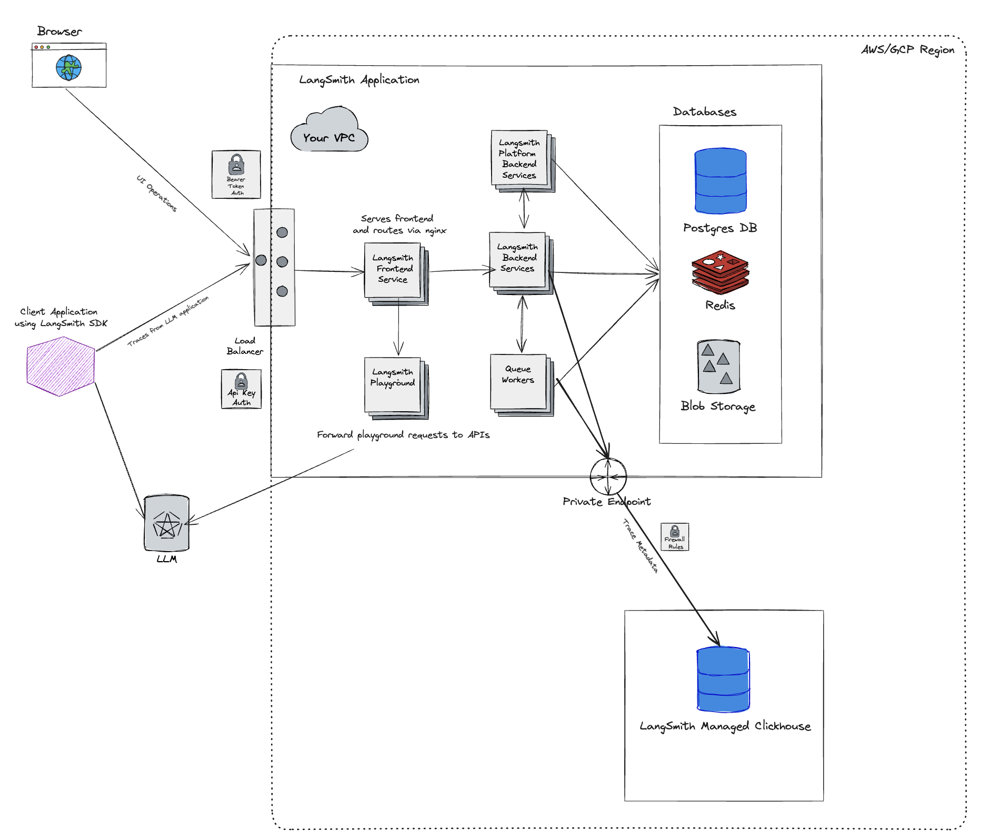

# LangSmith-managed ClickHouse

:::tip recommended reading

Please read the [LangSmith architectural overview](./architectural_overview) and [guide on connecting to external Clickhouse](./configuration/external_clickhouse) before proceeding with this guide.

:::

As mentioned in previous guides, LangSmith uses Clickhouse as the primary storage engine for traces and feedback.
For easier management and scaling, it is recommended to connect a self-hosted LangSmith instance to an external Clickhouse instance. LangSmith-managed ClickHouse is an option that allows you to use a fully managed ClickHouse instance that is monitored and maintained by the LangSmith team.

## Architecture Overview

Using LangSmith Managed Clickhouse with your Self-Hosted LangSmith instance is fairly simple. The overall architecture is similar to using a fully self-hosted ClickHouse instance, with a few key differences:

- You will need to set up a private network connection between your LangSmith instance and the LangSmith-managed ClickHouse instance. This is to ensure that your data is secure and that you can connect to the ClickHouse instance from your self-hosted LangSmith instance.
- With this option, sensitive information (inputs and outputs) of your traces will be stored in cloud object storage (S3 or GCS) within your cloud instead of Clickhouse to ensure that sensitive information doesn't leave your VPC.

:::note More on sensitive information

This [reference doc](../reference/data_formats/run_data_format) explains the format we use to store runs (spans), which are the building blocks of traces.

Our definition of sensitive information as it relates to application data are `inputs`, `outputs`, and `errors` of a run, since these fields can contain prompts and completions from LLMs.

With LangSmith-managed ClickHouse, we store `inputs`, `outputs`, and `errors` in cloud object storage (S3 or GCS) within your cloud and store the rest of the run data in ClickHouse. This ensures that sensitive information doesn't leave your VPC.

:::

- The LangSmith team will monitor your ClickHouse instance and ensure that it is running smoothly. This allows us to track metrics like run-ingestion delay and query performance.

The overall architecture looks like this:

## Requirements

- **You must be on AWS or GCP.** We do not support Azure at this time as we require S3 or GCS for blob storage. Read the [blob storage guide](/self_hosting/configuration/blob_storage) for more information.
- To use private endpoints, ensure that your VPC is in a ClickHouse Cloud supported [region](https://clickhouse.com/docs/en/cloud/reference/supported-regions). Otherwise, you will need to use a public endpoint we will secure with firewall rules. Your VPC will need to have a NAT gateway to allow us to whitelist your traffic.
- You must have a VPC that can connect to the LangSmith-managed Clickhouse service. You will need to work with our team to set up the necessary networking.
- You must have a LangSmith self-hosted instance running. You can use our managed ClickHouse service with both [Kubernetes](./installation/kubernetes) and [Docker](./installation/docker) installations.
