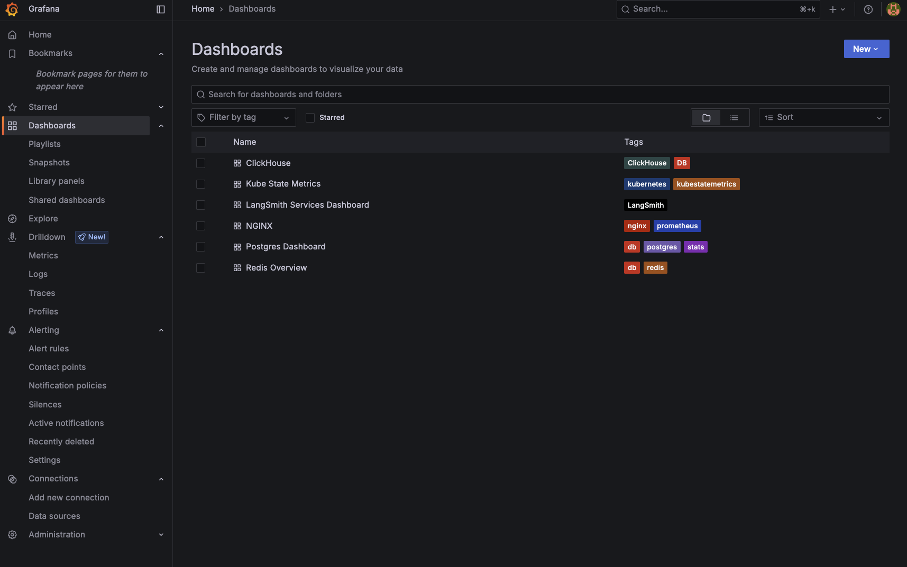

# Deploy an observability stack for your LangSmith deployment

:::warning Important
**This section is only applicable for Kubernetes deployments.**
:::

LangSmith applications expose telemetry data that can be sent to the backend of your choice. If you don’t already have an observability stack,
or prefer to keep LangSmith telemetry separate from your main application, you can use the LangSmith Observability Helm chart to deploy a basic observability stack.

# Section 1: Prometheus Exporters

Use this section if you would like to only deploy metrics exporters for the components in your self hosted deployment, which you can then scrape using your telemetry. If you would like a full observability stack deployed for you, go to the [End-to-End Deployment Section](./observability_stack#prerequisites).

The helm chart provides a set of Prometheus exporters to expose metrics from [Redis](https://github.com/prometheus-community/helm-charts/tree/main/charts/prometheus-redis-exporter),
[Postgres](https://github.com/prometheus-community/helm-charts/tree/main/charts/prometheus-postgres-exporter), [Nginx](https://github.com/prometheus-community/helm-charts/tree/main/charts/prometheus-nginx-exporter), and [Kube state metrics](https://github.com/prometheus-community/helm-charts/tree/main/charts/kube-state-metrics).

1. Create a local file called `langsmith_obs_config.yaml`
2. Copy over the values from this [file](https://github.com/langchain-ai/helm/blob/main/charts/langsmith-observability/examples/metric-exporters-only.yaml) into `langsmith_obs_config.yaml`, making sure to modify the values to match your LangSmith deployment.
3. Find the latest version of the chart by running `helm search repo langchain/langsmith-observability --versions`.
4. Grab the latest version number, and run `helm install langsmith-observability langchain/langsmith-observability --values langsmith_obs_config.yaml --version <version> -n <namespace> --debug`

This will allow you to scrape metrics at the following service endpoints:

- Postgres: `langsmith-observability-postgres-exporter:9187/metrics`
- Redis: `langsmith-observability-redis-exporter:9121/metrics`
- Nginx: `langsmith-observability-nginx-exporter:9113/metrics`
- KubeStateMetrics: `langsmith-observability-kube-state-metrics:8080/metrics`

You should see the following if the installation went through:

```
Release "langsmith-observability" has been installed. Happy Helming!
NAME: langsmith-observability
LAST DEPLOYED: Wed Jun 25 11:17:34 2025
NAMESPACE: langsmith-observability
STATUS: deployed
REVISION: 1
```

And if you run `kubectl get pods -n langsmith-observability`, you should see:

```
langsmith-observability-kube-state-metrics-b58bb8db4-bm4g5        1/1     Running   0          2m22s
langsmith-observability-nginx-exporter-6d686d9d4b-5qw9v           1/1     Running   0          2m22s
langsmith-observability-postgres-exporter-67d5db5684-tffbm        1/1     Running   0          2m22s
langsmith-observability-redis-exporter-846c4d65cb-vbtwd           1/1     Running   0          2m22s
```

# Section 2: Full Observability Stack

:::warning Important
**This is not a production observability stack. Use this to gain quick insight into logs, metrics and traces for your deployment. This is only made to handle a few dozen GB of data per day.**
:::
This section will show you how to deploy the end-to-end observability stack for LangSmith, using the [Helm Chart](https://github.com/langchain-ai/helm/tree/main/charts/langsmith-observability).

This chart is built around the open-source LGTM Stack from Grafana. It consists of:

- [Loki](https://grafana.com/docs/loki/latest/) for logs.
- [Mimir](https://grafana.com/docs/mimir/latest/) for metrics + alerting.
- [Tempo](https://grafana.com/docs/tempo/latest/) for traces.
- [Grafana](https://grafana.com/docs/grafana/latest/) for monitoring UI.

As well as [OpenTelemetry Collectors](https://opentelemetry.io/docs/collector/) for gathering the telemetry data.

## Prerequisites

### 1. Compute Resources

The resource requests and limits for each part of the stack can be modified in the helm chart. Here are the current allocations (request/limit):

- Loki: `2vCPU/3vCPU + 2Gi/4Gi`
- Mimir: `1vCPU/2vCPU + 2Gi/4Gi`
- Tempo: `1vCPU/2vCPU + 4Gi/6Gi`

Make sure you have those resources allocated before bringing up the helm chart, or modify the resource values in your helm configuration file.

### 2. Cert-Manager

The helm chart uses the OpenTelemetry Operator to provision collectors. The operator require that you have [cert-manager](https://cert-manager.io/docs/installation/)
installed in your Kubernetes cluster.

If you do not have it installed, you can run the following commands:

```bash
helm repo add jetstack https://charts.jetstack.io
helm repo update
helm install cert-manager jetstack/cert-manager -n cert-manager --create-namespace
```

### 3. OpenTelemetry Operator

Use the following to install the OpenTelemetry Operator:

```
helm repo add open-telemetry https://open-telemetry.github.io/opentelemetry-helm-charts
helm repo update'
helm install opentelemetry-operator open-telemetry/opentelemetry-operator -n <namespace>
```

## Installation

The following instructions will bring up OTel collectors, the LGTM stack, Grafana and Prometheus exporters.

1. Create a local file called `langsmith_obs_config.yaml`
2. Copy over the values from this [file](https://github.com/langchain-ai/helm/blob/main/charts/langsmith-observability/examples/e2e-stack.yaml) into `langsmith_obs_config.yaml`, making sure to modify the values to match your LangSmith deployment.
3. Find the latest version of the chart by running `helm search repo langchain/langsmith-observability --versions`.
4. Grab the latest version number, and run `helm install langsmith-observability langchain/langsmith-observability --values langsmith_obs_config.yaml --version <version> -n <namespace> --debug`

:::note Note
**You can selectively collect logs, metrics or traces by modifying the boolean values under `otelCollector` in your config file.
You can also selectively bring up each respective piece of the backend (Loki, Mimir, Tempo).**
:::

You should see the following if the install went through:

```
Release "langsmith-observability" has been installed. Happy Helming!
NAME: langsmith-observability
LAST DEPLOYED: Wed Jun 25 11:17:34 2025
NAMESPACE: langsmith-observability
STATUS: deployed
REVISION: 1
```

And if you run `kubectl get pods -n langsmith-observability`, you should see:

```
langsmith-observability-collector-gateway-collector-7746fb8pzbg   1/1     Running   0          5m26s
langsmith-observability-grafana-7c6fc976f9-cdbvr                  1/1     Running   0          2m49s
langsmith-observability-kube-state-metrics-b58bb8db4-bm4g5        1/1     Running   0          5m27s
langsmith-observability-loki-0                                    2/2     Running   0          5m27s
langsmith-observability-loki-chunks-cache-0                       2/2     Running   0          5m27s
langsmith-observability-loki-gateway-769fb6fff8-zjsn5             1/1     Running   0          5m27s
langsmith-observability-loki-results-cache-0                      2/2     Running   0          5m27s
langsmith-observability-mimir-0                                   1/1     Running   0          5m26s
langsmith-observability-nginx-exporter-6d686d9d4b-5qw9v           1/1     Running   0          5m27s
langsmith-observability-postgres-exporter-67d5db5684-tffbm        1/1     Running   0          5m27s
langsmith-observability-redis-exporter-846c4d65cb-vbtwd           1/1     Running   0          5m27s
langsmith-observability-tempo-0                                   1/1     Running   0          5m27s
opentelemetry-operator-756dff697-vblbn                            2/2     Running   0          12m
```

## Post-Installation

### Enable Logs and Traces in LangSmith

Once you have installed the observability helm chart, you need to set the following values in your <u>LangSmith</u> helm configuration file to enable collection of logs and traces.

```yaml
commonPodAnnotations:
  # This format fo this annotation sb
  sidecar.opentelemetry.io/inject: "${LANGSMITH_OBS_NAMESPACE}/${LANGSMITH_OTEL_CRD_NAME}"
observability:
  tracing:
    enabled: true
    # Replace this with the endpoint of your trace collector. If you are using the LangSmith Observability helm chart, this will be the endpoint of the OTEL Gateway collector.
    endpoint: "http://${GATEWAY_COLLECTOR_SERVICE_NAME}.${LANGSMITH_OBS_NAMESPACE}.svc.cluster.local:4318/v1/traces"
```

:::important Note

1. To get `${LANGSMITH_OTEL_CRD_NAME}`, you can run `kubectl get opentelemetrycollectors -n ${LANGSMITH_OBS_NAMESPACE}` and select the name of the one with MODE = `sidecar`
2. To get `${GATEWAY_COLLECTOR_SERVICE_NAME}` name, run `kubectl get services -n ${LANGSMITH_OBS_NAMESPACE}` and select the one with Ports 4317/4318 AND a ClusterIP set. It should be something like `langsmith-observability-collector-gateway-collector`
   :::

Now run `helm upgrade langsmith langchain/langsmith --values langsmith_config.yaml -n <langsmith-namespace> --debug`

Once upgraded, if you run `kubectl get pods -n <langsmith-namespace>` you should see the following (note the 2/2 for sidecar collectors):

```
langsmith-ace-backend-7dc85f7dff-xjbkj         2/2     Running     0               7m53s
langsmith-backend-566b66979c-rgcfh             2/2     Running     1               7m53s
langsmith-clickhouse-0                         2/2     Running     0               7m49s
langsmith-frontend-7cf8549885-vpkns            2/2     Running     0               7m53s
langsmith-platform-backend-5d46db7d9d-f6gh7    2/2     Running     0               7m52s
langsmith-platform-backend-5d46db7d9d-lrr4d    2/2     Running     1               7m41s
langsmith-platform-backend-5d46db7d9d-pcp27    2/2     Running     0               7m28s
langsmith-playground-65d4c9699c-h656r          2/2     Running     0               7m52s
langsmith-postgres-0                           2/2     Running     0               7m51s
langsmith-queue-bdcd45bd6-htssd                2/2     Running     0               7m52s
langsmith-queue-bdcd45bd6-pwdx4                2/2     Running     0               6m31s
langsmith-queue-bdcd45bd6-xqrb8                2/2     Running     0               5m11s
langsmith-redis-0                              2/2     Running     0               7m51s
```

## Grafana Usage

Once everything is installed, do the following:
to get your Grafana password:

```
kubectl get secret langsmith-observability-grafana -n <langsmith_observability_namespace> -o jsonpath="{.data.admin-password}" | base64 --decode
```

Then port-forward into the `langsmith-observability-grafana` container at port 3000, and open your browser as `localhost:3000`.
Use the username `admin` and the password from the secret above to log into Grafana.

Once in Grafana, you can use the UI to monitor logs, metrics and traces. Grafana also comes pre-packaged with sets of dashboards for monitoring the main components of your deployment.


