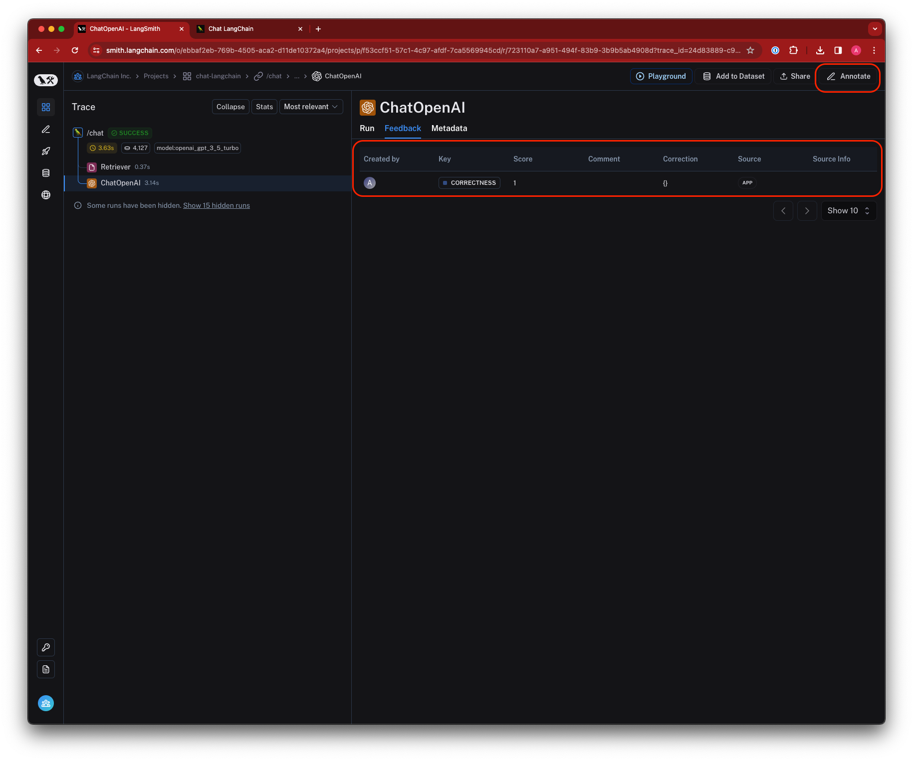
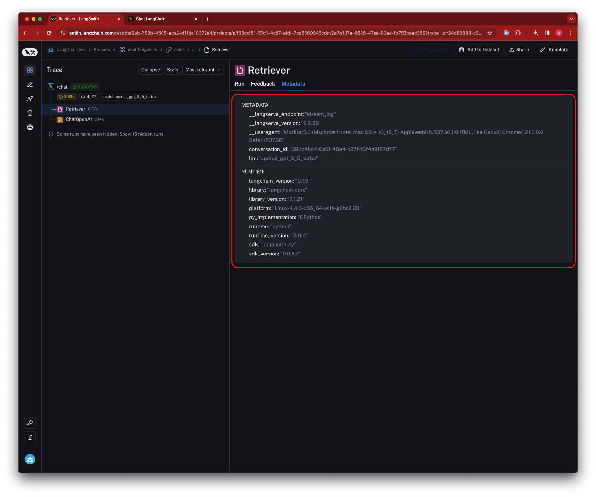

import ThemedImage from "@theme/ThemedImage";

# Concepts

In this guide we will go over some of the concepts that are important to understand when logging traces to LangSmith. A `Trace` is essentially a series of steps that your application takes to go from input to output. Each of these individual steps is represented by a `Run`. A `Project` is simply a collection of traces. The following diagram displays these concepts in the context of a simple RAG app, which retrieves documents from an index and generates an answer.

<ThemedImage
  alt="LangSmith Primitives"
  sources={{
    light: require("./static/concepts/primitives.png").default,
    dark: require("./static/concepts/primitives-dark.png").default,
  }}
/>

  Primitive datatypes in LangSmith

## Runs

A `Run` is a span representing a single unit of work or operation within your LLM application. This could be anything from single call to an LLM or chain, to a prompt formatting call, to a runnable lambda invocation. If you are familiar with [OpenTelemetry](https://opentelemetry.io/), you can think of a run as a span.

## Traces

A `Trace` is a collection of runs that are related to a single operation. For example, if you have a user request that triggers a chain, and that chain makes a call to an LLM, then to an output parser, and so on, all of these runs would be part of the same trace. If you are familiar with [OpenTelemetry](https://opentelemetry.io/), you can think of a LangSmith trace as a collection of spans. Runs are bound to a trace by a unique trace ID.

## Projects

A `Project` is a collection of traces. You can think of a project as a container for all the traces that are related to a single application or service. You can have multiple projects, and each project can have multiple traces.

## Feedback

`Feedback` allows you to score an individual run based on certain criteria.
Each feedback entry consists of a feedback tag and feedback score, and is bound to a run by a unique run ID.
Feedback can currently be continuous or discrete (categorical), and you can reuse feedback tags across different runs within an organization.

Collecting feedback on runs can be done in three main ways:

1. [In the UI](faq/logging_feedback#annotating-traces-with-feedback) - Annotate runs directly in the UI
2. [With the SDK](faq/logging_feedback#capturing-feedback-programmatically) - Programmatically log feedback to LangSmith
3. [With Online Evaluators](/monitoring/faq/online_evaluation) - Automatically run evaluators on a sample of your production traces to generate feedback in realtime

## Tags

`Tags` are collections of strings that can be attached to runs. They are used to categorize runs and make it easier to search for them in the LangSmith UI. Tags can be used to filter runs in the LangSmith UI, and can be used to group runs together for analysis. [Learn how to tag your traces in the LangSmith SDK.](faq/customizing_trace_attributes#adding-metadata-and-tags-to-traces)

## Metadata

`Metadata` is a collection of key-value pairs that can be attached to runs. Metadata can be used to store additional information about a run, such as the version of the application that generated the run, the environment in which the run was generated, or any other information that you want to associate with a run.
Similar to tags, you can use metadata to filter runs in the LangSmith UI, and can be used to group runs together for analysis. [Learn how to add metadata to your traces in the LangSmith SDK.](faq/customizing_trace_attributes#adding-metadata-and-tags-to-traces)

