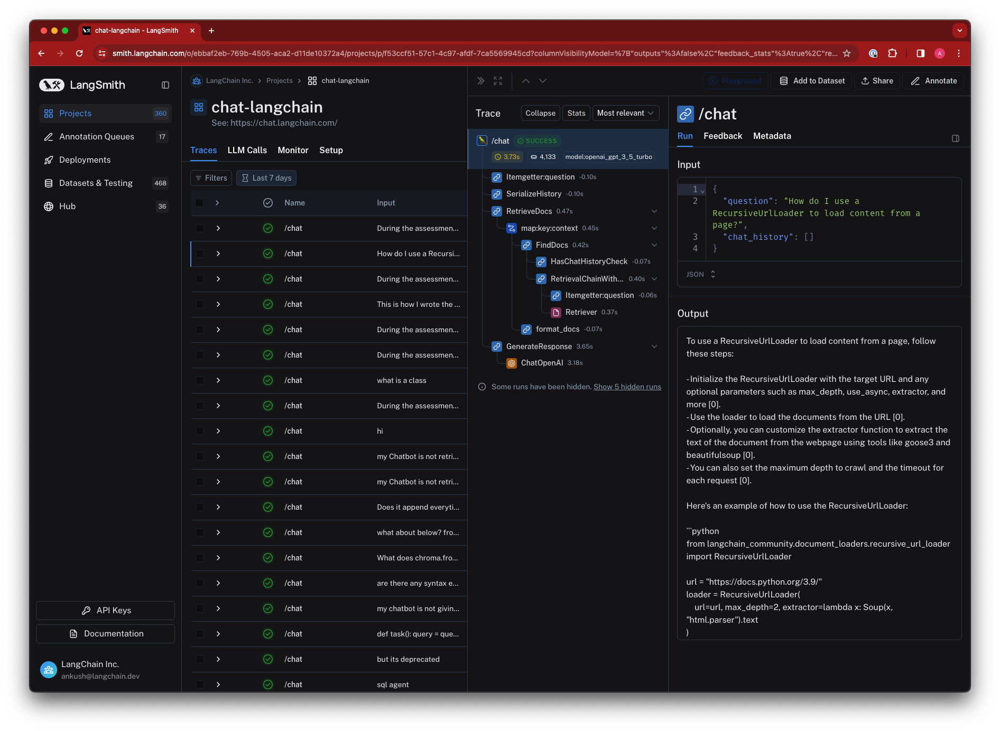

import {
  CodeTabs,
  PythonBlock,
  TypeScriptBlock,
  LangChainPyBlock,
  LangChainJSBlock,
  APIBlock,
} from "@site/src/components/InstructionsWithCode";

import { AccessRunIdBlock } from "@site/src/components/TracingFaq";

# How to log and view traces to LangSmith

LangSmith makes it easy to log and view traces from your LLM application, regardless of which language or framework you use.

### The `@traceable` decorator

The `@traceable` decorator is a simple way to log traces from the LangSmith Python SDK. Simply decorate any function with `@traceable`, set your
`LANGCHAIN_API_KEY` and `LANGCHAIN_TRACING_V2='true'`, and the inputs and outputs of that function will be logged to LangSmith as a `Run`. You can [choose
your desination project](/tracing/faq/customizing_trace_attributes#changing-the-destination-project-at-runtime), [add custom metadata and tags](/tracing/faq/customizing_trace_attributes#adding-metadata-and-tags-to-traces),
and [customize your run name](/tracing/faq/customizing_trace_attributes#customizing-the-run-name).

Also available is the `wrap_openai` function. This function allows you to wrap your OpenAI client in order to automatically log traces, no decorator necessary - it
is applied for you, under the hood.

### The `RunTree` API

Another, more explicit way to log traces to LangSmith is via the `RunTree` API. This API allows you more control over your tracing - you can manually
create runs and children runs to craft your trace however you like. You still need to set your `LANGCHAIN_API_KEY`, but `LANGCHAIN_TRACING_V2` is not
necessary for this method.

### Logging Traces

There are multiple ways to logs traces to LangSmith using the LangSmith SDK or API, OpenAI's Python client, or LangChain.

When using the Python SDK, take special note of the `traceable` decorator and `wrap_openai`, as these methods can be easier to use than the `RunTree` API.

:::note
Please follow the [Setup](/) guide to learn how to sign up and create an API key.
By default, the traces will be logged to a project named `default`.
To log traces to a different project, see [this section](/tracing/faq/customizing_trace_attributes#logging-to-a-specific-project).
:::
:::note
Please make sure to set the `LANGCHAIN_API_KEY` environment variable to your API key before running the examples below.
Additionally, you will need to set `LANGCHAIN_TRACING_V2='true'` if you plan to use either:

- LangChain (Python or JS)
- `@traceable` decorator or `wrap_openai` method in the Python SDK
:::

<CodeTabs
  tabs={[
    PythonBlock(`# To run the example below, ensure the environment variable OPENAI_API_KEY is set
from typing import Any, Iterable
import openai
from langsmith import traceable
from langsmith.run_trees import RunTree
from langsmith.wrappers import wrap_openai\n
### OPTION 1: Use traceable decorator ###
client = openai.Client()
@traceable(run_type="tool", name="Retrieve Context")
def my_tool(question: str) -> str:
    return "During this morning's meeting, we solved all world conflict."\n
@traceable(name="Chat Pipeline Traceable")
def chat_pipeline(question: str):
    context = my_tool(question)
    messages = [
        { "role": "system", "content": "You are a helpful assistant. Please respond to the user's request only based on the given context." },
        { "role": "user", "content": f"Question: {question}\\nContext: {context}"}
    ]
    chat_completion = client.chat.completions.create(
        model="gpt-3.5-turbo", messages=messages
    )
    return chat_completion.choices[0].message.content\n
chat_pipeline("Can you summarize this morning's meetings?")\n
### Alternatively, use the wrapped OpenAI client to log traces automatically:
client = wrap_openai(openai.Client())
client.chat.completions.create(
    messages=[{"role": "user", "content": "Hello, world"}],
    model="gpt-3.5-turbo"
)\n
### OPTION 2: Use RunTree API (more explicit) ###
# This can be a user input to your app
question = "Can you summarize this morning's meetings?"\n
# Create a top-level run
pipeline = RunTree(
    name="Chat Pipeline Run Tree",
    run_type="chain",
    inputs={"question": question}
)\n
# This can be retrieved in a retrieval step
context = "During this morning's meeting, we solved all world conflict."\n
messages = [
    { "role": "system", "content": "You are a helpful assistant. Please respond to the user's request only based on the given context." },
    { "role": "user", "content": f"Question: {question}\\nContext: {context}"}
]\n
# Create a child run
child_llm_run = pipeline.create_child(
    name="OpenAI Call",
    run_type="llm",
    inputs={"messages": messages},
)\n
# Generate a completion
client = openai.Client()
chat_completion = client.chat.completions.create(
    model="gpt-3.5-turbo", messages=messages
)\n
# End the runs and log them
child_llm_run.end(outputs=chat_completion)
child_llm_run.post()\n
pipeline.end(outputs={"answer": chat_completion.choices[0].message.content})
pipeline.post()`),
    TypeScriptBlock(`// To run the example below, ensure the environment variable OPENAI_API_KEY is set
import OpenAI from "openai";
import { RunTree } from "langsmith";\n
// This can be a user input to your app
const question = "Can you summarize this morning's meetings?";\n
const pipeline = new RunTree({
    name: "Chat Pipeline",
    run_type: "chain",
    inputs: { question }
});\n
// This can be retrieved in a retrieval step
const context = "During this morning's meeting, we solved all world conflict.";\n
const messages = [
    { role: "system", content: "You are a helpful assistant. Please respond to the user's request only based on the given context." },
    { role: "user", content: \`Question: \${question}\nContext: \${context}\` }
];\n
// Create a child run
const childRun = await pipeline.createChild({
    name: "OpenAI Call",
    run_type: "llm",
    inputs: { messages },
});\n
// Generate a completion
const client = new OpenAI();
const chatCompletion = await client.chat.completions.create({
    model: "gpt-3.5-turbo",
    messages: messages,
});\n
// End the runs and log them
childRun.end(chatCompletion);
await childRun.postRun();\n
pipeline.end({ outputs: { answer: chatCompletion.choices[0].message.content } });
await pipeline.postRun();`),
    APIBlock(`# To run the example below, ensure the environment variable OPENAI_API_KEY is set
# Here, we'll show you to use the requests library in Python to log a trace, but you can use any HTTP client in any language.
import openai
import requests
from datetime import datetime
from uuid import uuid4\n
def post_run(run_id, name, run_type, inputs, parent_id=None):
    """Function to post a new run to the API."""
    data = {
        "id": run_id.hex,
        "name": name,
        "run_type": run_type,
        "inputs": inputs,
        "start_time": datetime.utcnow().isoformat(),
    }
    if parent_id:
        data["parent_run_id"] = parent_id.hex
    requests.post(
        "https://api.smith.langchain.com/runs",
        json=data,
        headers=headers
    )\n
def patch_run(run_id, outputs):
    """Function to patch a run with outputs."""
    requests.patch(
        f"https://api.smith.langchain.com/runs/{run_id}",
        json={
            "outputs": outputs,
            "end_time": datetime.utcnow().isoformat(),
        },
        headers=headers,
    )\n
# Send your API Key in the request headers
headers = {"x-api-key": "<YOUR API KEY>"}\n
# This can be a user input to your app
question = "Can you summarize this morning's meetings?"\n
# This can be retrieved in a retrieval step
context = "During this morning's meeting, we solved all world conflict."
messages = [
    {"role": "system", "content": "You are a helpful assistant. Please respond to the user's request only based on the given context."},
    {"role": "user", "content": f"Question: {question}\\nContext: {context}"}
]\n
# Create parent run
parent_run_id = uuid4()
post_run(parent_run_id, "Chat Pipeline", "chain", {"question": question})\n
# Create child run
child_run_id = uuid4()
post_run(child_run_id, "OpenAI Call", "llm", {"messages": messages}, parent_run_id)\n
# Generate a completion
client = openai.Client()
chat_completion = client.chat.completions.create(model="gpt-3.5-turbo", messages=messages)\n
# End runs
patch_run(child_run_id, chat_completion.dict())
patch_run(parent_run_id, {"answer": chat_completion.choices[0].message.content})`),
    LangChainPyBlock(`# No extra code is needed to log a trace to LangSmith when using LangChain Python.
# Just run your LangChain code as you normally would with the LANGCHAIN_TRACING_V2 environment variable set to 'true' and the LANGCHAIN_API_KEY environment variable set to your API key.
from langchain_openai import ChatOpenAI
from langchain_core.prompts import ChatPromptTemplate
from langchain_core.output_parsers import StrOutputParser\n
prompt = ChatPromptTemplate.from_messages([
    ("system", "You are a helpful assistant. Please respond to the user's request only based on the given context."),
    ("user", "Question: {question}\nContext: {context}")
])
model = ChatOpenAI(model="gpt-3.5-turbo")
output_parser = StrOutputParser()\n
chain = prompt | model | output_parser\n
question = "Can you summarize this morning's meetings?"
context = "During this morning's meeting, we solved all world conflict."
chain.invoke({"question": question, "context": context})`),
    LangChainJSBlock(`// No extra code is needed to log a trace to LangSmith when using LangChain JS.
// Just run your LangChain code as you normally would with the LANGCHAIN_TRACING_V2 environment variable set to 'true' and the LANGCHAIN_API_KEY environment variable set to your API key.
import { ChatOpenAI } from "@langchain/openai";
import { ChatPromptTemplate } from "@langchain/core/prompts";
import { StringOutputParser } from "@langchain/core/output_parsers";\n
const prompt = ChatPromptTemplate.fromMessages([
["system", "You are a helpful assistant. Please respond to the user's request only based on the given context."],
["user", "Question: {question}\\nContext: {context}"],
]);
const model = new ChatOpenAI({ modelName: "gpt-3.5-turbo" });
const outputParser = new StringOutputParser();\n
const chain = prompt.pipe(model).pipe(outputParser);\n
const question = "Can you summarize this morning's meetings?"
const context = "During this morning's meeting, we solved all world conflict."
await chain.invoke({ question: question, context: context });`),
  ]}
  groupId="client-language"
/>

### Viewing Traces

To view traces, navigate to the project details page for your project (by default, all traces are logged to the "default" project).
Then, click on a row in the traces table to expand the trace. This will bring up a run tree, which shows the parent-child relationships between runs, as well as the inputs and outputs of each run.
You can also view feedback, metadata, and other information in the tabs.


### Setting a sampling rate for tracing

To downsample the number of traces logged to LangSmith, set the `LANGCHAIN_TRACING_SAMPLING_RATE` environment variable to
any float between 0 (no traces) and 1 (all traces). This requires a python SDK version >= 0.0.84, and a JS SDK version >= 0.0.64.
For instance, setting the following environment variable will filter out 25% of traces:

```bash
export LANGCHAIN_TRACING_SAMPLING_RATE=0.75
```

This works for the `traceable` decorator and `RunTree` objects.

### Distributed Tracing

LangSmith supports distributed tracing out of the box, linking runs within a trace across services using context propagation headers (`langsmith-trace` and optional `baggage` for metadata/tags).

Example client-server setup:

- Trace starts on client
- Continues on server

```python
# client.py
from langsmith.run_helpers import get_current_run_tree, traceable
import httpx

@traceable
async def my_client_function():
    headers = {}
    async with httpx.AsyncClient(base_url="...") as client:
        if run_tree := get_current_run_tree():
            # add langsmith-id to headers
            headers.update(run_tree.to_headers())
        return await client.post("/my-route", headers=headers)
```

Then the server (or other service) can continue the trace by passing the headers in as `langsmith_extra`:

```python
# server.py
from langsmith import traceable
from fastapi import FastAPI, Request


@traceable
async def my_application():
    ...


app = FastAPI()  # Or Flask, Django, or any other framework


@app.post("/my-route")
async def fake_route(request: Request):
    # request.headers:  {"langsmith-trace": "..."}
    # as well as optional metadata/tags in `baggage`
    # highlight-next-line
    return await my_application(langsmith_extra={"parent": request.headers})

```

### Turning off tracing

If you've decided you no longer want to trace your runs, you can remove the environment variables configured to start tracing in the first place.
By unsetting the `LANGCHAIN_TRACING_V2` environment variable, traces will no longer be logged to LangSmith.
Note that this currently does not affect the `RunTree` objects.

This setting works both with LangChain and the LangSmith SDK, in both Python and TypeScript.

### Getting the run ID of a logged run

The example below shows how to get the run ID of a logged run using the LangSmith SDK. **To get the run ID of a run using LangChain, you can follow the guide [here](/tracing/faq/langchain_specific_guides#getting-a-run-id-from-a-langchain-call).**

<CodeTabs
  tabs={[
    PythonBlock(`import openai\n
from uuid import uuid4
from langsmith import traceable
from langsmith.run_trees import RunTree
from langsmith.wrappers import wrap_openai\n
messages = [
    { "role": "system", "content": "You are a helpful assistant. Please respond to the user's request only based on the given context." },
    { "role": "user", "content": "Is sunshine good for you?" }
]\n
# Collect run ID using RunTree
run_id = uuid4()
rt = RunTree(
    name="OpenAI Call RunTree",
    run_type="llm",
    inputs={"messages": messages},
    id=run_id
)
client = openai.Client()
chat_completion = client.chat.completions.create(
    model="gpt-3.5-turbo", messages=messages
)
rt.end(outputs=chat_completion)
rt.post()
print("RunTree Run ID: ", run_id)\n
# Collect run ID using openai_wrapper
run_id = uuid4()
client = wrap_openai(openai.Client())
completion = client.chat.completions.create(
    model="gpt-3.5-turbo", messages=messages, langsmith_extra={
        "run_id": run_id,
    },
)
print("OpenAI Wrapper Run ID: ", run_id)\n
# Collect run id using traceable decorator
run_id = uuid4()
@traceable(
    run_type="llm",
    name="OpenAI Call Decorator",
)
def call_openai(
    messages: list[dict], model: str = "gpt-3.5-turbo"
) -> str:
    return client.chat.completions.create(
        model=model,
        messages=messages,
    ).choices[0].message.content
result = call_openai(
    messages,
    langsmith_extra={
        "run_id": run_id,
    },
)
print("Traceable Run ID: ", run_id)`),
    TypeScriptBlock(`import OpenAI from "openai";
import { RunTree } from "langsmith";
import {v4 as uuidv4} from "uuid";\n
const client = new OpenAI();\n
const messages = [
    {role: "system", content: "You are a helpful assistant."},
    {role: "user", content: "Is sunshine food for you?"}
];\n
const runId = uuidv4();
const rt = new RunTree({
    run_type: "llm",
    name: "OpenAI Call RunTree",
    inputs: { messages },
    id: runId
})
const chatCompletion = await client.chat.completions.create({
    model: "gpt-3.5-turbo",
    messages: messages,
});
rt.end(chatCompletion)
await rt.postRun()
console.log("Run ID: ", runId);`),
    APIBlock(`import openai
import requests\n
from datetime import datetime
from uuid import uuid4\n
# Send your API Key in the request headers
headers = {
    "x-api-key": "ls__..."
}\n
messages = [
    { "role": "system", "content": "You are a helpful assistant. Please respond to the user's request only based on the given context." },
    { "role": "user", "content": "Is sunshine good for you?" }
]\n
start_time = datetime.utcnow().isoformat()
client = openai.Client()
chat_completion = client.chat.completions.create(
    model="gpt-3.5-turbo", messages=messages
)\n
run_id = uuid4()
requests.post(
    "https://api.smith.langchain.com/runs",
    json={
        "id": run_id.hex,
        "name": "OpenAI Call",
        "run_type": "llm",
        "inputs": {"messages": messages},
        "start_time": start_time,
        "outputs": {"answer": chat_completion.choices[0].message.content},
        "end_time": datetime.utcnow().isoformat(),
    },
    headers=headers
)
print("API Run ID: ", run_id)`),
  ]}
  groupId="client-language"
/>

### Getting the URL of a logged run

Runs are logged to whichever project you have configured ("default" if none is set), and you can view them by opening the corresponding project details page. To programmatically access the run's URL, you can
use the LangSmith client. Below is an example. To get the run ID of a run, you can follow the guide [here](#getting-the-run-id-of-a-logged-run).

<CodeTabs
  tabs={[
    PythonBlock(`from langsmith import Client\n
client = Client()
run = client.read_run("<run_id>")
print(run.url)`),
    TypeScriptBlock(`import { Client } from "langsmith";\n
const client = new Client();
const runUrl = await client.getRunUrl({runId: "<run_id>"});
console.log(runUrl);
`),
  ]}
  groupId="client-language"
/>

### Deleting traces in a project?

You can delete a project, along with all its associated traces and other information, in the UI or by using the LangSmith client.

Below is an example using the SDK:

<CodeTabs
  tabs={[
    PythonBlock(`from langsmith import Client\n
client = Client()
client.delete_project(project_name="<project_name>")`),
    TypeScriptBlock(`import { Client } from "langsmith";\n
const client = new Client();
await client.deleteProject({projectName: "<project_name>"});
`),
  ]}
  groupId="client-language"
/>
