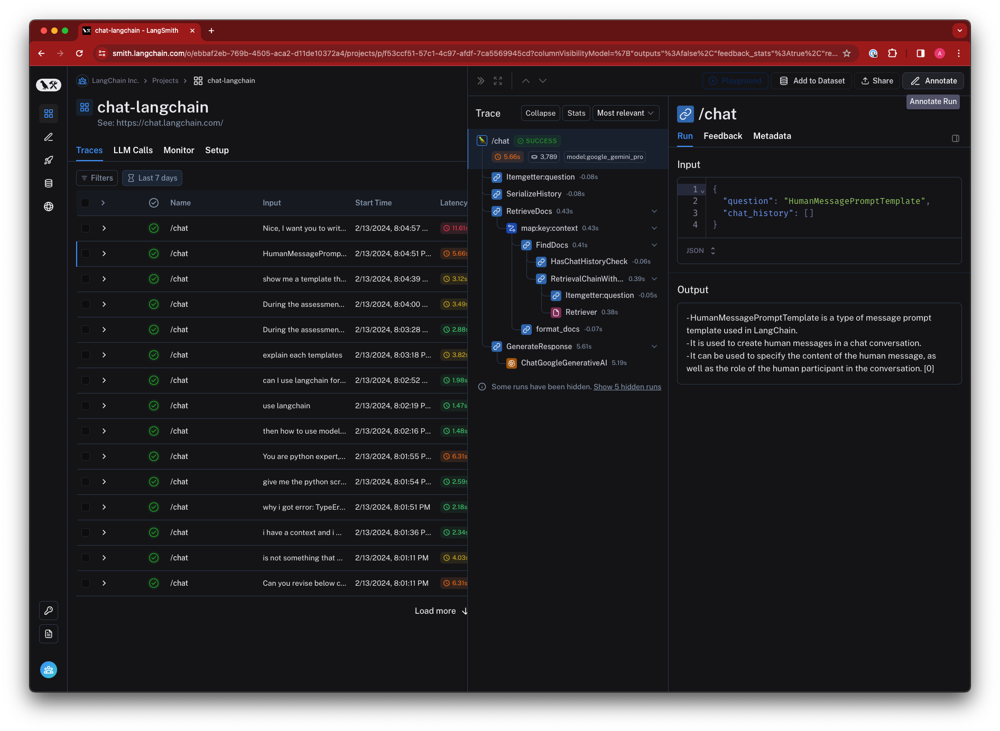
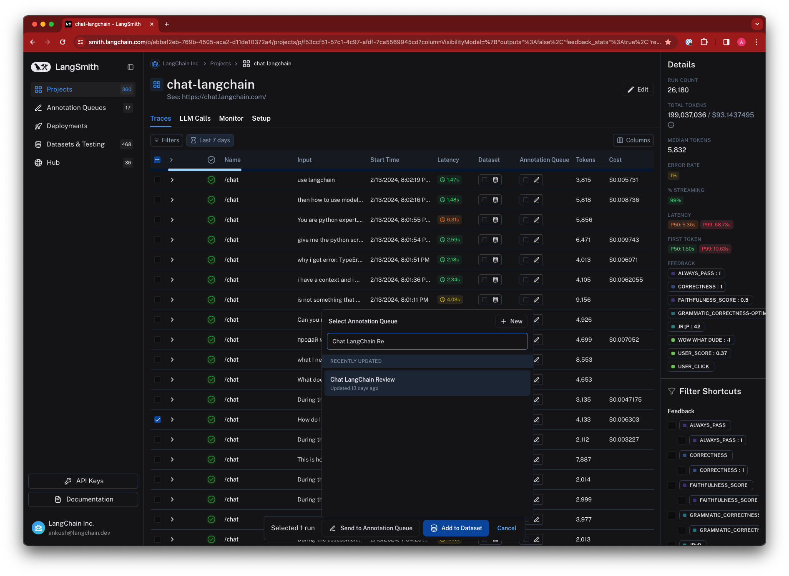
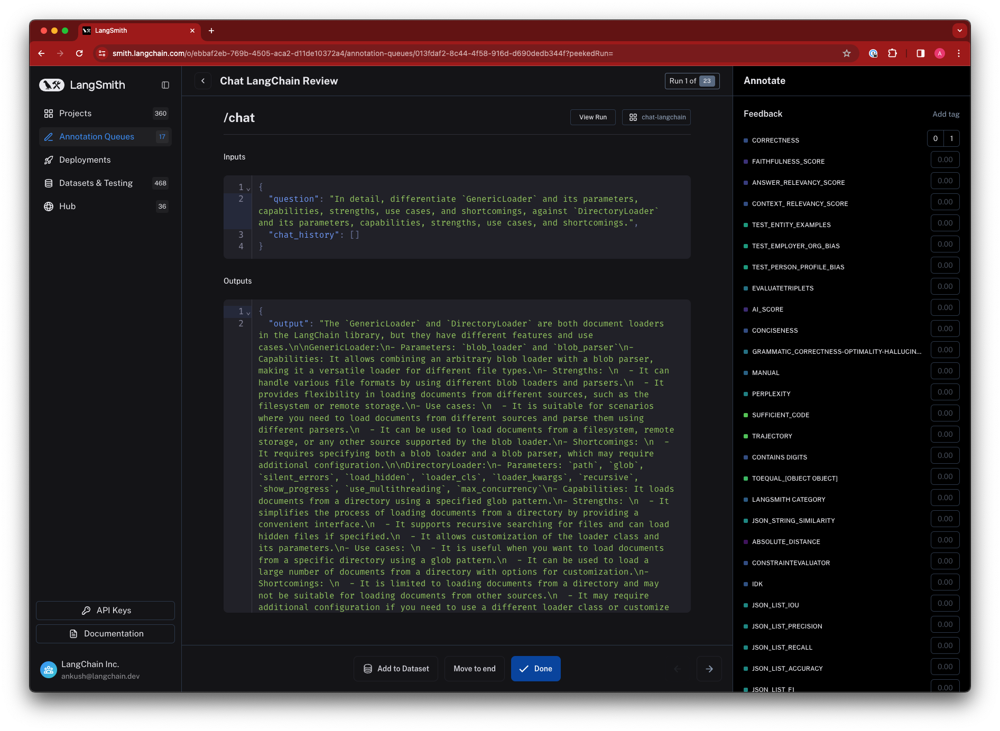

import {
  CodeTabs,
  PythonBlock,
  TypeScriptBlock,
  LangChainPyBlock,
  LangChainJSBlock,
  APIBlock,
} from "@site/src/components/InstructionsWithCode";

# How to Collect Feedback for Traces

Feedback allows you to understand how your users are experiencing your application and helps draw attention to problematic traces. LangSmith makes it easy to collect feedback for traces and view it in the context of the trace, as well as filter traces based on feedback.
For more information on how to score your application programmatically using a testing workflow, see the [Evaluation](/evaluation) section.

### Capturing feedback programmatically

It's often helpful to expose a simple mechanism (such as a thumbs-up, thumbs-down button) to collect user feedback for your application responses. You can then use the LangSmith SDK or API to send feedback for a trace.
To get the run_id of a logged run, see [this guide](/tracing/faq/logging_and_viewing#getting-the-run-id-of-a-logged-run).

<CodeTabs
  tabs={[
    PythonBlock(`from langsmith import Client\n
client = Client()\n
# ... Run your application and get the run_id...
# This information can be the result of a user-facing feedback form\n
client.create_feedback(
    run_id,
    key="feedback-key",
    score=1.0,
    comment="comment",
)`),
    TypeScriptBlock(`import { Client } from "langsmith";
const client = new Client();\n
// ... Run your application and get the run_id...
// This information can be the result of a user-facing feedback form\n
await client.createFeedback(
    runId,
    "feedback-key",
    {
        score: 1.0,
        comment: "comment",
    }
);`),
    APIBlock(`import requests\n
# Send your API Key in the request headers
headers = {
    "x-api-key": "ls__...",
}\n
requests.post(
    "https://api.smith.langchain.com/feedback",
    headers=headers,
    json={
        "run_id": run_id.hex,
        "key": "feedback-key",
        "score": 1.0,
        "comment": "comment",
    },
)`),
  ]}
  groupId="client-language"
/>

### Annotating traces with feedback

LangSmith allows you to manually annotate traces with feedback within the application. This can be useful for adding context to a trace, such as a user's comment or a note about a specific issue.
You can annotate a trace either inline or by sending the trace to an Annotation Queue, which allows you closely inspect and log feedbacks to runs one at a time.
Feedback tags are associated with your tenant.

You can click the top right corner of the trace to annotate it inline

Or you can send the trace to the Annotation Queue

You can annotate the trace in an Annotation Queue using one of the feedback tags associated with your tenant (or create a new one)

