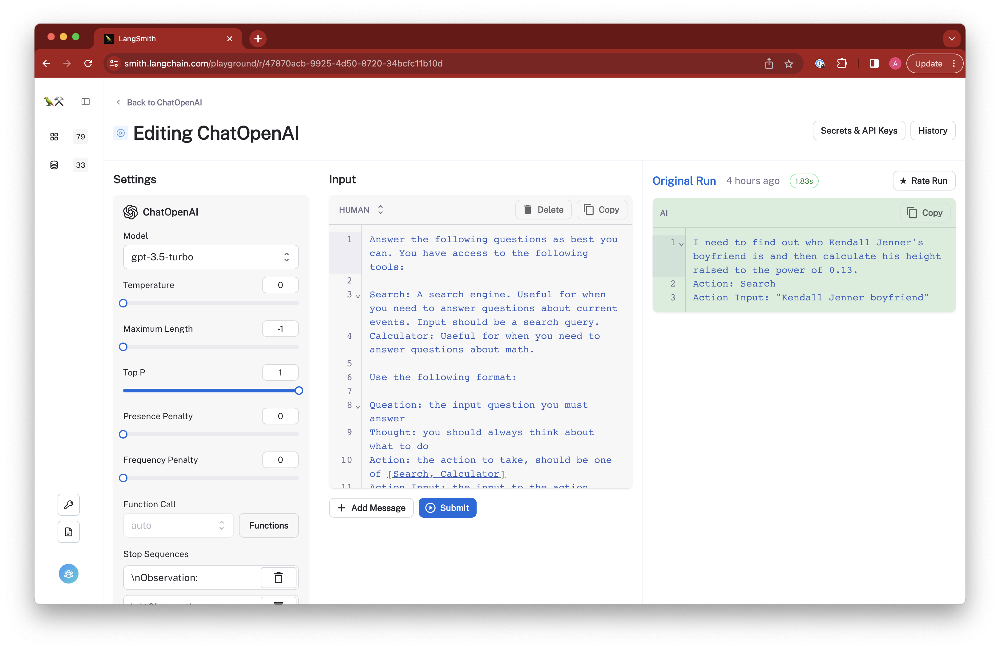
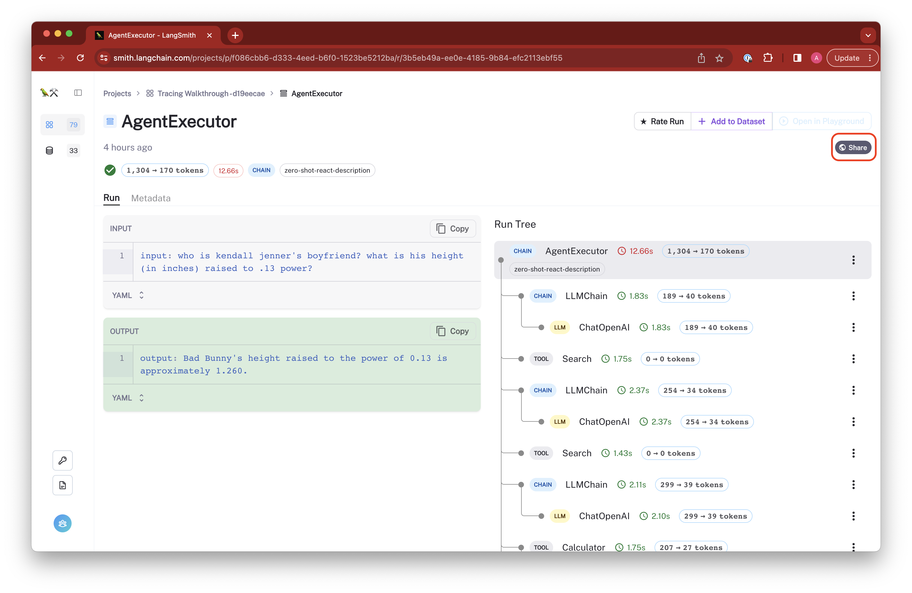
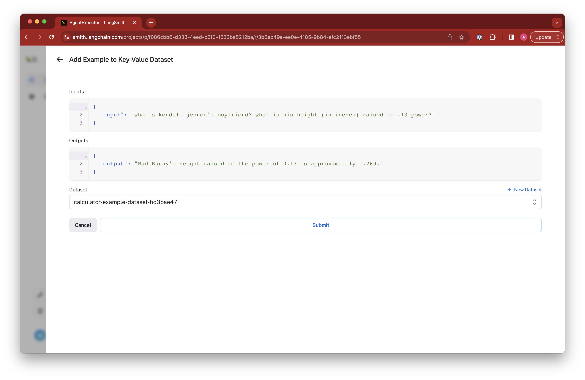

import {
  LangChainQuickStartCodeTabs,
  ConfigureEnvironmentCodeTabs,
} from "@site/src/components/QuickStart";

# Overview

LangSmith helps you visualize, debug, and improve your LLM apps. This section reviews some functionality LangSmith provides around logging and tracing.

<!-- TODO overview -->

## Log runs

LLM applications can get complicated quickly, especially if you are building working with agents or complex chains where there could be many layers of LLMs and other components. LangSmith makes it easy to log runs of your LLM applications so you can inspect the inputs and outputs of each component in the chain. This is especially useful when you are trying to debug your application or understand how a given component is behaving. This is done in two steps.

1. Configure environment

<ConfigureEnvironmentCodeTabs />

2. Run application

<LangChainQuickStartCodeTabs />

## Organize your work

Runs are saved to projects. Root level runs are called `traces` and are saved to the `default` project if you don't specify a project name. You can also view all of your runs un-nested.
You can create as many projects as you like to help you organize your work by context. For instance, you might have a project for each of your production LLM application environments, or you might have a project to separate runs on different days. You can also create projects for specific experiments or debugging sessions.

## Visualize your runs

Every time you run a LangChain component with tracing enabled or use the LangSmith SDK to save run trees directly, the call hierarchy for the run is saved and can be visualized in the app. You can drill down into the components inputs and outputs, invocation parameters, response time, feedback, token usage, and other important information to help you inspect your run. You can even rate the run to help you keep collect data for training, testing, and other analysis.

## Running in the playground

Once you have a run trace, you can directly modify the prompts and parameters of supported chains, LLMs, and chat models to see how they impact the output. This is a great way to quickly iterate on model and prompt configurations without having to switch contexts. All playground runs are logged to a "playground" project for safe keeping.

## Share your work

You can share any of the runs you've logged to LangSmith. This makes it easy to publish and reproduce your work. For instance, if you find a bug or unexpected output for a given setup, you can share it with your team or in an Issue on LangChain to make it easier to address.

## Create datasets for testing and evaluation

Add any representative runs from your debug projects to a dataset and use them for [testing and evaluation](../evaluation).

