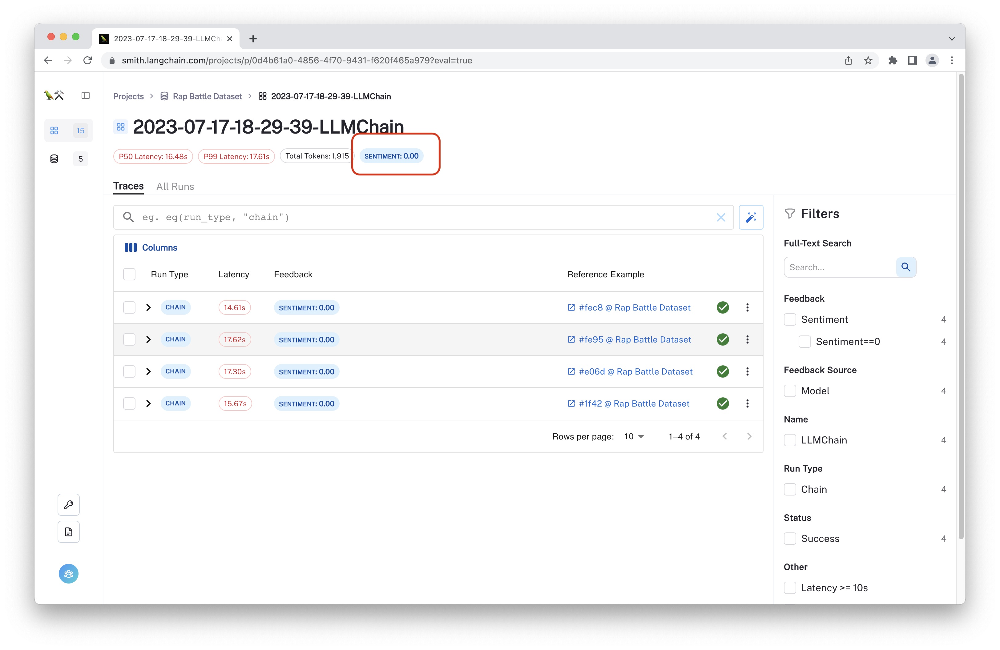

# Monitor Application Sentiment

In this guide, you will use create an evaluator to predict the sentiment of user queries in your production application. This technique can be flexibly applied to traced runs to add additional measurements to your unstructured data.

:::note Bias in Sentiment Analysis
Predicting sentiment from text has known [biases](https://arxiv.org/abs/1805.04508) and limitations. It's important to understand the implications of this before deciding whether it's appropriate to use sentiment and other NLP metrics in instrumenting your application.
:::

## Prerequisites

This guide assumes you have already deployed an LLM application and are logging traces in a monitoring project. While all the steps should work in a debug project as well, the signal is likely to be less useful.

## Step 1: Define Evaluator

You will be using an LLMChain to do the sentiment classification on the run's inputs. We will use a GPT-3.5 turbo model here, but you can use any model you like.

```python
from langsmith.evaluation import EvaluationResult, RunEvaluator
from langsmith.schemas import Example, Run

from langchain.chains import LLMChain
from langchain.chat_models import ChatOpenAI


class SentimentEvaluator(RunEvaluator):
    def __init__(self):
        prompt = """Is the predominant sentiment in the following statement positive, negative, or neutral?
---------
Statement: {input}
---------
Respond in one word: positive, negative, or neutral.
Sentiment:"""

        llm = ChatOpenAI(model="gpt-3.5-turbo", temperature=0.0)
        self.chain = LLMChain.from_string(llm=llm, template=prompt)

    def evaluate_run(self, run: Run, example: Example) -> EvaluationResult:
        input_str = str(list(run.inputs.values())[0])
        prediction = self.chain.run(input_str)
        # Strip the prompt
        prediction = prediction.strip()
        score = {"positive": 1, "negative": -1, "neutral": 0}.get(prediction)
        return EvaluationResult(
            key="sentiment",
            value=prediction,
            score=score,
        )
```

## Step 2: Evaluate

Now that you've defined your evaluator, use it to predict the sentiment of run inputs. You can do this by iterating over the runs in your project and evaluating each run with the object you just defined.

```python
from langsmith import Client

client = Client()
evaluator = SentimentEvaluator()
for run in client.list_runs(
    project_name="my-project",
    execution_order=1, # Do not return child / nested runs
):
        client.evaluate_run(run, evaluator)
```

## Step 3: View aggregate feedback

The sentiment predictions are logged as feedback and can be viewed in the application UI. You can view the aggregate sentiment scores over the project and filter by feedback values.



You can use the client to filter and export run and feedback information.

```python
# Get the aggregate stats for the project
project = client.read_project(project_name="my-project")
aggregate_feedback = project.feedback_stats

# Get feedback per run
rowwise_feedback = [
    run.feedback_stats
    for run in client.list_runs(
        project_name="my-project",
        execution_order=1,
        )
]

# Get runs that were scored as negative
negative_runs = client.list_runs(
    project_name="my-project",
    query="and(eq(feedback_key, "sentiment"), eq(feedback_score, -1))",
)
```

If you use [run tags](../../tracing/tracing-faq#how-do-i-add-tags-to-runs) to organize runs within a project, you can use these for subset and cohort analysis.

```python
# Get feedback for runs
# with the tag "my-tag"
rowwise_feedback = [
    run.feedback_stats
    for run in client.list_runs(
        project_name="my-project",
        execution_order=1,
        query='has(tags, "my-tag")'
        )
]
```
