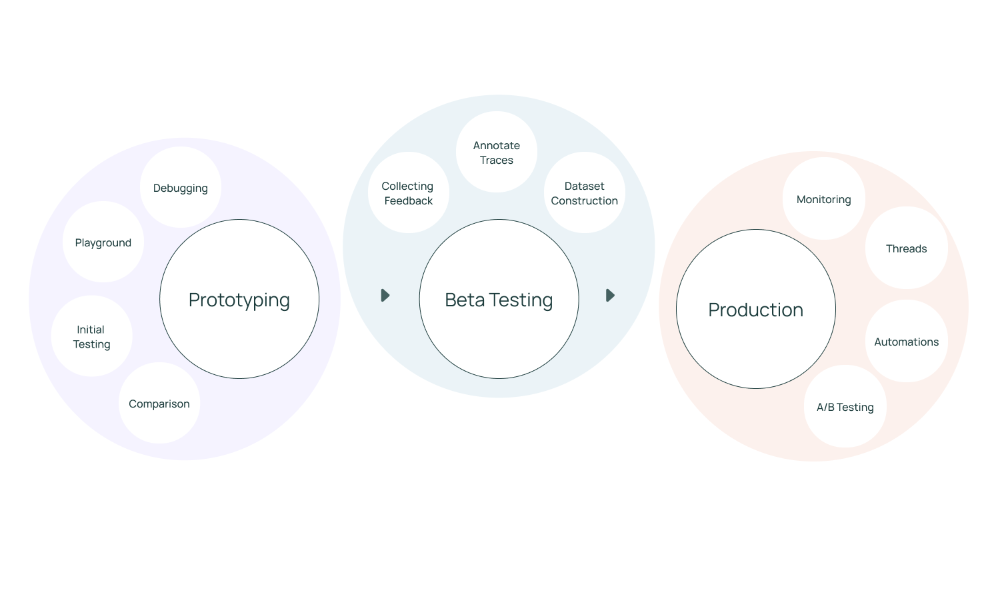

# LangSmith User Guide

LangSmith is a platform for LLM application development, monitoring, and testing. In this guide, we’ll highlight the breadth of workflows LangSmith supports and how they fit into each stage of the application development lifecycle. We hope this will inform users how to best utilize this powerful platform or give them something to consider if they’re just starting their journey.

## Prototyping
Prototyping LLM applications often involves quick experimentation between prompts, model types, retrieval strategy and other parameters.
The ability to rapidly understand how the model is performing — and debug where it is failing — is incredibly important for this phase.

#### Debugging
When developing new LLM applications, we suggest having LangSmith tracing enabled by default.
Oftentimes, it isn’t necessary to look at every single trace. However, when things go wrong (an unexpected end result, infinite agent loop, slower than expected execution, higher than expected token usage), it’s extremely helpful to debug by looking through the application traces. LangSmith gives clear visibility and debugging information at each step of an LLM sequence, making it much easier to identify and root-cause issues.
We provide native rendering of chat messages, functions, and retrieve documents.

#### Initial Test Set
While many developers still ship an initial version of their application based on “vibe checks”, we’ve seen an increasing number of engineering teams start to adopt a more test driven approach. LangSmith allows developers to create datasets, which are collections of inputs and reference outputs, and use these to run tests on their LLM applications.
These test cases can be uploaded in bulk, created on the fly, or exported from application traces. LangSmith also makes it easy to run custom evaluations (both LLM and heuristic based) to score test results.

#### Comparison View
When prototyping different versions of your applications and making changes, it’s important to see whether or not you’ve regressed with respect to your initial test cases.
Oftentimes, changes in the prompt, retrieval strategy, or model choice can have huge implications in responses produced by your application.
In order to get a sense for which variant is performing better, it’s useful to be able to view results for different configurations on the same datapoints side-by-side. We’ve invested heavily in a user-friendly comparison view for test runs to track and diagnose regressions in test scores across multiple revisions of your application.

#### Playground
LangSmith provides a playground environment for rapid iteration and experimentation.
This allows you to quickly test out different prompts and models. You can open the playground from any prompt or model run in your trace.
Every playground run is logged in the system and can be used to create test cases or compare with other runs.

## Beta Testing
Beta testing allows developers to collect more data on how their LLM applications are performing in real-world scenarios. In this phase, it’s important to develop an understanding for the types of inputs the app is performing well or poorly on and how exactly it’s breaking down in those cases. Both feedback collection and run annotation are critical for this workflow. This will help in curation of test cases that can help track regressions/improvements and development of automatic evaluations.

#### Collecting Feedback
When launching your application to an initial set of users, it’s important to gather human feedback on the responses it’s producing. This helps draw attention to the most interesting runs and highlight edge cases that are causing problematic responses. LangSmith allows you to attach feedback scores to logged traces (oftentimes, this is hooked up to a feedback button in your app), then filter on traces that have a specific feedback tag and score. A common workflow is to filter on traces that receive a poor user feedback score, then drill down into problematic points using the detailed trace view.

#### Annotating Traces
LangSmith also supports sending runs to annotation queues, which allow annotators to closely inspect interesting traces and annotate them with respect to different criteria. Annotators can be PMs, engineers, or even subject matter experts. This allows users to catch regressions across important evaluation criteria.

#### Adding Runs to a Dataset
As your application progresses through the beta testing phase, it's essential to continue collecting data to refine and improve its performance. LangSmith enables you to add runs as examples to datasets (from both the project page and within an annotation queue), expanding your test coverage on real-world scenarios. This is a key benefit in having your logging system and your evaluation/testing system in the same platform.

## Production
Closely inspecting key data points, growing benchmarking datasets, annotating traces, and drilling down into important data in trace view are workflows you’ll also want to do once your app hits production. However, especially at the production stage, it’s crucial to get a high-level overview of application performance with respect to latency, cost, and feedback scores. This ensures that it's delivering desirable results at scale.

#### Monitoring and A/B Testing
LangSmith provides monitoring charts that allow you to track key metrics over time. You can expand to view metrics for a given period and drill down into a specific data point to get a trace table for that time period — this is especially handy for debugging production issues.

LangSmith also allows for tag and metadata grouping, which allows users to mark different versions of their applications with different identifiers and view how they are performing side-by-side within each chart. This is helpful for A/B testing changes in prompt, model, or retrieval strategy.