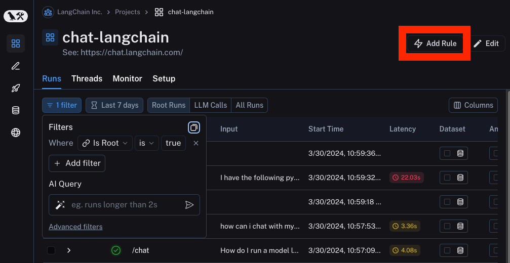
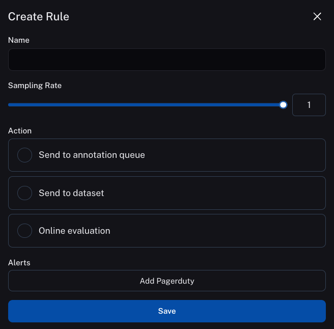
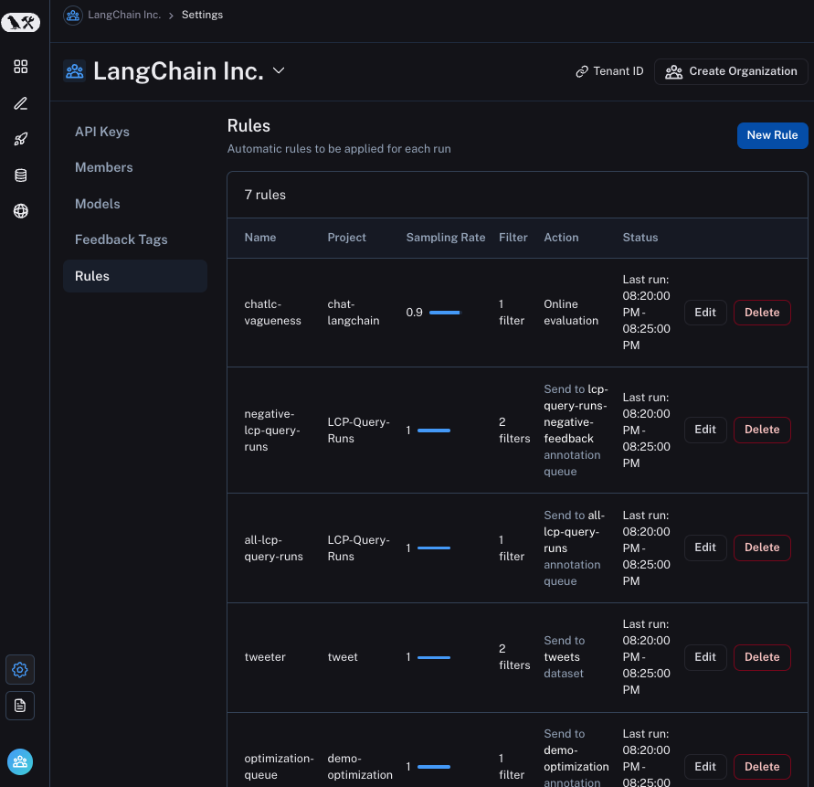
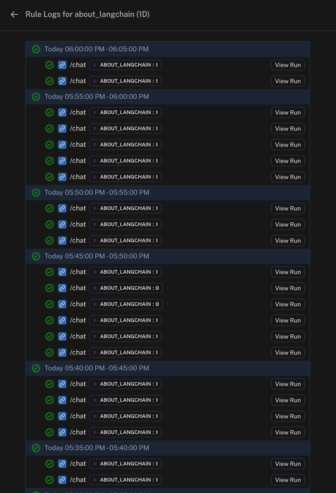

# How to apply automations

While it is useful to look at all datapoints by hand, it can be useful to create automations that automatically take action upon a filtered subset of datapoints.
Automations are defined by a filter, sampling rate and an action

## How to create a filter

You can create a filter by doing what you normally would to filter traces. When you then click on `Rules`, an automation is created with that specified filter.

## How to specify a sampling rate

You can specify a sampling rate (between 0 and 1) for automations. This will control the percent of the filtered runs that are sent to an automation

## How to manage automations

You can manage automations by going `Settings` -> `Rules`. From here you can view all automations you already created, you can edit them, and you can delete them.
You can also create new automations, although it is generally recommended you create automations from the `Traces` panel in a Project, so that you can see the filter you apply.

### How to view logs for your automations

You can view logs for your automations by going to `Settings` -> `Rules` and click on the `Logs` button in any row.

You can also get to logs by clicking on `Rules` in the top right hand corner of any project details page, then clicking on `See Logs` for any rule.

Logs allow you to gain confidence that your rules are working as expected. You can now view logs that list all runs processed by a given rule for the past day. For rules that apply online evaluation scores, you can easily see the output score and navigate to the run. For rules that add runs as examples to datasets, you can view the example produced.
If a particular rule execution has triggered an error, you can view the error message by hovering over the error icon.

