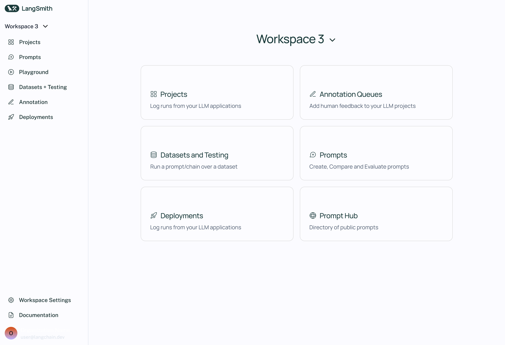
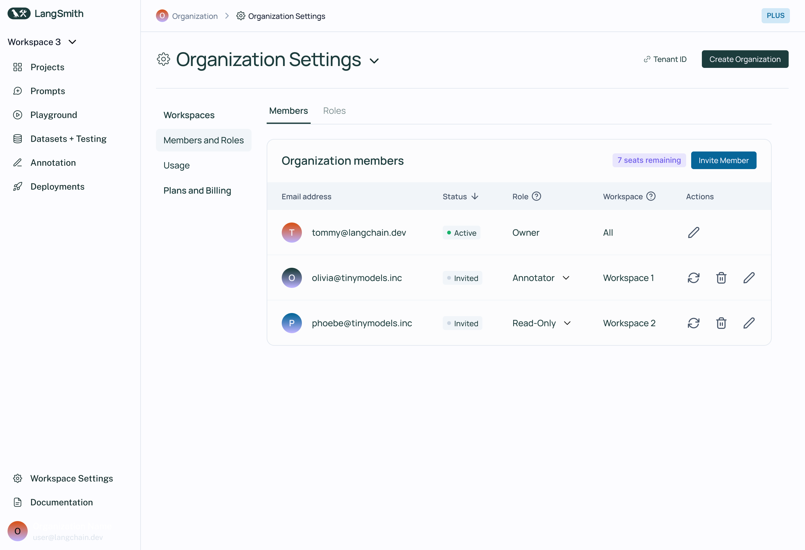
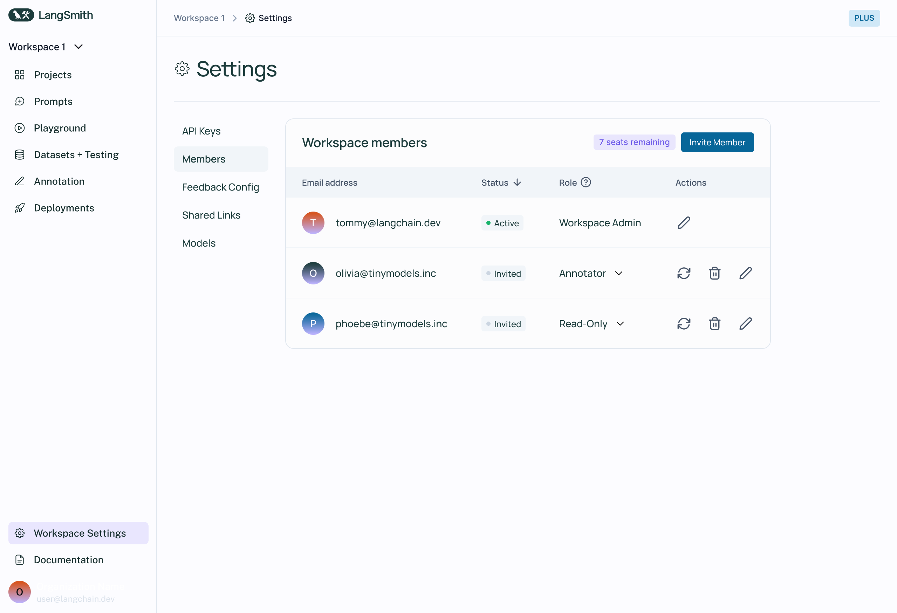
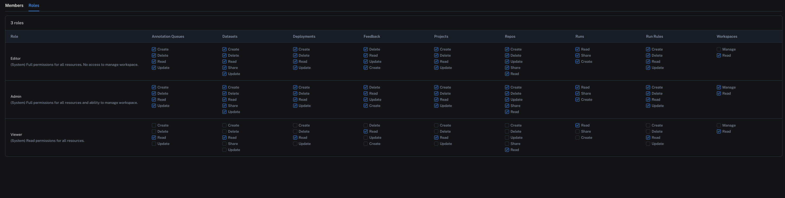

# Admin

This conceptual guide covers topics related to managing users, organizations, and workspaces within LangSmith.

## Organizations

An organization is a logical grouping of users within LangSmith with its own billing configuration. Typically, there is one organization per company. An organization can have multiple workspaces. For more details, see the [setup guide](../../how_to_guides/setup/set_up_organization.mdx).

## Workspaces (coming soon) {#workspaces}

A workspace is a logical grouping of users and resources within an organization. Users may have permissions in a workspace that grant them access to the resources in that workspace, including tracing projects, datasets, annotation queues, and prompts. For more details, see the [setup guide](../../how_to_guides/setup/set_up_workspace.mdx).

## Users

A user is a person who has access to LangSmith. Users can be members of one or more organizations and workspaces within those organizations.

Organization members are managed in organization settings:

And workspace members are managed in workspace settings:

## API Keys

:::danger Dropping support July 1st, 2024
We will be dropping support for API keys on July 1st 2024 in favor of personal access tokens (PATs) and service keys. We recommend using PATs and service keys for all new integrations. API keys prefixed with `ls__` will NO LONGER work after July 1st, 2024.
:::

API keys are used to authenticate requests to the LangSmith API. They are created by users and scoped to a workspace. This means that all requests made with an API key will be associated with the workspace that the key was created in. The API key will have the ability to create, read, update, delete all resources within that workspace.

API keys are prefixed with `ls__`. These keys will also show up in the UI under the service keys tab.

### Personal Access Tokens (PATs)

Personal Access Tokens (PATs) are used to authenticate requests to the LangSmith API. They are created by users and scoped to a user. The PAT will have the same permissions as the user that created it.

PATs are prefixed with `lsv2_pt_`

### Service Keys

Service keys are similar to PATs, but are used to authenticate requests to the LangSmith API on behalf of a service account.

Service keys are prefixed with `lsv2_sk_`

:::note
To see how to create a service key or Personal Access Token, see the [setup guide](../../how_to_guides/setup/create_account_api_key.mdx)
:::

## Organization Roles

Organization roles are distinct from the Enterprise feature (RBAC) below and are used in the context of multiple [workspaces](#workspaces). Your organization role determines your workspace membership characteristics and your organization-level permissions. See the [organization setup guide](../../how_to_guides/setup/set_up_organization#organization-roles) for more information.

## Workspace Roles

:::note
RBAC (Role-Based Access Control) is a feature that is only available to Enterprise customers. If you are interested in this feature, please contact our sales team at sales@langchain.dev
Other plans default to using the Admin role for all users.
:::

Roles are used to define the set of permissions that a user has within a workspace. There are three built-in system roles that cannot be edited:

- `Admin` - has full access to all resources within the workspace
- `Viewer` - has read-only access to all resources within the workspace
- `Editor` - has full permissions except for workspace management (adding/removing users, changing roles, configuring service keys)

Admins can also create/edit custom roles with specific permissions for different resources.

Roles can be managed in organization settings under the `Roles` tab:

For more details on assigning and creating roles, see the [access control setup guide](../../how_to_guides/setup/set_up_access_control.mdx).
