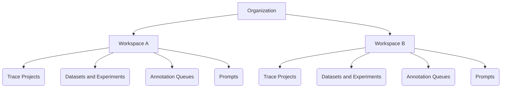

# Admin

This conceptual guide covers topics related to managing users, organizations, and workspaces within LangSmith.

## Organizations

An organization is a logical grouping of users within LangSmith with its own billing configuration. Typically, there is one organization per company. An organization can have multiple workspaces. For more details, see the [setup guide](../../how_to_guides/setup/set_up_organization.mdx).

When you log in for the first time, a personal organization will be created for you automatically. If you'd like to collaborate with others, you can create a separate organization and invite your team members to join.
There are a few important differences between your personal organization and shared organizations:

| Feature             | Personal            | Shared                                                       |
| ------------------- | ------------------- | ------------------------------------------------------------ |
| Maximum workspaces  | 1                   | Variable, depending on plan (see [pricing page](../pricing)) |
| Collaboration       | Cannot invite users | Can invite users                                             |
| Billing: paid plans | Developer plan only | All other plans available                                    |

## Workspaces {#workspaces}

A workspace is a logical grouping of users and resources within an organization. Users may have permissions in a workspace that grant them access to the resources in that workspace, including tracing projects, datasets, annotation queues, and prompts. For more details, see the [setup guide](../../how_to_guides/setup/set_up_workspace.mdx).

The following image shows a sample workspace settings page:

The following diagram explains the relationship between organizations, workspaces, and the different resources scoped to and within a workspace: 

 

See the table below for details on which features are available in which scope (organization or workspace):

| Resource/Setting                                                            | Scope        |
| --------------------------------------------------------------------------- | ------------ |
| Trace Projects                                                              | Workspace    |
| Annotation Queues                                                           | Workspace    |
| Deployments                                                                 | Workspace    |
| Datasets &amp; Testing                                                      | Workspace    |
| Prompts                                                                     | Workspace    |
| API Keys                                                                    | Workspace    |
| Settings including Secrets, Feedback config, Models, Rules, and Shared URLs | Workspace    |
| User management: Invite User to Workspace                                   | Workspace    |
| RBAC: Assigning Workspace Roles                                             | Workspace    |
| Data Retention, Usage Limits                                                | Workspace\*  |
| Plans and Billing, Credits, Invoices                                        | Organization |
| User management: Invite User to Organization                                | Organization |
| Adding Workspaces                                                           | Organization |
| Assigning Organization Roles                                                | Organization |
| RBAC: Creating/Editing/Deleting Custom Roles                                | Organization |

\*&nbsp;Data retention settings and usage limits will be available soon for the organization level as well

## Users

A user is a person who has access to LangSmith. Users can be members of one or more organizations and workspaces within those organizations.

Organization members are managed in organization settings:

And workspace members are managed in workspace settings:

## API keys

:::danger Dropping support July 1st, 2024
We will be dropping support for API keys on July 1st 2024 in favor of personal access tokens (PATs) and service keys. We recommend using PATs and service keys for all new integrations. API keys prefixed with `ls__` will NO LONGER work after July 1st, 2024.
:::

API keys are used to authenticate requests to the LangSmith API. They are created by users and scoped to a workspace. This means that all requests made with an API key will be associated with the workspace that the key was created in. The API key will have the ability to create, read, update, delete all resources within that workspace.

API keys are prefixed with `ls__`. These keys will also show up in the UI under the service keys tab.

### Personal Access Tokens (PATs)

Personal Access Tokens (PATs) are used to authenticate requests to the LangSmith API. They are created by users and scoped to a user. The PAT will have the same permissions as the user that created it.

PATs are prefixed with `lsv2_pt_`

### Service keys

Service keys are similar to PATs, but are used to authenticate requests to the LangSmith API on behalf of a service account.

Service keys are prefixed with `lsv2_sk_`

:::note
To see how to create a service key or Personal Access Token, see the [setup guide](../../how_to_guides/setup/create_account_api_key.mdx)
:::

## Organization roles

Organization roles are distinct from the Enterprise feature (RBAC) below and are used in the context of multiple [workspaces](#workspaces). Your organization role determines your workspace membership characteristics and your organization-level permissions. See the [organization setup guide](../../how_to_guides/setup/set_up_organization#organization-roles) for more information.

The organization role selected also impacts workspace membership as described here:

- `Organization Admin` grants full access to manage all organization configuration, users, billing, and workspaces. **An `Organization Admin` has `Admin` access to all workspaces in an organization**
- `Organization User` may read organization information but cannot execute any write actions at the organization level. **An `Organization User` can be added to a subset of workspaces and assigned workspace roles as usual (if RBAC is enabled), which specify permissions at the workspace level.**

:::info
The `Organization User` role is only available in organizations on plans with multiple workspaces. In organizations limited to a single workspace, all users are `Organization Admins`.
Custom organization-scoped roles are not available yet.
:::

See the table below for all organization permissions:

|                                             | Organization User | Organization Admin |
| ------------------------------------------- | ----------------- | ------------------ |
| View organization configuration             | ✅                | ✅                 |
| View organization roles                     | ✅                | ✅                 |
| View organization members                   | ✅                | ✅                 |
| View data retention settings                | ✅                | ✅                 |
| View usage limits                           | ✅                | ✅                 |
| Admin access to all workspaces              |                   | ✅                 |
| Manage billing settings                     |                   | ✅                 |
| Create workspaces                           |                   | ✅                 |
| Create, edit, and delete organization roles |                   | ✅                 |
| Invite new users to organization            |                   | ✅                 |
| Delete user invites                         |                   | ✅                 |
| Remove users from an organization           |                   | ✅                 |
| Update data retention settings\*            |                   | ✅                 |
| Update usage limits\*                       |                   | ✅                 |

## Workspace roles (RBAC) {#workspace-roles}

:::note
RBAC (Role-Based Access Control) is a feature that is only available to Enterprise customers. If you are interested in this feature, please contact our sales team at sales@langchain.dev
Other plans default to using the Admin role for all users.
:::

Roles are used to define the set of permissions that a user has within a workspace. There are three built-in system roles that cannot be edited:

- `Admin` - has full access to all resources within the workspace
- `Viewer` - has read-only access to all resources within the workspace
- `Editor` - has full permissions except for workspace management (adding/removing users, changing roles, configuring service keys)

Admins can also create/edit custom roles with specific permissions for different resources.

Roles can be managed in organization settings under the `Roles` tab:

For more details on assigning and creating roles, see the [access control setup guide](../../how_to_guides/setup/set_up_access_control.mdx).
