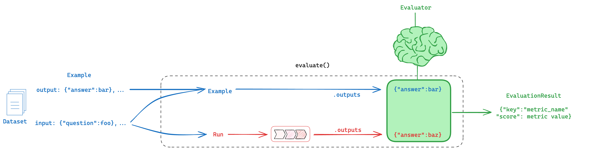

# Evaluation

Welcome to the comprehensive guide on evaluations in LangSmith!

:::tip

To supplement this guide:

- See our [LangSmith Evaluation video series](https://youtu.be/vygFgCNR7WA?feature=shared)

:::

Evaluations play a crucial role in assessing the performance of AI applications. They provide answers to essential questions, such as how minor changes to prompts can impact the output of your LLM and which model among a set of candidates is the most suitable for your specific requirements. By conducting thorough evaluations, you can ensure that your AI applications deliver optimal performance and adhere to the highest quality standards.

LangSmith provides a powerful framework for executing evaluations on your AI applications. The core components of LangSmith evaluation include:

- `Datasets`: These are the inputs used for conducting evaluations. Datasets can be meticulously curated by hand or collected from user interactions with your application, providing a diverse range of examples for assessment.
- `Evaluator`: An evaluator is a function responsible for scoring your AI application based on the provided dataset. It processes the dataset inputs, feeds them into your application, and evaluates the generated outputs. The resulting score is logged as feedback in LangSmith and associated with the trace of the task that produced the output, enabling detailed analysis and insights.

:::tip

To learn more about traces:

- See the [`LangSmith Primitives` video in our LangSmith Evaluation series](https://youtu.be/OuFUy45RsHU?feature=shared)
- See our [Conceptual Guide on tracing in LangSmith](https://docs.smith.langchain.com/concepts/tracing)

:::

In the sections below, we’ll explore the fundamentals of Datasets and Evaluators, discuss popular evaluation Use-Cases, and provide a decision tree to help you select the right evaluation approach for your application.

## Datasets

Datasets form the cornerstone of the evaluation workflow in LangSmith, serving as collections of Examples that provide the necessary inputs and, optionally, expected outputs for assessing your AI applications. Each Example within a dataset represents a single data point, consisting of an `inputs` dictionary, an optional `output` dictionary, and an optional `metadata` dictionary. To maintain consistency and ensure meaningful evaluations, all examples within a dataset should adhere to the same schema.

:::tip

There are many wants to manage and customize datasets:

- Explore the [`Manually curated datasets` video in our LangSmith Evaluation series](https://youtu.be/N9hjO-Uy1Vo?feature=shared) to learn how to create datasets by hand-selecting examples.
- Discover how to leverage user interactions with your application to generate datasets in the [`Datasets from traces` video](https://youtu.be/hPqhQJPIVI8?feature=shared).
- Dive into the concept of dataset splits and learn how to partition your datasets for training, validation, and testing purposes in the [`Dataset splits` video](https://youtu.be/FQMn_FQV-fI?feature=shared).
- Refer to our comprehensive [documentation on dataset management](https://docs.smith.langchain.com/how_to_guides/datasets/manage_datasets_in_application#create-and-manage-dataset-splits) for detailed instructions on creating, organizing, and manipulating datasets within your application.

:::

By carefully curating and structuring your datasets, you lay the groundwork for effective evaluations in LangSmith. Whether you choose to manually create datasets, leverage user-generated data, or employ dataset splits, LangSmith provides the flexibility and tools to tailor your datasets to your specific evaluation requirements.

### Types of Datasets

LangSmith offers three distinct dataset types—kv, llm, and chat—each designed to accommodate specific input and output schemas. These dataset types are crucial for organizing and running evaluations effectively within the LangSmith framework.

1. `kv` (Key-Value) Dataset:

   - The kv dataset is the most versatile and default type, suitable for a wide range of evaluation scenarios.
   - In kv datasets, inputs and outputs are represented as arbitrary key-value pairs, allowing for flexibility in data representation.
   - This dataset type is ideal for evaluating chains and agents that require multiple inputs or generate multiple outputs.
   - However, running evaluations on kv datasets can be more complex, especially when multiple keys are involved. In such cases, you need to manually specify the `prepare_data` function in any off-the-shelf evaluators to ensure the correct information is used for scoring.

2. `llm` (Language Model) Dataset:

   - The llm dataset is specifically designed for evaluating "completion" style language models, where the input is a string prompt and the output is a string response.
   - In llm datasets, the "inputs" dictionary contains a single "input" key mapped to the prompt string, and the "outputs" dictionary contains a single "output" key mapped to the corresponding response string.
   - This dataset type simplifies the evaluation process for language models by providing a standardized format for inputs and outputs.

3. `chat` Dataset:
   - The chat dataset is tailored for evaluating language models that utilize structured "chat" messages as inputs and outputs.
   - Each example in a chat dataset expects an "inputs" dictionary with a single "input" key mapped to a list of serialized chat messages, and an "outputs" dictionary with a single "output" key mapped to a list of serialized chat messages.
   - This dataset type is particularly useful for evaluating conversational AI systems or chatbots that rely on structured message exchanges.

By selecting the appropriate dataset type for your evaluation needs, you can ensure that your data is organized and structured in a way that aligns with the specific requirements of your AI application. Whether you're working with key-value pairs, string-based prompts and responses, or structured chat messages, LangSmith provides the flexibility to accommodate your evaluation scenarios. These datasets can come from a variety of sources, including:

- `Manually curated examples`: Hand-selected examples that represent a diverse range of inputs and outputs for evaluation.
- `Historical logs`: Logs of past interactions with your application, offering insights into real-world performance and user behavior.
- `Synthetic data`: Artificially generated examples that simulate various scenarios and edge cases for evaluation.

## Evaluators

Evaluators are functions that score how well your system performs on a particular example, serving as a judge. During an evaluation, your example inputs are processed through your Task to produce Runs, which are then passed to your evaluator along with the Example. The evaluator function returns an `EvaluationResult`, specifying the metric name and score. The following diagram provides an overview of the data flow in an evaluation:

The inputs to an evaluator include:

- `Example`: The inputs for your pipeline, optionally including the reference outputs or labels.
- `Root_run`: The observed output obtained from running the inputs through the Task, along with metadata and intermediate steps.

The evaluator returns an `EvaluationResult` (or a similarly structured dictionary), which consists of:

- `Key`: The name of the metric being evaluated.
- `Score`: The value of the metric for this example.
- `Comment`: The reasoning or additional string information justifying the score.

### Types of Judges

There are a few types of judges that can be used in evaluation:

1. Heuristic judge:

   - Heuristic evaluators are hard-coded functions that perform computations to determine a score.
   - They can be reference-free, meaning they assess the output without considering any example output. For instance, you might write an evaluator that checks if the system output is an empty string or valid JSON.
   - Heuristic evaluators can also be ground truth evaluators, which compare the system output to a reference output. For example, you might write an evaluator that checks if the system output matches the reference output exactly.
   - To learn more about creating custom heuristic evaluators, refer to the [How to create custom evaluators] guide.

   :::tip

   Dive deeper into custom evaluators:

   - Watch the [`Custom evaluator` video in our LangSmith Evaluation series](https://www.youtube.com/watch?v=w31v_kFvcNw) for a comprehensive overview.
   - Read our [documentation](https://docs.smith.langchain.com/how_to_guides/evaluation/evaluate_on_intermediate_steps#3-define-your-custom-evaluators) on custom evaluators.

   :::

2. LLM-as-judge:

   - LLM-as-judge evaluators leverage the power of language models to score system output.
   - They can be reference-free, such as checking if the system output contains offensive content, without comparing it to any example output.
   - LLM-as-judge evaluators can also be ground truth evaluators, assessing if the system output has the same meaning as the example output.
   - To get started with LLM-as-judge evaluators, explore LangSmith's [off-the-shelf evaluators] library.

   :::tip

   Check out our video on [LLM-as-judge evaluators](https://youtu.be/y5GvqOi4bJQ?feature=shared) in our LangSmith Evaluation series.

   :::

3. Human-as-judge:
   - Manual evaluation by humans is another valuable approach supported by LangSmith.
   - Human evaluators can provide subjective assessments and insights that automated evaluators might miss.
   - LangSmith offers flexibility in conducting human evaluations, either [via the SDK] or [in the LangSmith UI].

### Modes of evaluation

When conducting evaluations in LangSmith, there are three common modes of evaluation that serve as general design patterns. Let's explore each mode in detail:

1. Comparison:

   - Comparison evaluations involve using pairwise evaluators to compare two runs and determine which one is better.
   - Pairwise evaluators rely on a judge, such as a human or an LLM-as-judge, to make the comparison between the two runs.
   - This mode of evaluation is particularly useful when you have multiple versions of your AI application and want to determine which one performs better based on specific criteria.
   - Pairwise evaluation allows you to make relative assessments and identify the strengths and weaknesses of each version.

   :::tip

   To gain a deeper understanding of pairwise evaluation, consider the following resources:

   - Watch the [`Pairwise evaluation` video in our LangSmith Evaluation series](https://youtu.be/yskkOAfTwcQ?feature=shared) for a comprehensive overview of the concept and its application.
   - Read our [blog post on pairwise evaluation](https://blog.langchain.dev/pairwise-evaluations-with-langsmith/) for practical insights, examples, and best practices.

   :::

2. Reference-free:

   - Reference-free evaluation assesses the quality of the AI application's output without relying on a reference or ground truth.
   - This mode of evaluation often employs either a heuristic judge or an LLM-as-judge evaluator with specific criteria.
   - For example, you might use a reference-free evaluation to check if the output is helpful or meets certain quality standards based on a set of predefined criteria.
   - Reference-free evaluation is useful when you don't have access to ground truth data or when you want to assess the output based on general characteristics rather than specific correctness.

3. Ground Truth:
   - Ground truth evaluation assesses the AI application's output relative to a reference or ground truth.
   - This mode of evaluation commonly uses an LLM-as-judge evaluator with a reference to compare the output against.
   - For instance, you might use ground truth evaluation to check the accuracy of the LLM's text output by comparing it to a reference output that is known to be correct.
   - Ground truth evaluation is valuable when you have access to reliable reference data and want to measure the correctness or accuracy of your AI application's output.

## Experiments

We can visualize the above ideas collectively in this diagram. Below, we'll walk through a few differnt way to apply evals via different types of experiments.

### Experiment mechanics

An Experiment is a single execution of all your example inputs through your Task. In LangSmith, you can easily view all the experiments associated with your dataset and track your application's performance over time. Additionally, you can compare multiple experiments in a comparison view to gain deeper insights. Multiple experiments can be linked to the same dataset, and each experiment can encompass multiple runs.

### Types of experiments

When it comes to evaluating your AI applications, LangSmith offers two main experimental approaches: offline evaluation and online evaluation. Each approach has its own strengths and use cases, allowing you to assess your application's performance in different contexts.

#### Offline Evaluation: Assessing Performance with Historical Data

Offline evaluations are conducted using historical data or manually curated datasets prior to app deploying, providing a controlled environment for testing your application's performance. This approach is particularly useful for unit tests, regression testing, and back-testing.

1. Unit Tests:

   - Unit tests are a familiar concept to most developers and focus on evaluating individual components of your application.
   - In the context of LLM applications, unit tests often focus on LLM output type or schema checking.
   - By running unit tests, you can ensure that each component of your application functions as expected and meets the specified requirements.

   :::tip

   To learn more about unit tests with LangSmith, check out our unit testing [video](https://youtu.be/ZA6ygagspjA?feature=shared).

   :::

2. Regression Testing:

   - Regression testing is a popular form of offline evaluation that highlights changes in your application's performance over time.
   - By comparing the results of new experiments with those of previous runs, you can identify any discrepancies and ensure consistent performance.
   - Regression testing helps you detect and prevent unintended changes or regressions in your application's behavior.

   :::tip

   To learn more about regression testing with LangSmith, explore our regression testing [video](https://youtu.be/xTMngs6JWNM?feature=shared) and our video focusing on regression testing applied to GPT4-o vs GPT4-turbo [video](https://youtu.be/_ssozegykRs?feature=shared).

   :::

Here is an image showing LangSmith's regression testing comparison view; examples that have changed relaitve to the baseline are highlighted in red or green:

3. Back-testing:

   - Back-testing involves converting logs (e.g., user inputs to your app) into a dataset of inputs and running new versions of your app on them.
   - This approach allows you to evaluate your app on real-world data, providing valuable insights into its performance in practical scenarios.
   - By leveraging historical logs, you can assess real-world performance, iterate and improve your app based on feedback and data obtained from real-world usage.

   :::tip

   Check out our video on back-testing: [`Back-testing video` in our LangSmith Evaluation series](https://youtu.be/3cDtDI2W-xA?feature=shared).

   :::

#### Online Evaluation: Assessing Performance in Live Environments

Online evaluation is crucial for assessing your app's performance in a live environment, ensuring it functions correctly and adheres to standards such as correctness and toxicity. By conducting online evaluations, you can:

- Monitor Real-Time Performance: Continuously track how your app performs in real-world scenarios and promptly identify any issues.
- Ensure Quality and Safety: Regularly check for correctness, toxicity, and other critical factors to maintain a high-quality user experience.
- Adapt and Optimize: Quickly respond to any detected issues and make necessary adjustments to improve your app's functionality and reliability.

:::tip

Explore our videos on online evaluation:

- [`Online evaluation` in our LangSmith Evaluation series](https://youtu.be/4NbV44E-hCU?feature=shared)
- [`Online evaluation` with focus on guardrails in our LangSmith Evaluation series](https://youtu.be/jypHvE1vN5U?feature=shared)
- [`Online evaluation` with focus on RAG in our LangSmith Evaluation series](https://youtu.be/O0x6AcImDpM?feature=shared)

:::

## Use Cases: Evaluating Retrieval Augmented Generation (RAG)

### Overview

Retrieval Augmented Generation (RAG) is a powerful technique that involves retrieving relevant documents based on a user's input and passing them to a language model for processing. RAG enables AI applications to generate more informed and context-aware responses by leveraging external knowledge.

:::tip

For a comprehensive understanding of RAG concepts, check out our detailed video series and repository:

- [`RAG From Scratch` series](https://github.com/langchain-ai/rag-from-scratch) provides an in-depth overview of general RAG concepts.

:::

### Dataset Considerations

When evaluating RAG applications, a key consideration is whether you have or can easily obtain reference answers for each input question. Reference answers serve as ground truth for assessing the correctness of the generated responses. However, even in the absence of reference answers, various evaluations can still be performed using reference-free RAG evaluation prompts (examples provided below).

### Evaluator Options

`LLM-as-judge` is a commonly used evaluator for RAG applications. It leverages the power of language models to assess the quality of the generated answers or intermediate steps in the RAG process.

When evaluating RAG applications, you have two main options:

1. `Ground truth reference`: Compare the RAG chain's generated answer against a reference answer to assess its correctness.
2. `Reference-free prompts`: Perform self-consistency checks using prompts that don't require a reference answer (represented by orange, green, and red in the above figure).

:::tip

Dive deeper into RAG evaluation concepts with our LangSmith video series:

- [RAG answer correctness evaluation](https://youtu.be/lTfhw_9cJqc?feature=shared)
- [RAG answer hallucination](https://youtu.be/IlNglM9bKLw?feature=shared)
- [RAG document relevance](https://youtu.be/Fr_7HtHjcf0?feature=shared)
- [RAG intermediate steps evaluation](https://youtu.be/yx3JMAaNggQ?feature=shared)

:::

### Applying RAG Evaluation

When applying RAG evaluation, consider the following approaches:

1. `Offline evaluation`: Use offline evaluation for any prompts that rely on a reference answer. This is most commonly used for RAG answer correctness evaluation, where the reference is a ground truth (correct) answer.

2. `Online evaluation`: Employ online evaluation for any reference-free prompts. This allows you to assess the RAG application's performance in real-time scenarios.

3. `Pairwise evaluation`: Utilize pairwise evaluation to compare answers produced by different RAG chains. This evaluation focuses on user-specified criteria (e.g., answer format or style) rather than correctness, which can be evaluated using self-consistency or a ground truth reference.

:::tip

Explore our LangSmith video series for more insights on RAG evaluation:

- [RAG with online evaluation](https://youtu.be/O0x6AcImDpM?feature=shared)
- [RAG pairwise evaluation](https://youtu.be/yskkOAfTwcQ?feature=shared)

:::

#### RAG evaluation summary

| Use Case            | Detail                                            | Reference-free? | LLM-as-judge?                                                                         | Pairwise relevant |
| ------------------- | ------------------------------------------------- | --------------- | ------------------------------------------------------------------------------------- | ----------------- |
| Document relevance  | Are documents relevant to the question?           | Yes             | Yes - [prompt](https://smith.langchain.com/hub/langchain-ai/rag-document-relevance)   | No                |
| Answer faithfulness | Is the answer grounded in the documents?          | Yes             | Yes - [prompt](https://smith.langchain.com/hub/langchain-ai/rag-answer-hallucination) | No                |
| Answer helpfulness  | Does the answer help address the question?        | Yes             | Yes - [prompt](https://smith.langchain.com/hub/langchain-ai/rag-answer-helpfulness)   | No                |
| Answer correctness  | Is the answer consistent with a reference answer? | No              | Yes - [prompt](https://smith.langchain.com/hub/langchain-ai/rag-answer-vs-reference)  | No                |
| Chain comparison    | How do multiple answer versions compare?          | Yes             | Yes - [prompt](https://smith.langchain.com/hub/langchain-ai/pairwise-evaluation-rag)  | Yes               |

### Summarization

#### Overview

Summarization is one specific type of free-form writing. The evaluation aim is typically to examine the writing (summary) relative to a set of criteria.

#### Dataset

`Developer curated examples` of texts to summarize are commonly used for evaluation (see a dataset example [here](https://smith.langchain.com/public/659b07af-1cab-4e18-b21a-91a69a4c3990/d)). However, `user logs` from a production (summarization) app can be used for online evaluation with any of the `Reference-free` evaluation prompts below.

#### Evaluator

`LLM-as-judge` is typically used for evaluation of summarization (as well as other types of writing) using `Reference-free` prompts that follow provided criteria to grade a summary. It is less common to provide a particular `Reference` summary, because summarization is a creative task and there are many possible correct answers.

#### Applying summarization evaluation

`Online` or `Offline` evaluation are feasible because of the `Reference-free` prompt used.

`Pairwise` evaluation is also a powerful way to perform comparisons between different summarization chains (e.g., different summarization prompts or LLMs):

:::tip

See our LangSmith video series to go deeper on these concepts:

- Video on pairwise evaluation: https://youtu.be/yskkOAfTwcQ?feature=shared

:::

#### Summarization evaluation summary

| Use Case         | Detail                                                                     | Reference-free? | LLM-as-judge?                                                                                | Pairwise relevant |
| ---------------- | -------------------------------------------------------------------------- | --------------- | -------------------------------------------------------------------------------------------- | ----------------- |
| Factual accuracy | Is the summary accurate relative to the source documents?                  | Yes             | Yes - [prompt](https://smith.langchain.com/hub/langchain-ai/summary-accurancy-evaluator)     | Yes               |
| Faithfulness     | Is the summary grounded in the source documents (e.g., no hallucinations)? | Yes             | Yes - [prompt](https://smith.langchain.com/hub/langchain-ai/summary-hallucination-evaluator) | Yes               |
| Helpfulness      | Is summary helpful relative to user need?                                  | Yes             | Yes - [prompt](https://smith.langchain.com/hub/langchain-ai/summary-helpfulness-evaluator)   | Yes               |

### Classification / Tagging

#### Overview

Classification / Tagging applies a label to a given input (e.g., for toxicity detection, sentiment analysis, etc). Classification / Tagging evaluation typically employs the following components, which we will review in detail below:

#### Dataset

A central consideration for Classification / Tagging evaluation is whether you have a dataset with `reference` labels or not. If not, users frequently want to define an evaluator that uses criteria to apply label (e.g., toxicity, etc) to an input (e.g., text, user-question, etc). However, if ground truth class labels are provided, then the evaluation objective is focused on scoring a Classification / Tagging chain relative to the ground truth class label (e.g., using metrics such as precision, recall, etc).

#### Evaluator

If ground truth reference labels are provided, then it's common to simply define a [custom heuristic evaluator](https://docs.smith.langchain.com/how_to_guides/evaluation/evaluate_llm_application#use-custom-evaluators) to compare ground truth labels to the chain output. However, it is increacingly common given the emergence of LLMs simply use `LLM-as-judge` to perform the Classification / Tagging of an input based upon specified criteria (without a ground truth reference).

#### Applying classification evaluation

`Online` or `Offline` evaluation is feasible when using `LLM-as-judge` with the `Reference-free` prompt used. In particular, this is well suited to `Online` evaluation when a user wants to tag / classifity application input (e.g., for toxicity, etc).

See our LangSmith video series to go deeper on these concepts:

:::tip

- Online evaluation video: https://youtu.be/O0x6AcImDpM?feature=shared

:::

#### Classification / tagging evaluation summary

| Use Case  | Detail                          | Reference-free?         | LLM-as-judge?                                                        | Pairwise relevant |
| --------- | ------------------------------- | ----------------------- | -------------------------------------------------------------------- | ----------------- |
| Criteria  | Tag if specific criteria is met | Yes                     | Yes - [prompt](https://smith.langchain.com/hub/langchain-ai/tagging) | No                |
| Accuracy  | Standard definition             | No (ground truth class) | No                                                                   | No                |
| Precision | Standard definition             | No (ground truth class) | No                                                                   | No                |
| Recall    | Standard definition             | No (ground truth class) | No                                                                   | No                |

### Agents

#### Overview

[LLM-powered autonomous agents](https://lilianweng.github.io/posts/2023-06-23-agent/) combine three central components: (1) Tool calling, (2) Memory, and (3) Planning. [Tool calling](https://python.langchain.com/v0.1/docs/modules/model_io/chat/function_calling/) allows a model to respond to a given prompt by generating two things: (1) a tool to invoke and (2) the input arguments required.

Agents [use tool calling](https://python.langchain.com/v0.1/docs/modules/agents/agent_types/tool_calling/) with planning (e.g., often via prompting) and memory (e.g., often short-term message history) to generate responses.

Below is a schematic of an example tool-calling agent in [LangGraph](https://langchain-ai.github.io/langgraph/tutorials/introduction/). The `assistant node` is an LLM that determines whether to invoke a tool based upon the input. The `tool condition` sees if a tool was selected by the `assistant node` and, if so, routes to the `tool node`. The `tool node` executes the tool and returns the output as a tool message to the `assistant node`. This loop contiues until as long as the `assistant node` selects a tool. If no tool is selected, the the agent directly returns the LLM response.

This sets up three general types of agent evaluations that users are often interested in:

- `Response`: Evaluate the agent response against an expected answer. This does not evaluate any intermediate tool calls, but rather focuses only on the final agent response.
- `Single node`: Evaluate any agent node in isolation. For example, this can focus specifically on the `assistant node` and evalute whether it selects the appropriate tool given an input.
- `Trajectory`: Evaluate whether the agent took the expected path to arrive at the final answer.

#### Dataset

- `Response`: The dataset inputs are typically a prompt and a list of available tools. The output is the agent response. The `reference` is the expected agent response.
- `Single node`: The dataset inputs are typically a prompt (e.g., related to a particular tool) and a list of available tools. The output is the node (e.g., `assistant node`) output. The `reference` is the expected node output (e.g., tool call and arguments).
- `Trajectory`: The dataset inputs are typically a prompt and a list of available tools. The output is the list of tool calls. The `reference` is the expected list of tool calls.

#### Evaluator

- `Response`: The evaluation criteria is typically accuracy, comparing the agent response to the expected response. This will often utilize LLM-as-judge evaluators, as we discussed above with RAG.
- `Single node`: The evaluation criteria is typically a binary score indicating whether the correct tool was used or not. This will often utilize a custom evaluator that compares the selected tool relative to a reference.
- `Trajectory`: The evaluation criteria is typically trajectory similarity. < TO ADD HERE >

#### Applying agent evaluation

Agents can be both costly (in terms of LLM invocations) and un-reliable (due to variability in tool calling). Some approaches to help address these effects:

:::tip

- Test [multiple tool calling](https://python.langchain.com/v0.2/docs/integrations/chat/) LLMs with you agent. It's possible that faster and / or lower cost LLMs show acceptable performance for your application.
- Use repetitions to smooth out noise, as tool selection and agent behavior can show run-to-run variability. See the [video on `Repititions` in our LangSmith Evaluation series](https://youtu.be/Pvz24JdzzF8)
- Use dataset splits to speed up the evaulation process and lower costs, as agents can involve multiple LLM invocations. See the [video on `Splits` in our LangSmith Evaluation series](https://youtu.be/FQMn_FQV-fI)

:::

## Deciding which evaluation approach to use

We frequently hear users ask how to get started with evaluation. Here is a decision tree to help you select the right evaluation approach for your application:

