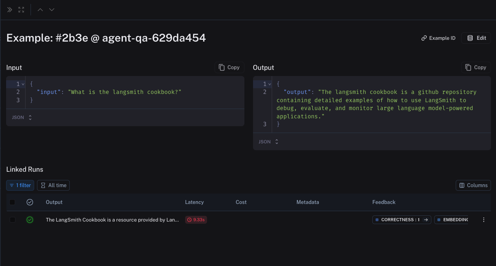

# Evaluation

This conceptual guice covers topics that are important to understand when running evaluations in LangSmith.

Evaluations allow you to understand the performance of your LLM application over time. At its core, an evaluator is a function that takes in a set of inputs and outputs from your LLM pipeline, along with an expected output (if available)
and returns a score (or multiple scores). This score is logged as [feedback](./tracing#feedback) in LangSmith and bound to the trace of the underlying task that produced the output.

This score may be based on comparing the outputs with reference outputs (e.g. with string matching or using an LLM as a judge).
However, there are also evaluators that don't require a reference output - for example, one that checks if the output is valid JSON, which is a common requirement in LLM applications.
LangSmith allows you to run evaluations on your application via `Datasets`, which are made up of `Examples`.

The following diagram outlines the building blocks for evaluations in LangSmith. `Datasets` define the inputs over which you run your chain, model, or agent (the `Task`),
and optionally the reference outputs against which your evaluator will compare the outputs of your `Task`. These datasets can be from any number of sources -
you might manually curate them, collect them from user input/feedback, or generate them via LLM. Your `Evaluator` can be any arbitrary function which returns a score
based on the inputs and outputs of your `Task`, and the reference output if desired. You can also use [one of LangSmith's off-the-shelf
evaluators] to get started quickly!

<ThemedImage
  alt="LangSmith Primitives"
  sources={{
    light: require("../static/langsmith_summary.png").default,
    dark: require("../static/langsmith_summary_dark.png").default,
  }}
/>

## Datasets and examples

`Datasets` are collections of `Examples`, the core building block for the evaluation workflow in LangSmith.
Examples provide the inputs over which you will be running your pipeline,
and, if applicable, the expected outputs that you will be comparing against.
All examples in a given dataset should follow the same schema. Examples contain an `"inputs"` dict and an `"output"` dict,
along with (optionally) a `metadata` dict.

  A Dataset in the LangSmith UI

  An Example in the LangSmith UI

### Types of Datasets

Dataset types communicate common input and output schemas. There are three types of datasets in LangSmith: `kv`, `llm`, and `chat`. `kv` datasets are the default type, and are
sufficient for almost all use-cases. `llm` and `chat` datasets can be useful to conveniently export datasets into known fine-tuning formats.

- `kv`: In `kv` datasets, inputs and outputs can be arbitrary key-value pairs. These are useful when evaluating chains and agents that require
  multiple inputs or that return multiple outputs.
  The tradeoff with these datasets is that running evaluations on them can be a bit more involved. If there are multiple keys, you will have to manually specify the `prepare_data`
  function in any off-the-shelf evaluators so they know what information to consider in generating a score.
- `llm`: `llm` datasets correspond to the string inputs and outputs from the "completion" style LLMS (string in, string out). The `"inputs"` dictionary contains a single `"input"` key mapped to a single prompt string. Similarly, the `"outputs"` dictionary contains a single `"output"` key mapped to a single response string.
- `chat`: `chat` datasets correspond to messages and generations from LLMs that expect structured "chat" messages as inputs and outputs. Each example row
  expects an `"inputs"` dictionary containing a single `"input"` key mapped to a list of serialized chat messages. The `"outputs"` dictionary contains a single `"output"` key mapped to a single list of serialized chat messages.

## Experiments

A single execution of all your example inputs through your `Task` is called an `Experiment`. In LangSmith, you can easily view all the experiments that are associated
with your dataset, and track your application's performance over time! You can also compare two or more experiments in a comparison view.

Multiple experiments can be bound to the same dataset, and each experiment can have multiple runs.

  Comparing Multiple Experiments in the LangSmith UI

## Evaluators

Evaluators are functions that help score how well your system did on a particular example. When running an evaluation,
your example inputs are run through your `Task` to produce `Runs`, which are then passed into your evaluator along with the `Example`.
The function then returns an `EvaluationResult`, which specifies your metric name and score. Evaluations in LangSmith are run via the `evaluate()` function.
The following diagram gives an overview of the data flow in an evaluation:

<ThemedImage
  alt="LangSmith Evaluations"
  sources={{
    light: require("../static/langsmith_app_flow.png").default,
    dark: require("../static/langsmith_app_flow_dark.png").default,
  }}
/>

The inputs to an evaluator consist of:

1. An `example` - the inputs for your pipeline and optionally the reference outputs or labels
2. A `root_run` - observed output gathered from running the inputs through the `Task` along with metadata and intermediate steps

An evaluator will then return an `EvaluationResult` (or similarly shaped dictionary), which is made up of:

- `key`: The name the metric being evaluated
- `score`: The value of the metric on this example
- `comment`: the reasoning trajectory or other string information motivating the score

### Types of Evaluators

The evaluator itself can be any arbitrary function. There are a few different types of evaluators that are commonly used:

- **Heuristics**: A heuristic evaluator is a hard-coded function that does some computation to determine a score. For example, you might write an
  evaluator that checks whether the output of the system is an empty string, or determines if it is valid JSON. These would be considered **reference-free** evaluators,
  as they don't consider any example output when making their decision. You might also want to check that the output of the system matches the reference output exactly,
  which would be considered a **ground truth** evaluator because it compares the output to a reference. See [How to create custom evaluators].
- **LLM-as-judge**: An LLM-as-judge evaluator uses an LLM to score system output. For example, you might want to check whether your system is outputting
  offensive content. This is **reference-free**, as there is no comparison to an example output. You might also want to check whether the system output has the same
  meaning as the example output, which would be a **ground truth** evaluator. To get started with LLM-as-a-judge, try out LangSmith's [off-the-shelf evaluators]!
- **Human**: You can also evaluate your runs manually. This can be done in LangSmith [via the SDK],
  or [in the LangSmith UI].
