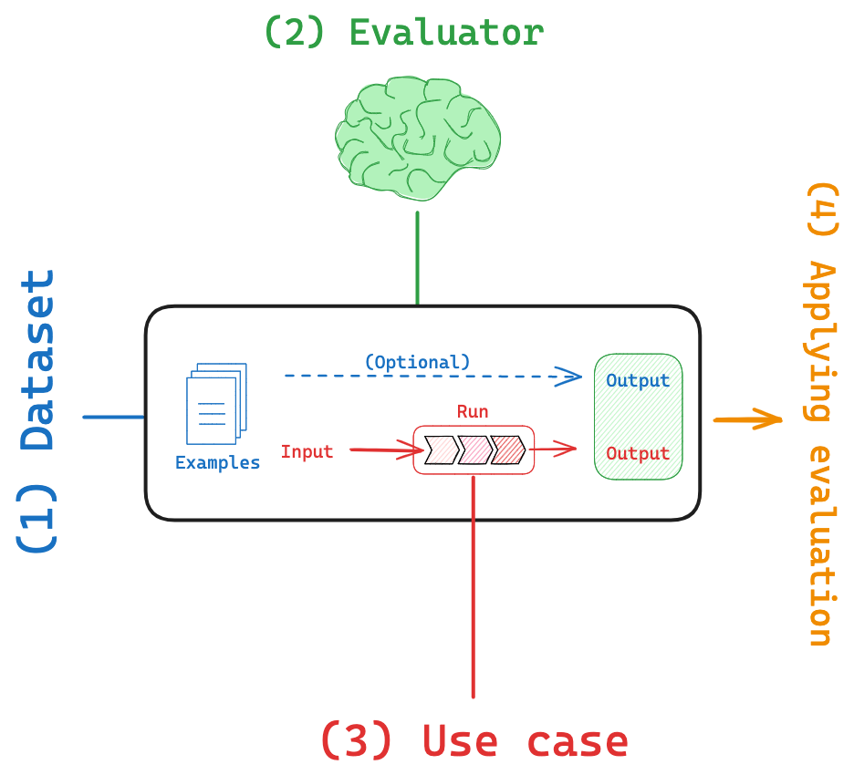
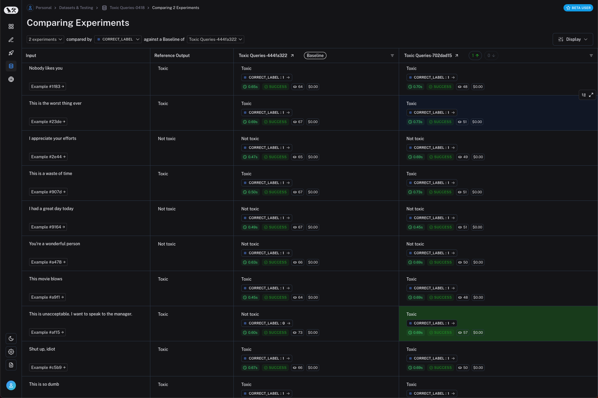
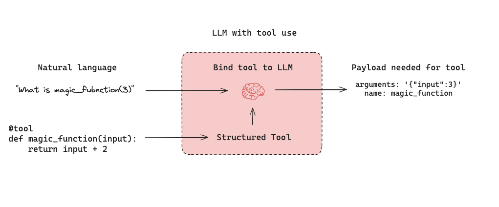
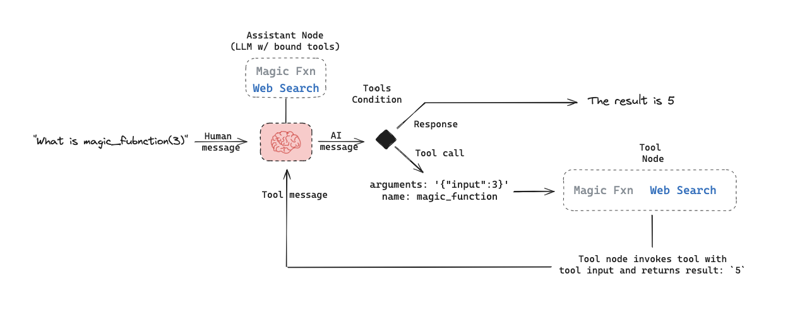
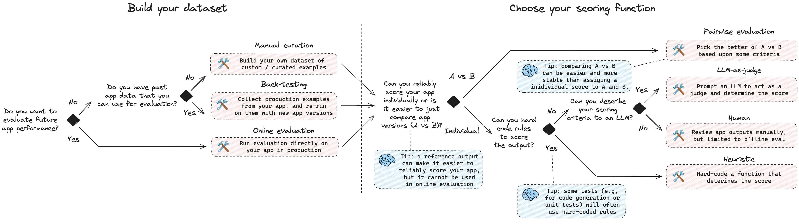

# Evaluation

The pace of AI application development is often rate-limited by high-quality evaluations because there is a paradox of choice. Developers often wonder how to engineer their prompt or which LLM best balances accuracy, latency, and cost. High quality evaluations can help you rapidly answer these types of questions with confidence.

LangSmith allows you to build high-quality evaluations for your AI application. This conceptual guide will give you the foundations to get started. First, let's introduce the core components of LangSmith evaluation:

- `Dataset`: These are the inputs to your application used for conducting evaluations.
- `Evaluator`: An evaluator is a function responsible for scoring your AI application based on the provided dataset.

## Datasets

Datasets are the cornerstone of the LangSmith evaluation workflow. They are collections of examples that provide the necessary inputs and, optionally, expected `reference` outputs for assessing your AI application. Each example within a dataset represents a single data point, consisting of an `inputs` dictionary, an optional `output` dictionary, and an optional `metadata` dictionary. The `optional` output dictionary will often contain a `reference` key, which is the expected LLM application output for the given input.

There are various ways to build datasets for evaluation, including:

- `Manually curated examples`: Hand-chosen / written examples
- `Historical logs`: Logs of past interactions with your application
- `Synthetic data`: Artificially generated examples that often simulate various scenarios and / or edge cases

:::tip

To learn more about creating datasets in LangSmith, see our LangSmith Evaluation series:

- See our video on [`Manually curated datasets`](https://youtu.be/N9hjO-Uy1Vo?feature=shared).
- See our videos on [`Datasets from traces`](https://youtu.be/hPqhQJPIVI8?feature=shared)

:::

LangSmith offers three distinct dataset types:

1. `kv` (Key-Value) Dataset:

   - "Inputs" and "outputs" are represented as arbitrary key-value pairs.
   - The `kv` dataset is the most versatile and default type, suitable for a wide range of evaluation scenarios.
   - This dataset type is ideal for evaluating chains and agents that require multiple inputs or generate multiple outputs.

2. `llm` (Language Model) Dataset:

   - The `llm` dataset is designed for evaluating "completion" style language models.
   - The "inputs" dictionary contains a single "input" key mapped to the prompt string.
   - The "outputs" dictionary contains a single "output" key mapped to the corresponding response string.
   - This dataset type simplifies evaluation for LLMs by providing a standardized format for inputs and outputs.

3. `chat` Dataset:
   - The `chat` dataset is designed for evaluating LLM structured "chat" messages as inputs and outputs.
   - The "inputs" dictionary contains a single "input" key mapped to a list of serialized chat messages
   - The "outputs" dictionary contains a single "output" key mapped to a list of serialized chat messages.
   - This dataset type is useful for evaluating conversational AI systems or chatbots.

### Partitioning datasets

When setting up your evaluation, you may want to partition your dataset into different splits. This can help save cost. For example, you might use a smaller split for many rapid iterations and a larger split for your final evaluation. In addition, splits can be important for the interpretability of your experients. For example, if you have a RAG application, you may want your dataset splits to focus on different types of questions (e.g., factual, opinion, etc) and to evaluate your application on each split separately.

:::tip

To learn more about creating dataset splits in LangSmith:

- See our video on [`dataset splits`](https://youtu.be/FQMn_FQV-fI?feature=shared) in the LangSmith Evaluation series.
- See our documentation [here](https://docs.smith.langchain.com/how_to_guides/datasets/manage_datasets_in_application#create-and-manage-dataset-splits).

:::

## Evaluators

Evaluators are functions in LangSmith that score how well your application performs on a particular example. During an evaluation, your examples from your dataset are processed through your application. The inputs to an evaluator include:

- `Example`: The example from your Dataset.
- `Root_run`: The output and intermediate steps from running the inputs through the application.

The evaluator returns an `EvaluationResult` (or a similarly structured dictionary), which consists of:

- `Key`: The name of the metric being evaluated.
- `Score`: The value of the metric for this example.
- `Comment`: The reasoning or additional string information justifying the score.

There are a few approaches and types of scoring functions that can be used in LangSmith evaluation.

### Human

- Human evaluation is [often a great starting point for evaluation](https://hamel.dev/blog/posts/evals/#looking-at-your-traces).
- LangSmith makes it easy to review your LLM application outputs as well as the traces (all intermediate steps).

:::tip

See our [video](https://www.youtube.com/watch?v=Vn8A3BxfplE) using LangSmith to capture human feedback for prompt engineering.

:::

### Heuristic

- Heuristic evaluators are hard-coded functions that perform computations to determine a score.
- To use them, you typically will need a set of rules that can be easily encoded into a function.
- They can be `reference-free` (e.g., check the output for empty string or valid JSON).
- Or they can compare task output to a `reference` (e.g., check if the output matches the reference exactly).

:::tip

For some tasks, like code generation, custom heuristic evaluation (e.g., import and code execution-evaluation) are often extremely useful and superior to other evaluations (e.g., LLM-as-judge, discussed below).

- Watch the [`Custom evaluator` video in our LangSmith Evaluation series](https://www.youtube.com/watch?v=w31v_kFvcNw) for a comprehensive overview.
- Read our [documentation](https://docs.smith.langchain.com/how_to_guides/evaluation/evaluate_on_intermediate_steps#3-define-your-custom-evaluators) on custom evaluators.
- See our [blog](https://blog.langchain.dev/code-execution-with-langgraph/) using custom evaluators for code generation.

:::

### LLM-as-judge

- LLM-as-judge evaluators use LLMs to score system output.
- To use them, you typically encode the grading rules / criteria in the LLM prompt.
- They can be `reference-free` (e.g., check if system output contains offensive content or adheres to specific criteria).
- Or, they can compare task output to a `reference` (e.g., check if the output is factually accurate relative to the reference).

:::tip

Check out our video on [LLM-as-judge evaluators](https://youtu.be/y5GvqOi4bJQ?feature=shared) in our LangSmith Evaluation series.

:::

### Pairwise

- Pairwise evaluators pick the better of two task outputs based upon some criteria.
- Often asking a human or LLM to pick the better of two options can lead to more stable results.

## Applying evaluations

We can visualize the above ideas collectively in the below diagram. To review, `datasets` are composed of `examples` can be curated from a variety of sources such as historical logs or user curated examples. `Evaluators` are functions that score how well your application performs on each `example` in your `dataset`. Evaluators can use different scoring functions, such as `human`, `heuristic`, `LLM-as-judge`, or `pairwise`. And if the `dataset` contains `reference` outputs, then the evaluator can compare the application output to the `reference`.

Each time we run an evaluation, we are conducting an experiment. An experiment is a single execution of all the example inputs in your `dataset` through your `task`. Typically, we will run multiple experiments on a given `dataset`, testing different tweaks to our `task` (e.g., different prompts or LLMs). In LangSmith, you can easily view all the experiments associated with your `dataset` and track your application's performance over time. Additionally, you can compare multiple experiments in a comparison view.

In the `Dataset` section above, we discussed a few ways to build datasets (e.g., from historical logs or manual curation). One common way to use these use these datasets is offline evaluation, which is usually conducted prior to deployment of your LLM application. Below we'll discuss a few common paradigms for offline evaluation.

### Unit Tests

Unit tests are often used in software development to verify the correctness of individual system components. [Unit tests are often lightweight assertions](https://hamel.dev/blog/posts/evals/#level-1-unit-tests) on LLM inputs or outputs (e.g., type or schema checks). Often these are triggered by any change to your application as quick assertions of basic functionality.

:::tip

To learn more about unit tests with LangSmith, check out our unit testing [video](https://youtu.be/ZA6ygagspjA?feature=shared).

:::

### Regression Testing

Regression testing is often used to measure performance across versions of your application over time. They are used to ensure new app versions do not regress on examples that your current version is passing. In practice, they help you assess how much better or worse your new version is relative to the baseline. Often these are triggered when you are making app updates that are expected to influence the user experience.

:::tip

- To learn more about regression testing with LangSmith, see our regression testing [video](https://youtu.be/xTMngs6JWNM?feature=shared)
- See our video focusing on regression testing applied to GPT4-o vs GPT4-turbo [video](https://youtu.be/_ssozegykRs?feature=shared).

:::

LangSmith's comparison view has native support for regression testing, allowing your to quickly see examples that have changed relative to the baseline (with regressions on specific examples shown in red and improvements in green):

### Back-testing

Back-testing is an approach that combines dataset creation (discussed above) with evaluation. If you have a collection of production logs, you can turn them into a dataset. Then, you can re-run those production examples with with newer application versions. This allows you to assess performance on past and realistic user inputs.

:::tip

See our video on [`Back-testing`](https://youtu.be/3cDtDI2W-xA?feature=shared) to learn about this workflow.

:::

### Pairwise-testing

It [can be easier](https://www.oreilly.com/radar/what-we-learned-from-a-year-of-building-with-llms-part-i/) for a human (or an LLM grader) to determine `A is better than B` than to assign an individual score to either A or B. This helps to explain why some have observated that pairwise evaluations can be a more stable scoring approach than assigning individual scores to each experiment, particularly when working with LLM-as-judge evaluators.

:::tip

- Watch the [`Pairwise evaluation` video in our LangSmith Evaluation series](https://youtu.be/yskkOAfTwcQ?feature=shared).
- See our [blog post on pairwise evaluation](https://blog.langchain.dev/pairwise-evaluations-with-langsmith/).

:::

### Online Evaluation

Whereas offline evaluation focuses on pre-deployment testing, online evaluation allow you to evaluate an application in production. This can be useful for applying guardrails to LLM inputs or outputs, such as correctness and toxicity. Online evaluation can also work hand-in-hand with offline evaluation: for example, an online evaluator can be used to classify input questions into a set of categories that can be later used to curate a dataset for offline evaluation.

:::tip

Explore our videos on online evaluation:

- [`Online evaluation` in our LangSmith Evaluation series](https://youtu.be/4NbV44E-hCU?feature=shared)
- [`Online evaluation` with focus on guardrails in our LangSmith Evaluation series](https://youtu.be/jypHvE1vN5U?feature=shared)
- [`Online evaluation` with focus on RAG in our LangSmith Evaluation series](https://youtu.be/O0x6AcImDpM?feature=shared)

:::

### Experiment Configurations

LangSmith evaluations are kicked off using a single function, `evaluate`, which takes in a `dataset`, `evaluator`, and various optional configurations, some of which we discuss below.

:::tip

See documentation on using `evaluate` [here](https://docs.smith.langchain.com/how_to_guides/evaluation/evaluate_llm_application#step-4-run-the-evaluation-and-view-the-results).

:::

#### Repetitions

One of the most common questions when evaluating AI applications is how to build confidence the result of an experiment? This is particularly relevant for LLM applications (e.g., agents), which can exhibit considerable run-to-run variability. Repetitions involve running the same evaluation multiple times and aggregating the results to smooth out run-to-run variability and examine the reproducibility of the AI application's performance. LangSmith `evaluate` function allows you to easily set the number of repetitions and aggregates (the mean) of replicate experiments for you in the UI.

:::tip

- See the [video on `Repetitions` in our LangSmith Evaluation series](https://youtu.be/Pvz24JdzzF8)
- See our documentation on [`Repetitions`](https://docs.smith.langchain.com/how_to_guides/evaluation/evaluate_llm_application#evaluate-on-a-dataset-with-repetitions)

:::

---

# Evaluating Specific LLM Applications

Below, we will discuss evaluation of a few specific, popular LLM applications.

## Agents

[LLM-powered autonomous agents](https://lilianweng.github.io/posts/2023-06-23-agent/) combine three components (1) Tool calling, (2) Memory, and (3) Planning. Agents [use tool calling](https://python.langchain.com/v0.1/docs/modules/agents/agent_types/tool_calling/) with planning (e.g., often via prompting) and memory (e.g., often short-term message history) to generate responses. [Tool calling](https://python.langchain.com/v0.1/docs/modules/model_io/chat/function_calling/) allows a model to respond to a given prompt by generating two things: (1) a tool to invoke and (2) the input arguments required.

Below is a tool-calling agent in [LangGraph](https://langchain-ai.github.io/langgraph/tutorials/introduction/). The `assistant node` is an LLM that determines whether to invoke a tool based upon the input. The `tool condition` sees if a tool was selected by the `assistant node` and, if so, routes to the `tool node`. The `tool node` executes the tool and returns the output as a tool message to the `assistant node`. This loop continues until as long as the `assistant node` selects a tool. If no tool is selected, the the agent directly returns the LLM response.

This sets up three general types of agent evaluations that users are often interested in:

- `Response`: Evaluate the agent response.
- `Single node`: Evaluate any agent node in isolation (e.g., whether it selects the appropriate tool).
- `Trajectory`: Evaluate whether the agent took the expected path (e.g., of tool calls) to arrive at the final answer.

### Dataset

- `Response`: The inputs are a prompt and a list of tools. The output is the agent response.
- `Single node`: As before, the inputs are a prompt and a list of tools. The output is the node (e.g., `assistant node`) output.
- `Trajectory`: As before, the inputs are a prompt and a list of tools. The output is the list of tool calls.

In all cases, the outputs can include a `referece`, particularly for `Single node` and `Trajectory` evaluations.

### Evaluator

- `Response`: The evaluation criteria is typically accuracy using LLM-as-judge evaluator.
- `Single node`: Typically a binary score using a heuristic evaluator indicating whether the correct tool was used or not.
- `Trajectory`: Typically a binary score using a heuristic evaluator indicating whether the correct trajectory was taken.

### Applying agent evaluation

Agents can be both costly (in terms of LLM invocations) and unreliable (due to variability in tool calling). Some approaches to help address these effects:

:::tip

- Test [multiple tool calling LLMs](https://python.langchain.com/v0.2/docs/integrations/chat/) with you agent.
- It's possible that faster and / or lower cost LLMs show acceptable performance for your application.
- Use repetitions to smooth out noise, as tool selection and agent behavior can show run-to-run variability.
- See the [video on `Repetitions` in our LangSmith Evaluation series](https://youtu.be/Pvz24JdzzF8)

:::

## Retrieval Augmented Generation (RAG)

Retrieval Augmented Generation (RAG) is a powerful technique that involves retrieving relevant documents based on a user's input and passing them to a language model for processing. RAG enables AI applications to generate more informed and context-aware responses by leveraging external knowledge.

:::tip

For a comprehensive review of RAG concepts, see our [`RAG From Scratch` series](https://github.com/langchain-ai/rag-from-scratch).

:::

### Dataset

When evaluating RAG applications, a key consideration is whether you have (or can easily obtain) reference answers for each input question. Reference answers serve as ground truth for assessing the correctness of the generated responses. However, even in the absence of reference answers, various evaluations can still be performed using reference-free RAG evaluation prompts (examples provided below).

### Evaluator

`LLM-as-judge` is a commonly used evaluator for RAG because it's an effective way to evaluate factual accuracy or consistency between texts.

When evaluating RAG applications, you have two main options:

1. `Reference` answer: Compare the RAG chain's generated answer or retrievals against a reference answer (or retrievals) to assess its correctness.
2. `Reference-free`: Perform self-consistency checks using prompts that don't require a reference answer (represented by orange, green, and red in the above figure).

:::tip

Dive deeper into RAG evaluation concepts with our LangSmith video series:

- [RAG answer correctness evaluation](https://youtu.be/lTfhw_9cJqc?feature=shared)
- [RAG answer hallucination](https://youtu.be/IlNglM9bKLw?feature=shared)
- [RAG document relevance](https://youtu.be/Fr_7HtHjcf0?feature=shared)
- [RAG intermediate steps evaluation](https://youtu.be/yx3JMAaNggQ?feature=shared)

:::

### Applying RAG Evaluation

When applying RAG evaluation, consider the following approaches:

1. `Offline evaluation`: Use offline evaluation for any prompts that rely on a reference answer. This is most commonly used for RAG answer correctness evaluation, where the reference is a ground truth (correct) answer.

2. `Online evaluation`: Employ online evaluation for any reference-free prompts. This allows you to assess the RAG application's performance in real-time scenarios.

3. `Pairwise evaluation`: Utilize pairwise evaluation to compare answers produced by different RAG chains. This evaluation focuses on user-specified criteria (e.g., answer format or style) rather than correctness, which can be evaluated using self-consistency or a ground truth reference.

:::tip

Explore our LangSmith video series for more insights on RAG evaluation:

- [RAG with online evaluation](https://youtu.be/O0x6AcImDpM?feature=shared)
- [RAG pairwise evaluation](https://youtu.be/yskkOAfTwcQ?feature=shared)

:::

### RAG evaluation summary

| Use Case            | Detail                                            | Reference-free? | LLM-as-judge?                                                                         | Pairwise relevant |
| ------------------- | ------------------------------------------------- | --------------- | ------------------------------------------------------------------------------------- | ----------------- |
| Document relevance  | Are documents relevant to the question?           | Yes             | Yes - [prompt](https://smith.langchain.com/hub/langchain-ai/rag-document-relevance)   | No                |
| Answer faithfulness | Is the answer grounded in the documents?          | Yes             | Yes - [prompt](https://smith.langchain.com/hub/langchain-ai/rag-answer-hallucination) | No                |
| Answer helpfulness  | Does the answer help address the question?        | Yes             | Yes - [prompt](https://smith.langchain.com/hub/langchain-ai/rag-answer-helpfulness)   | No                |
| Answer correctness  | Is the answer consistent with a reference answer? | No              | Yes - [prompt](https://smith.langchain.com/hub/langchain-ai/rag-answer-vs-reference)  | No                |
| Chain comparison    | How do multiple answer versions compare?          | Yes             | Yes - [prompt](https://smith.langchain.com/hub/langchain-ai/pairwise-evaluation-rag)  | Yes               |

## Common use-cases

### Summarization

Summarization is one specific type of free-form writing. The evaluation aim is typically to examine the writing (summary) relative to a set of criteria.

`Developer curated examples` of texts to summarize are commonly used for evaluation (see a dataset example [here](https://smith.langchain.com/public/659b07af-1cab-4e18-b21a-91a69a4c3990/d)). However, `user logs` from a production (summarization) app can be used for online evaluation with any of the `Reference-free` evaluation prompts below.

`LLM-as-judge` is typically used for evaluation of summarization (as well as other types of writing) using `Reference-free` prompts that follow provided criteria to grade a summary. It is less common to provide a particular `Reference` summary, because summarization is a creative task and there are many possible correct answers.

`Online` or `Offline` evaluation are feasible because of the `Reference-free` prompt used. `Pairwise` evaluation is also a powerful way to perform comparisons between different summarization chains (e.g., different summarization prompts or LLMs):

:::tip

See our LangSmith video series to go deeper on these concepts:

- Video on pairwise evaluation: https://youtu.be/yskkOAfTwcQ?feature=shared

:::

| Use Case         | Detail                                                                     | Reference-free? | LLM-as-judge?                                                                                | Pairwise relevant |
| ---------------- | -------------------------------------------------------------------------- | --------------- | -------------------------------------------------------------------------------------------- | ----------------- |
| Factual accuracy | Is the summary accurate relative to the source documents?                  | Yes             | Yes - [prompt](https://smith.langchain.com/hub/langchain-ai/summary-accurancy-evaluator)     | Yes               |
| Faithfulness     | Is the summary grounded in the source documents (e.g., no hallucinations)? | Yes             | Yes - [prompt](https://smith.langchain.com/hub/langchain-ai/summary-hallucination-evaluator) | Yes               |
| Helpfulness      | Is summary helpful relative to user need?                                  | Yes             | Yes - [prompt](https://smith.langchain.com/hub/langchain-ai/summary-helpfulness-evaluator)   | Yes               |

### Classification / Tagging

Classification / Tagging applies a label to a given input (e.g., for toxicity detection, sentiment analysis, etc). Classification / Tagging evaluation typically employs the following components, which we will review in detail below:

A central consideration for Classification / Tagging evaluation is whether you have a dataset with `reference` labels or not. If not, users frequently want to define an evaluator that uses criteria to apply label (e.g., toxicity, etc) to an input (e.g., text, user-question, etc). However, if ground truth class labels are provided, then the evaluation objective is focused on scoring a Classification / Tagging chain relative to the ground truth class label (e.g., using metrics such as precision, recall, etc).

If ground truth reference labels are provided, then it's common to simply define a [custom heuristic evaluator](https://docs.smith.langchain.com/how_to_guides/evaluation/evaluate_llm_application#use-custom-evaluators) to compare ground truth labels to the chain output. However, it is increasingly common given the emergence of LLMs simply use `LLM-as-judge` to perform the Classification / Tagging of an input based upon specified criteria (without a ground truth reference).

`Online` or `Offline` evaluation is feasible when using `LLM-as-judge` with the `Reference-free` prompt used. In particular, this is well suited to `Online` evaluation when a user wants to tag / classify application input (e.g., for toxicity, etc).

:::tip

See our LangSmith video series to go deeper on these concepts:

- Online evaluation video: https://youtu.be/O0x6AcImDpM?feature=shared

:::

| Use Case  | Detail                          | Reference-free?         | LLM-as-judge?                                                        | Pairwise relevant |
| --------- | ------------------------------- | ----------------------- | -------------------------------------------------------------------- | ----------------- |
| Criteria  | Tag if specific criteria is met | Yes                     | Yes - [prompt](https://smith.langchain.com/hub/langchain-ai/tagging) | No                |
| Accuracy  | Standard definition             | No (ground truth class) | No                                                                   | No                |
| Precision | Standard definition             | No (ground truth class) | No                                                                   | No                |
| Recall    | Standard definition             | No (ground truth class) | No                                                                   | No                |

## Deciding which evaluation approach to use

We frequently hear users ask how to get started with evaluation. Here is a decision tree to help you select the right evaluation approach for your application, summarizing the key points discussed above:

### Collect your evaluation data

First, consider whether you want to evaluate your application in production. This can be useful for applying guardrails, such as checks for correctness and toxicity on your LLM inputs or outputs. This will not require collection of a `Dataset` and will employ a `reference-free` evaluator, since you will not have a `reference` output to compare against when you are evaluating in production.

:::tip

For online evaluation, it is common to consider `reference-free` LLM-as-judge evaluators, which are effective at detecting toxicity or performing simple self-consistency checks (e.g., in the case of RAG). See our examples above.

:::

If you do not want to evaluate in production, then you will need to collect a `Dataset`. A great starting point is often to use `historical logs` from your application. This ensures that the `Dataset` inputs are realistic and representative of your application's actual user interactions. This also enables the process of `Back-testing`, which is re-running these production examples with new app versions to see how the new versions perform on historical user interactions.

:::tip

When creating a `Dataset` for `Back-testing`, you will have a `reference` output because you will be directly pulling user interactions. Of course, modifying the dataset to include a `reference` output is possible and can be beneficial. But, often `reference-free` evaluators are used in `Back-testing` to rapidly assess new app versions on the production examples.

:::

Sometimes, historical logs are not sufficient. For example, you may require `references` for your evaluation. Or you want to add user-defined edge-cases. For this, you can `manually curate` a dataset. This can be a time-consuming process, but it is sometimes necessary for high-quality evaluation.

### Choose your scoring function

A well designed scoring function should have a low cognitive burden, resulting in higher reliability. For example, scoring the factual correctness of a RAG response [on a scale](https://en.wikipedia.org/wiki/Likert_scale) of 1 (worst) to 10 (best) is cognitively demanding and, in our experience, unreliable. A human or LLM-as-judge evaluator is less likely to grade consistently with such an open-ended grading scale.

One well-established trick to reduce the cognitive burden of evaluation is `pairwise evaluation`: [it is often easier to determine](https://www.oreilly.com/radar/what-we-learned-from-a-year-of-building-with-llms-part-i/) `A is better than B` than to assign an individual score to and A and B. With this in mind, first consider whether pairwise evaluation can improve the reliability of your evaluation.

But, if you are confident in your ability to assign individual scores to our application output, then ask whether your scoring function can be a hard-coded rule. Consider the simplest case: you want to check to see if the output is empty. This can be easily hard-coded in a custom heuristic evaluator.

If your scoring function cannot be hard-coded, then consider whether you can describe the scoring criteria to an LLM that can serve as judge.

:::tip

For LLM-as-judge evaluators, we have found that binary evaluations (e.g., `yes` or `no`) are often more reliable than open-ended rating scales. See our tables above with example prompts for several use-cases.

:::

Finally, if you're not confident in the ability to use LLM-as-judge, then manual review is a great starting point. It can help build intuition for criteria that can be later encoded into LLM-as-judge or heuristic evaluator.
