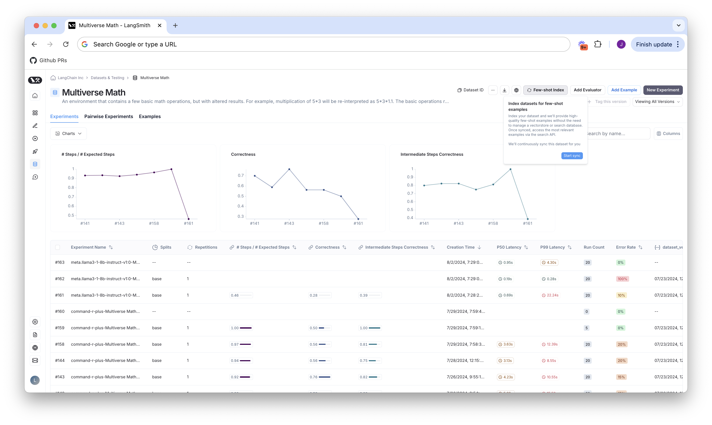

import {
  CodeTabs,
  PythonBlock,
  TypeScriptBlock,
} from "@site/src/components/InstructionsWithCode";

# Dynamic few shot example selection

:::note
This feature is currently in closed beta. Please sign up [here](https://forms.gle/in9R6t9HNSYMBt7P7) for access
:::

Configure your datasets so that you can search for few shot examples based on an incoming request.

## Pre-conditions

1. Your dataset must have the KV store data type (we do not currently support chat model or LLM type datasets)
2. You must have an input schema defined for your dataset. See our docs on setting up schema validation [in our UI](./manage_datasets_in_application#dataset-schema-validation) for details.
3. You must be enabled for the closed beta
4. You must be on LangSmith cloud

## Index your dataset to be searched

On the datasets UI, click the `Few-shot Index` on the top right corner and hit `Start Sync`.

This process will start to index your data to be searchable in the background. A note will appear on the
modal above that says if your index is up to date, and if not, what version of your dataset it last indexed.

All new data added to your dataset will automatically be indexed. You do not need to re-index when adding new data.

## Search your dataset for similar examples

You can search your dataset via API for similar examples using the `POST /datasets/<id>/search` REST API. Its documentation
can be found [here](https://api.smith.langchain.com/docs#/datasets/search_api_v1_datasets__dataset_id__search_post).
You can see detailed examples of how use this in your prompts both with and without LangChain in
[our cookbook on using indexed datasets with few shot prompts](https://github.com/langchain-ai/langsmith-cookbook/blob/beta-few-shot-search-cookbook/optimization/dataset-few-shot-search/FewShotDatasetsQuickstart.ipynb)
