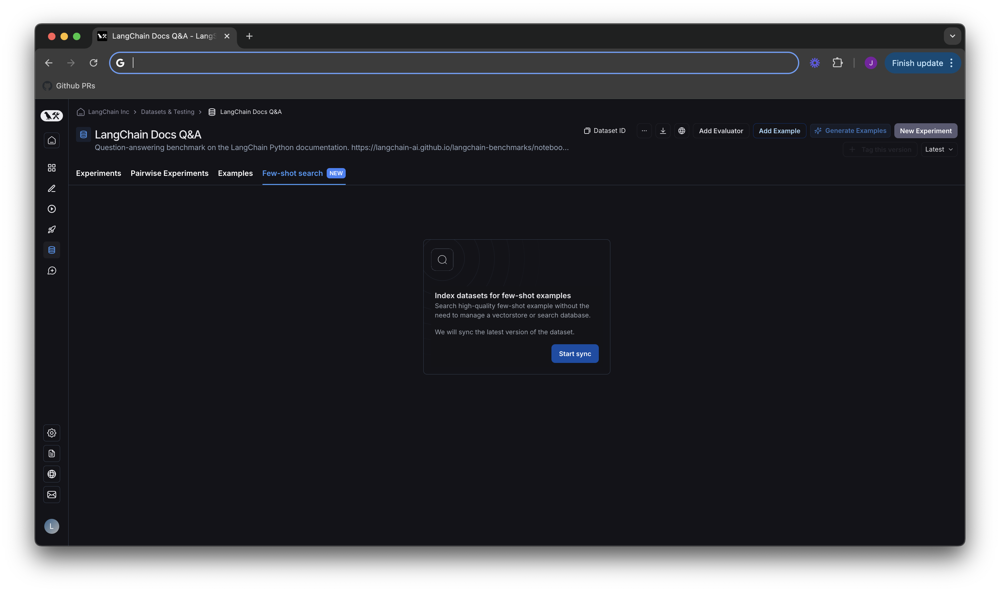
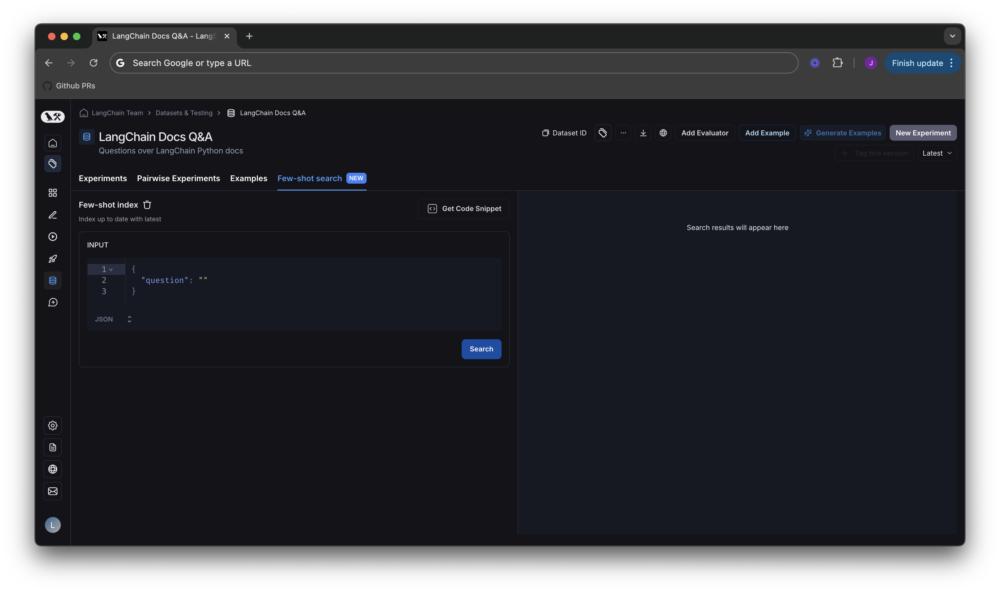
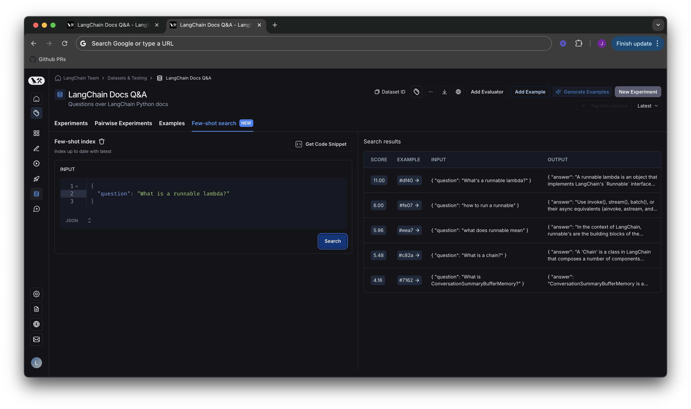
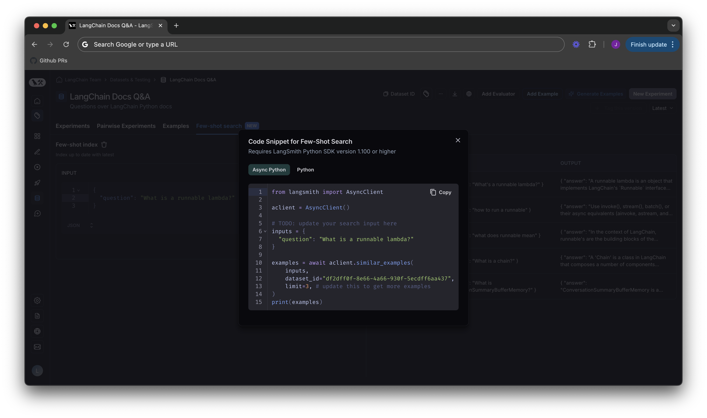

import {
  AsyncPythonBlock,
  CodeTabs,
  PythonBlock,
  TypeScriptBlock,
} from "@site/src/components/InstructionsWithCode";

# Dynamic few shot example selection

:::note
This feature is in open beta. It is only available to paid team plans. Please reach out to support@langchain.dev
if you have questions about enablement.
:::

Configure your datasets so that you can search for few shot examples based on an incoming request.

## Pre-conditions

1. Your dataset must use the KV store data type (we do not currently support chat model or LLM type datasets)
2. You must have an input schema defined for your dataset. See our docs on setting up schema validation [in our UI](./manage_datasets_in_application#dataset-schema-validation) for details.
3. You must be on a paid team plan (e.g. Plus plan)
4. You must be on LangSmith cloud

## Index your dataset for few shot search

Navigate to the datasets UI, and click the new `Few-Shot search` tab. Hit the `Start sync` button, which will
create a new index on your dataset to make it searchable.

By default, we sync to the latest version of your dataset. That means when new examples are added to your dataset, they
will automatically be added to your index. This process runs every few minutes, so there should be a very short delay for
indexing new examples. You can see whether your index is up to date under `Few-shot index` on the lefthand side of the screen
in the next section.

## Test search quality in the few shot playground

Now that you have turned on indexing for your dataset, you will see the new few shot playground.

You can type in a sample input, and check which results would be returned by our search API.

Each result will have a score and a link to the example in the dataset. The scoring system works such that
0 is a completely random result, and higher scores are better. Results will be sorted in descending order
according to score.

:::note
Search uses a BM25-like algorithm for keyword based similarity scores. The actual score is subject to change
as we improve the search algorithm, so we recommend not relying on the scores themselves, as their meaning
may evolve over time. They are simply used for convenience in vibe-testing outputs in the playground.
:::

## Adding few shot search to your application

Click the `Get Code Snippet` button in the previous diagram, you'll be taken to a screen that has
code snippets from our LangSmith SDK in different languages.

For code samples on using few shot search in LangChain applications, please see our how-to guide
in the LangChain docs here: TODO LINK

### Code snippets

:::note
Please ensure you are using the python SDK with version >= 1.100 or the typescript SDK with version >= TODO
:::

For copy and paste convenience, you can find the same code snippets described in the screenshot above
here:

<CodeTabs
  tabs={[
    AsyncPythonBlock(`import langsmith as ls\n
# Copy this value from LangSmith UI
dataset_id = "1c5e9c95-dfd4-4dc5-a4b8-df7ea921c913"
async with ls.AsyncClient() as client:
    examples = await client.similar_examples(
        {"question": "knock knock"}, dataset_id=dataset_id, limit=1
    )
    print(examples[0].outputs)
    # {"output": "Few shots'll do the trick."}
`),
    PythonBlock(`from langsmith import Client\n
client = Client()\n
# Copy this value from LangSmith UI
dataset_id = "1c5e9c95-dfd4-4dc5-a4b8-df7ea921c913"
examples = client.similar_examples(
    {"question": "knock knock"}, dataset_id=dataset_id, limit=1
)
print(examples[0].outputs)
# {"output": "Few shots'll do the trick."}
`),
    TypeScriptBlock(`import { Client } from "langsmith";\n
const client = new Client();\n
// Copy this value from LangSmith UI
const dataset_id = "1c5e9c95-dfd4-4dc5-a4b8-df7ea921c913";
const examples = await client.similarExamples(
  {"question": "knock knock", dataset.id, 1}
);
console.log(examples[0].outputs);
// {"output": "Few shots'll do the trick."}
`),
  ]}
  groupId="client-language"
/>
