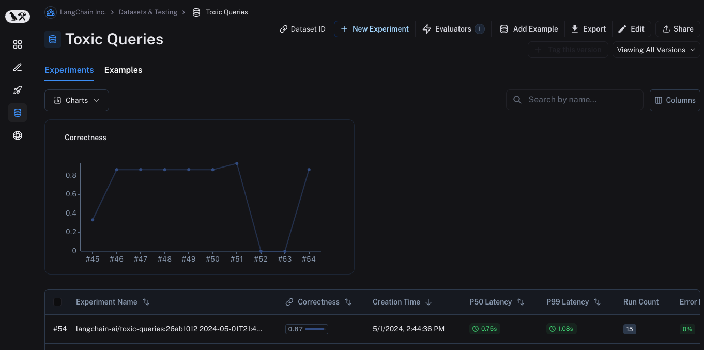
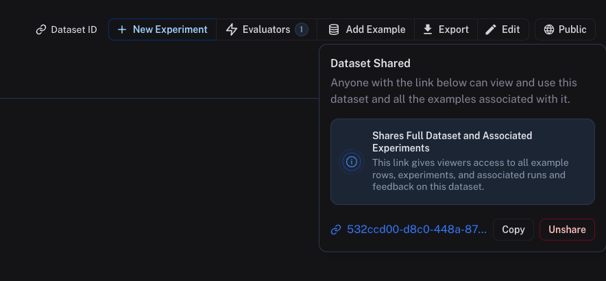

# Share or unshare a dataset publicly

:::caution

Sharing a dataset publicly will make it accessible to anyone with the link. Make sure you're not sharing sensitive information.
**This link gives viewers access to all example rows, experiments, and associated runs and feedback on this dataset.**
This feature is only available in the cloud-hosted version of LangSmith.

:::

To share a dataset publicly, simply click on the **Share** button in the upper right hand side of any dataset details page.

This will open a dialog where you can copy the link to the dataset.

Shared datasets will be accessible to anyone with the link, even if they don't have a LangSmith account. They will be able to view the dataset, experiments and examples, but not edit any of this information.

To "unshare" a dataset, either

1. Click on **Unshare** by click on **Public** in the upper right hand corner of any publicly shared dataset, then **Unshare** in the dialog.
   

2. Navigate to your organization's list of publicly shared dataset, either by clicking on **Settings** -> **Shared URLs** or [this link](https://smith.langchain.com/settings/shared), then click on **Unshare** next to the dataset you want to unshare.
   
