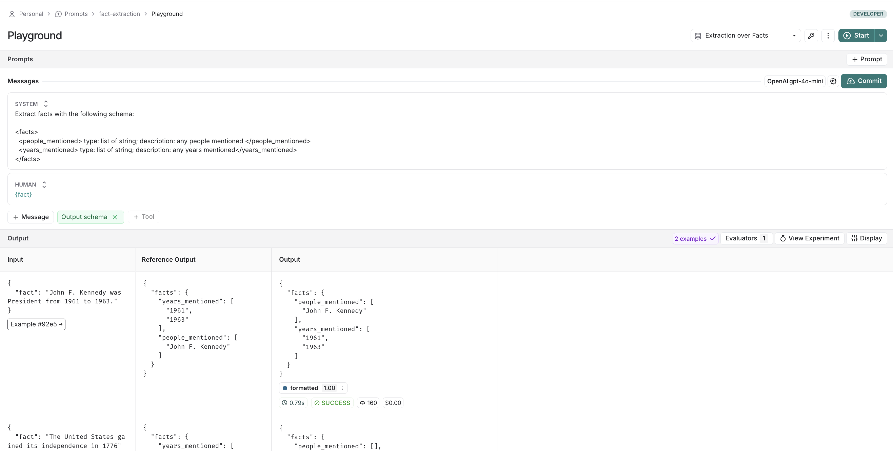

# Set up an Auto-Evaluator that runs Custom Python Code

In this guide, we will walk through how to set up an auto evaluator that runs
user defined python code over all new experiments on your dataset.

## Set up the auto-evaluator

Go to the datasets UI, select your dataset, and click the Auto Evaluators button. When prompted,
select the `Custom Code` type evaluator.

## Write your evaluation function

:::note
Custom Code evaluators use pyodide sandboxes under the hood to ensure security for our customers. You are
restricted to import only their [supported packages](https://pyodide.org/en/stable/usage/packages-in-pyodide.html).
Most commonly used python packages are available (e.g. numpy, pandas, jsonschema, etc)
:::

In the UI, you will see a panel that lets you write your code inline, with some starter code:


Custom Code evaluators use the same function signature as all other evaluators. They take in two arguments:

- A `Run` ([reference](../../../reference/data_formats/run_data_format)). This represents the new run in your
  experiment. For example, if you ran an experiment via SDK, this would contain the input/output from your
  chain or model you are testing.
- An `Example`. This represents the reference example in your dataset that the chain or model you are testing
  uses. The `input` to the Run and Example should be the same. If your Example has a reference `output`, then
  you can use this to compare to the run's output for scoring.

They return a single value:

- Feedback(s) Dictionary: A dictionary whose keys are the type of feedback you want to return, and values are the
  score you will give for that feedback key. For example, `{"correctness": 1, "silliness": 0}` would create two types
  of feedback on the run in your experiment, one saying it is correct, and the other saying it is not silly.

In the below screenshot, you can see an example of a simple function that validates that each run in the experiment
has a known json field:

```{python}
import json

def perform_eval(run, example):
  output_to_validate = run['outputs']
  is_valid_json = 0

  # assert you can serialize/deserialize as json
  try:
    json.loads(json.dumps(output_to_validate))
  except Exception as e:
    return { "formatted": False }

  # assert output facts exist
  if "facts" not in output_to_validate:
    return { "formatted": False }

  # assert required fields exist
  if "years_mentioned" not in output_to_validate["facts"]:
    return { "formatted": False }

  return {"formatted": True}
```

## Test and save your evaluation function

Before saving, you can click test, and LangSmith will run your code over a past run+example pair to make sure your evaluation code works.

## See the results in action

On the dataset, if you now click to the `experiments` tab -> `+ Experiment` -> `Run in Playground`, you can see the results in action.
Your runs in your experiments will be automatically marked with the key specified in your code sample above (here, `formatted`):



And if you navigate back to your dataset, you'll see summary stats for said experiment in the `experiments` tab:


