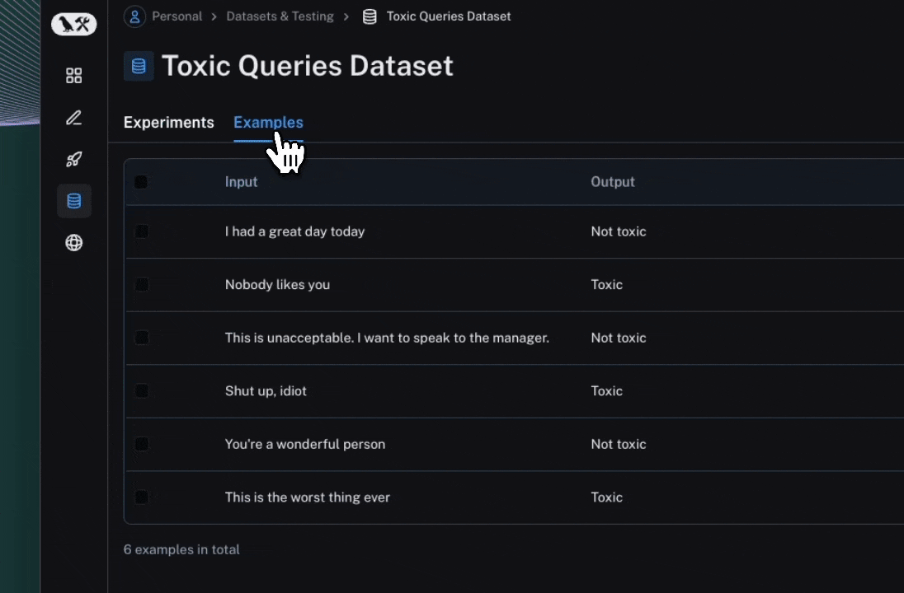
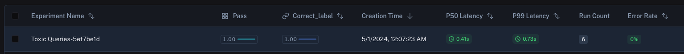

import {
  CodeTabs,
  python,
  typescript,
  PythonBlock,
} from "@site/src/components/InstructionsWithCode";

# Evaluate an LLM Application

:::tip Recommended Reading
Before diving into this content, it might be helpful to read the following:

- [Conceptual guide on evaluation](../../concepts/evaluation)
- [How-to guide on managing datasets](../datasets/manage_datasets_in_application)
- [How-to guide on managing datasets programmatically](../datasets/manage_datasets_programmatically)

:::

Evaluating the performance of your LLM application is a critical step in the development process. LangSmith makes it easy to run evaluations and track evaluation performance over time.
This section provides guidance on how to evaluate the performance of your LLM application.

## Run an evaluation

At a high-level, the evaluation process involves the following steps:

1. Define your LLM application or target task.
2. Creating or selecting a dataset to evaluate your LLM application. Your evaluation criteria may or may not require expected outputs in the dataset.
3. Configuring evaluators to score the outputs of your LLM application, sometimes against expected outputs.
4. Running the evaluation and viewing the results.

The following example involves evaluating a very simple LLM pipeline as classifier to label input data as `"Toxic"` or `"Not toxic"`.

### Step 1: Define your target task

In this case, we are defining a simple evaluation target consisting of an LLM pipeline that classifies text as toxic or non-toxic.
We've optionally enabled tracing to capture the inputs and outputs of each step in the pipeline.

To understand how to annotate your code for tracing, please refer to [this guide](../tracing/annotate_code).

<CodeTabs
  groupId="client-language"
  tabs={[
    python`
      from langsmith import traceable, wrappers
      from openai import Client
      
      openai = wrappers.wrap_openai(Client())
      
      @traceable
      def label_text(text):
          messages = [
              {
                  "role": "system",
                  "content": "Please review the user query below and determine if it contains any form of toxic behavior, such as insults, threats, or highly negative comments. Respond with 'Toxic' if it does, and 'Not toxic' if it doesn't.",
              },
              {"role": "user", "content": text},
          ]
          result = openai.chat.completions.create(
              messages=messages, model="gpt-3.5-turbo", temperature=0
          )
          return result.choices[0].message.content
      `,
    typescript`
      import { OpenAI } from "openai";
      import { wrapOpenAI } from "langsmith/wrappers";
      import { traceable } from "langsmith/traceable";
      
      const client = wrapOpenAI(new OpenAI());
      
      const labelText = traceable(
        async (text: string) => {
          const result = await client.chat.completions.create({
            messages: [
              { 
                role: "system",
                content: "Please review the user query below and determine if it contains any form of toxic behavior, such as insults, threats, or highly negative comments. Respond with 'Toxic' if it does, and 'Not toxic' if it doesn't.",
              },
              { role: "user", content: text },
            ],
            model: "gpt-3.5-turbo",
            temperature: 0,
          });
          
          return result.choices[0].message.content;
        },
        { name: "labelText" }
      );`,
  ]}
/>

### Step 2: Create or select a dataset

In this case, we are creating a dataset to evaluate the performance of our LLM application. The dataset contains examples of toxic and non-toxic text.

Each `Example` in the dataset contains three dictionaries / objects:

- `outputs`: The reference labels or other context found in your dataset
- `inputs`: The inputs to your pipeline
- `metadata`: Any other metadata you have stored in that example within the dataset

These dictionaries / objects can have arbitrary keys and values, but the keys must be consistent across all examples in the dataset.
The values in the examples can also take any form, such as strings, numbers, lists, or dictionaries, but for this example, we are simply using strings.

<CodeTabs
  groupId="client-language"
  tabs={[
    python`
      from langsmith import Client
      
      client = Client()
      
      # Create a dataset
      examples = [
          ("Shut up, idiot", "Toxic"),
          ("You're a wonderful person", "Not toxic"),
          ("This is the worst thing ever", "Toxic"),
          ("I had a great day today", "Not toxic"),
          ("Nobody likes you", "Toxic"),
          ("This is unacceptable. I want to speak to the manager.", "Not toxic"),
      ]
      
      dataset_name = "Toxic Queries"
      dataset = client.create_dataset(dataset_name=dataset_name)
      inputs, outputs = zip(
          *[({"text": text}, {"label": label}) for text, label in examples]
      )
      client.create_examples(inputs=inputs, outputs=outputs, dataset_id=dataset.id)
    `,
    typescript`
      import { Client } from "langsmith";
      
      const langsmith = new Client();
      
      // create a dataset
      const toxicExamples = [
        ["Shut up, idiot", "Toxic"],
        ["You're a wonderful person", "Not toxic"],
        ["This is the worst thing ever", "Toxic"],
        ["I had a great day today", "Not toxic"],
        ["Nobody likes you", "Toxic"],
        ["This is unacceptable. I want to speak to the manager.", "Not toxic"],
      ];
      
      const [inputs, outputs] = toxicExamples.reduce<
        [Array<{ input: string }>, Array<{ outputs: string }>]
      >(
        ([inputs, outputs], item) => [
          [...inputs, { input: item[0] }],
          [...outputs, { outputs: item[1] }],
        ],
        [[], []]
      );
      
      const datasetName = "Toxic Queries";
      const toxicDataset = await langsmith.createDataset(datasetName);
      await langsmith.createExamples({ inputs, outputs, datasetId: toxicDataset.id });
    `,
  ]}
/>

### Step 3. Configure evaluators to score the outputs

In this case, we are using a dead-simple evaluator that compares the output of our LLM pipeline to the expected output in the dataset.
Writing evaluators is discussed in more detail in the [following section](#custom-evaluators).

<CodeTabs
  groupId="client-language"
  tabs={[
    PythonBlock(`from langsmith.schemas import Example, Run\n
def correct_label(root_run: Run, example: Example) -> dict:
    score = root_run.outputs.get("output") == example.outputs.get("label")
    return {"score": int(score), "key": "correct_label"}`),
    typescript`
      import type { EvaluationResult } from "langsmith/evaluation";
      import type { Run, Example } from "langsmith/schemas";
      
      // Row-level evaluator
      function correctLabel(rootRun: Run, example: Example): EvaluationResult {
        const score = rootRun.outputs?.outputs === example.outputs?.output;
        return { key: "correct_label", score };
      }
    `,
  ]}
/>

### Step 4. Run the evaluation and view the results

You can use the `evaluate` method in Python and TypeScript to run an evaluation.

At its simplest, the `evaluate` method takes the following arguments:

- a function that takes an input dictionary or object and returns an output dictionary or object
- `data` - the name OR UUID of the LangSmith dataset to evaluate on, or an iterator of examples
- `evaluators` - a list of evaluators to score the outputs of the function
- `experiment_prefix` - a string to prefix the experiment name with. A name will be generated if not provided.

<CodeTabs
  groupId="client-language"
  tabs={[
    python`
      from langsmith.evaluation import evaluate
      
      dataset_name = "Toxic Queries"
      
      results = evaluate(
          lambda inputs: label_text(inputs["text"]),
          data=dataset_name,
          evaluators=[correct_label],
          experiment_prefix="Toxic Queries",
          description="Testing the baseline system.",  # optional
      )
    `,
    typescript`
      import { evaluate } from "langsmith/evaluation";
      
      const datasetName = "Toxic Queries";
      
      await evaluate((inputs) => labelText(inputs["input"]), {
        data: datasetName,
        evaluators: [correctLabel],
        experimentPrefix: "Toxic Queries",
      });
    `,
  ]}
/>

Each invocation of `evaluate` produces an experiment which is bound to the dataset, and can be viewed in the LangSmith UI.
Evaluation scores are stored against each individual output produced by the target task as feedback, with the name and score configured in the evaluator.

_If you've annotated your code for tracing, you can open the trace of each row in a side panel view._



## Use custom evaluators

At a high-level, evaluators are functions that take in a `Run` and an `Example` and return a dictionary or object with a keys `score` (numeric) and `key` (string).
The `key` will be associated with the score in the LangSmith UI.

:::tip advanced use-cases

- Configure more feedback fields: you can configure other fields in the dictionary as well. Please see the [feedback reference](../../reference/data_formats/feedback_data_format) for more information.
- Evaluate on intermediate steps: to view a more advanced example that traverses the `root_run` / `rootRun` object, please refer to [this guide](./evaluate_on_intermediate_steps) on evaluating on intermediate steps.
- Return multiple scores: you can return multiple scores from a single evaluator. Please check out [the example below](#return-multiple-scores) for more information.

:::

To learn more about the `Run` format, you can read the following [reference](../../reference/data_formats/run_data_format). However, many of the fields are not relevant nor required for writing evaluators.
The `root_run` / `rootRun` is always available and contains the inputs and outputs of the target task. If tracing is enabled, the `root_run` / `rootRun` will also contain child runs for each step in the pipeline.

Here is an example of a very simple custom evaluator that compares the output of a model to the expected output in the dataset:

<CodeTabs
  groupId="client-language"
  tabs={[
    PythonBlock(`from langsmith.schemas import Example, Run\n
def correct_label(root_run: Run, example: Example) -> dict:
    score = root_run.outputs.get("output") == example.outputs.get("label")
    return {"score": int(score), "key": "correct_label"}`),
    typescript`
      import type { EvaluationResult } from "langsmith/evaluation";
      import type { Run, Example } from "langsmith/schemas";
      
      // Row-level evaluator
      function correctLabel(rootRun: Run, example: Example): EvaluationResult {
        const score = rootRun.outputs?.outputs === example.outputs?.output;
        return { key: "correct_label", score };
      }
    `,
  ]}
/>

:::note default feedback key

If the "key" field is not provided, the default key name will be the name of the evaluator function.

:::

## Evaluate on a particular version of a dataset

:::tip Recommended Reading

Before diving into this content, it might be helpful to read the [guide on versioning datasets](../datasets/version_datasets).
Additionally, it might be helpful to read the [guide on fetching examples](../datasets/manage_datasets_programmatically#fetch-examples).

:::

You can take advantage of the fact that `evaluate` allows passing in an iterable of examples to evaluate on a particular version of a dataset.
Simply use `list_examples` / `listExamples` to fetch examples from a particular version tag using `as_of` / `asOf`.

<CodeTabs
  groupId="client-language"
  tabs={[
    python`
      from langsmith.evaluation import evaluate
      
      results = evaluate(
          lambda inputs: label_text(inputs["text"]),
          data=client.list_examples(dataset_name=toxic_dataset_name, as_of="latest"),
          evaluators=[correct_label],
          experiment_prefix="Toxic Queries",
      )
    `,
    typescript`
      import { evaluate } from "langsmith/evaluation";
      
      await evaluate((inputs) => labelText(inputs["input"]), {
        data: langsmith.listExamples({
          datasetName: datasetName,
          asOf: "latest",
        }),
        evaluators: [correctLabel],
        experimentPrefix: "Toxic Queries",
      });
    `,
  ]}
/>

## Evaluate on a subset of a dataset

:::tip Recommended Reading

Before diving into this content, it might be helpful to read the [guide on fetching examples](../datasets/manage_datasets_programmatically#fetch-examples).

:::

You can use the `list_examples` / `listExamples` method to fetch a subset of examples from a dataset to evaluate on. You can refer to guide above to learn more about the different ways to fetch examples.

One common workflow is to fetch examples that have a certain metadata key-value pair.

<CodeTabs
  groupId="client-language"
  tabs={[
    python`
      from langsmith.evaluation import evaluate
      
      results = evaluate(
          lambda inputs: label_text(inputs["text"]),
          data=client.list_examples(dataset_name=dataset_name, metadata={"desired_key": "desired_value"}),
          evaluators=[correct_label],
          experiment_prefix="Toxic Queries",
      )
    `,
    typescript`
      import { evaluate } from "langsmith/evaluation";
      
      await evaluate((inputs) => labelText(inputs["input"]), {
        data: langsmith.listExamples({
          datasetName: datasetName,
          metadata: {"desired_key": "desired_value"},
        }),
        evaluators: [correctLabel],
        experimentPrefix: "Toxic Queries",
      });
    `,
  ]}
/>

## Evaluate on a dataset split

:::tip Recommended Reading

Before reading, it might be useful to check out the [guide on creating/managing dataset splits](../datasets/manage_datasets_in_application#create-and-manage-dataset-splits).

:::

You can use the `list_examples` / `listExamples` method to evaluate on one or multiple splits of your dataset. The `splits` param takes a list of the splits you would like to evaluate.

<CodeTabs
  groupId="client-language"
  tabs={[
    python`
      from langsmith.evaluation import evaluate
      
      results = evaluate(
          lambda inputs: label_text(inputs["text"]),
          data=client.list_examples(dataset_name=dataset_name, splits=["test", "training"]),
          evaluators=[correct_label],
          experiment_prefix="Toxic Queries",
      )
    `,
    typescript`
      import { evaluate } from "langsmith/evaluation";
      
      await evaluate((inputs) => labelText(inputs["input"]), {
        data: langsmith.listExamples({
          datasetName: datasetName,
          splits: ["test", "training"],
        }),
        evaluators: [correctLabel],
        experimentPrefix: "Toxic Queries",
      });
    `,
  ]}
/>

## Evaluate on a dataset with repetitions

The optional `num_repetitions` param to the `evaluate` function allows you to specify how many times
to run/evaluate each example in your dataset. For instance, if you have 5 examples and set
`num_repetitions=5`, each example will be run 5 times, for a total of 25 runs. This can be useful for reducing
noise in systems prone to high variability, such as agents.

<CodeTabs
  groupId="client-language"
  tabs={[
    python`
      from langsmith.evaluation import evaluate
      
      results = evaluate(
          lambda inputs: label_text(inputs["text"]),
          data=dataset_name,
          evaluators=[correct_label],
          experiment_prefix="Toxic Queries",
          num_repetitions=3,
      )
    `,
    typescript`
      import { evaluate } from "langsmith/evaluation";
      
      await evaluate((inputs) => labelText(inputs["input"]), {
        data: datasetName,
        evaluators: [correctLabel],
        experimentPrefix: "Toxic Queries",
        numReptitions=3,
      });
    `,
  ]}
/>

## Use a summary evaluator

Some metrics can only be defined on the entire experiment level as opposed to the individual runs of the experiment.
For example, you may want to compute the overall pass rate or f1 score of your evaluation target across all examples in the dataset.
These are called `summary_evaluators`. Instead of taking in a single `Run` and `Example`, these evaluators take a list of each.

Below, we'll implement a very simple summary evaluator that computes overall pass rate:

<CodeTabs
  groupId="client-language"
  tabs={[
    python`
      from langsmith.schemas import Example, Run
      
      def summary_eval(runs: list[Run], examples: list[Example]) -> dict:
          correct = 0
          for i, run in enumerate(runs):
              if run.outputs["output"] == examples[i].outputs["label"]:
                  correct += 1
          if correct / len(runs) > 0.5:
              return {"key": "pass", "score": True}
          else:
              return {"key": "pass", "score": False}
    `,
    typescript`
      import { Run, Example } from "langsmith/schemas";
      
      function summaryEval(runs: Run[], examples: Example[]) {
        let correct = 0;
        
        for (let i = 0; i < runs.length; i++) {
          if (runs[i].outputs["output"] === examples[i].outputs["label"]) {
            correct += 1;
          }
        }
        
        return { key: "pass", score: correct / runs.length > 0.5 };
      }
    `,
  ]}
/>

You can then pass this evaluator to the `evaluate` method as follows:

<CodeTabs
  groupId="client-language"
  tabs={[
    python`
      results = evaluate(
          lambda inputs: label_query(inputs["text"]),
          data=dataset_name,
          evaluators=[correct_label],
          summary_evaluators=[summary_eval],
          experiment_prefix="Toxic Queries",
      )
    `,
    typescript`
      await evaluate((inputs) => labelQuery(inputs["input"]), {
        data: datasetName,
        evaluators: [correctLabel],
        summaryEvaluators: [summaryEval],
        experimentPrefix: "Toxic Queries",
      });
    `,
  ]}
/>

In the LangSmith UI, you'll the summary evaluator's score displayed with the corresponding key.



## Evaluate a LangChain runnable

You can configure a `LangChain` runnable to be evaluated by passing `runnable.invoke` it to the `evaluate` method in Python, or just the `runnable` in TypeScript.

First, define your `LangChain` runnable:

<CodeTabs
  groupId="client-language"
  tabs={[
    python`
      from langchain_openai import ChatOpenAI
      from langchain_core.prompts import ChatPromptTemplate
      from langchain_core.output_parsers import StrOutputParser
      
      prompt = ChatPromptTemplate.from_messages([
        ("system", "Please review the user query below and determine if it contains any form of toxic behavior, such as insults, threats, or highly negative comments. Respond with 'Toxic' if it does, and 'Not toxic' if it doesn't."),
        ("user", "{text}")
      ])
      chat_model = ChatOpenAI()
      output_parser = StrOutputParser()
      
      chain = prompt | chat_model | output_parser
    `,
    typescript`
      import { ChatOpenAI } from "@langchain/openai";
      import { ChatPromptTemplate } from "@langchain/core/prompts";
      import { StringOutputParser } from "@langchain/core/output_parsers";
      
      const prompt = ChatPromptTemplate.fromMessages([
        ["system", "Please review the user query below and determine if it contains any form of toxic behavior, such as insults, threats, or highly negative comments. Respond with 'Toxic' if it does, and 'Not toxic' if it doesn't."],
        ["user", "{text}"]
      ]);
      const chatModel = new ChatOpenAI();
      const outputParser = new StringOutputParser();
      
      const chain = prompt.pipe(chatModel).pipe(outputParser);
    `,
  ]}
/>

Then, pass the `runnable.invoke` method to the `evaluate` method. Note that the input variables of the runnable must match the keys of the example inputs.

<CodeTabs
  groupId="client-language"
  tabs={[
    python`
      from langsmith.evaluation import evaluate
      
      results = evaluate(
          chain.invoke,
          data=dataset_name,
          evaluators=[correct_label],
          experiment_prefix="Toxic Queries",
      )
    `,
    typescript`
      import { evaluate } from "langsmith/evaluation";
      
      await evaluate(chain, {
        data: datasetName,
        evaluators: [correctLabel],
        experimentPrefix: "Toxic Queries",
      });
    `,
  ]}
/>

The runnable is traced appropriately for each output.


## Return Multiple Scores

In most cases, each evaluator returns a single key or categorical value. Alternatively, you can return evaluation metrics from a single evaluator. This is useful if your metrics share intermediate values. For example, precision and recall but rely on the same true and false positives and negative values, or you may have an LLM generate multiple metrics in a single shot.

To return multiple scores, simply return a dictionary of the following form:

```python
{
    "results": [
        {"key":string, "score": number},
        {"key":string, "score": number},
        # You may log as many as you wish
    ]
}
```

Each of these dictionaries can contain any or all of the [feedback fields](../../reference/data_formats/feedback_data_format); check out the linked document for more information.


Example:

```python
from langsmith.schemas import Example, Run

def multiple_scores(root_run: Run, example: Example) -> dict:
    # Your evaluation logic here
    return {
        "results": [
            {"key": "precision", "score": 0.8},
            {"key": "recall", "score": 0.9},
            {"key": "f1", "score": 0.85},
        ]
    }
```
