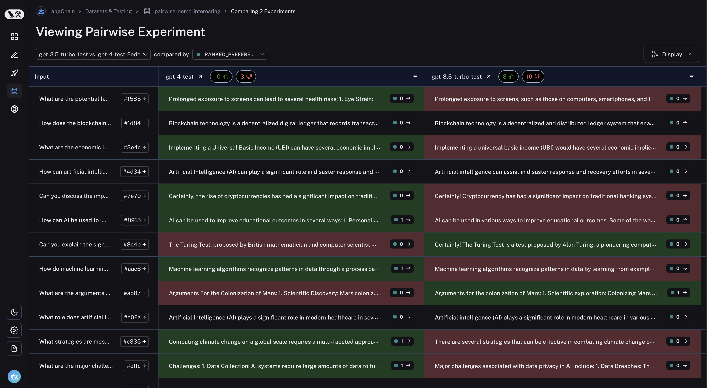
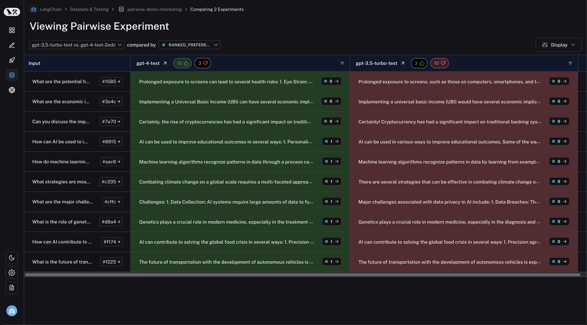

import {
  CodeTabs,
  python,
  typescript,
} from "@site/src/components/InstructionsWithCode";

# Run Pairwise Evaluations

LangSmith supports evaluating **existing** experiments against each other. This allows you to use automatic evaluators (especially, LLM-based evaluators) to score the outputs from multiple experiments against each other, rather than being confined to evaluating outputs one at a time. Think [Chatbot Arena](https://chat.lmsys.org/) - this is the same concept! To do this, use the `evaluate_comparative` / `evaluateComparative` function
with two existing experiments. If you haven't already created experiments to compare, check out our [Quick Start guide](https://docs.smith.langchain.com/#5-run-your-first-evaluation) or our [Evaluations How-To Guide](https://docs.smith.langchain.com/how_to_guides/evaluation/evaluate_llm_application) to get started with evaluations.

## The `evaluate_comparative` Function

At its simplest, `evaluate_comparative` function takes the following arguments:

- `experiments`: A list of the two **existing experiments** you would like to evaluate against each other. These can be uuids or experiment names.
- `evaluators`: A list of the pairwise evaluators that you would like to attach to this evaluation. See the section below for how to define these.

Along with these, you can also pass in the following optional args:

- `randomize_order`: An optional boolean indicating whether the order of the outputs should be randomized for each evaluation. This is a strategy for minimizing positional bias in your prompt: often, the LLM will be biased
  towards one of the responses based on the order. This should mainly be addressed via prompt engineering, but this is another optional mitigation. Defaults to `False`.
- `experiment_prefix`: A prefix to be attached to the beginning of the pairwise experiment name. Defaults to `None`.
- `description`: A description of the pairwise experiment. Defaults to `None`.
- `max_concurrency`: The maximum number of concurrent evaluations to run. Defaults to 5.
- `client`: The LangSmith client to use. Defaults to `None`.
- `metadata`: Metadata to attach to your pairwise experiment. Defaults to `None`.
- `load_nested`: Whether to load all child runs for the experiment. When `False`, only the root trace will be passed to your evaluator. Defaults to `False`.

## Inputs and Outputs to your Evaluator

**Inputs:** A list of Runs and a single Example. This is exactly the same as a normal evaluator, except with a list of Runs instead of a single Run. The list of runs will have a length of two. You can access the inputs and outputs with
`runs[0].inputs`, `runs[0].outputs`, `runs[1].inputs`, `runs[1].outputs`, `example.inputs`, and `example.outputs`.

**Output:** Your evaluator should return a dictionary with two keys: `key`, which represents the feedback key that will be logged, and `scores`, which is a
mapping from run ID to score for that run. **We strongly encourage using 0 and 1 as the score values, where 1 is better.** You may also set both to 0 to represent
"both equally bad" or both to 1 for "both equally good".

Note that you should choose a feedback key that is distinct from standard feedbacks on your run. We recommend prefixing pairwise feedback keys with `pairwise` or `ranked`.

## Example

The following example uses [a prompt](https://smith.langchain.com/hub/langchain-ai/pairwise-evaluation-2/26647e49?organizationId=94d4125d-dba0-55c3-8b1d-2464c35e5a41)
which asks the LLM to decide which is better between two AI assistant responses. It uses structured output to parse the AI's response: 0, 1, or 2.

<CodeTabs
  tabs={[
    python`
      from langsmith.evaluation import evaluate_comparative
      from langchain import hub
      from langchain_openai import ChatOpenAI
      from langsmith.schemas import Run, Example
      prompt = hub.pull("langchain-ai/pairwise-evaluation-2")
      
      def evaluate_pairwise(runs: list[Run], example: Example):
          scores = {}
          
          # Create the model to run your evaluator
          model = ChatOpenAI(model_name="gpt-4")
          
          runnable = prompt | model
          response = runnable.invoke({
              "question": example.inputs["question"],
              "answer_a": runs[0].outputs["output"] if runs[0].outputs is not None else "N/A",
              "answer_b": runs[1].outputs["output"] if runs[1].outputs is not None else "N/A",
          })
          score = response["Preference"]
          if score == 1:
              scores[runs[0].id] = 1
              scores[runs[1].id] = 0
          elif score == 2:
              scores[runs[0].id] = 0
              scores[runs[1].id] = 1
          else:
              scores[runs[0].id] = 0
              scores[runs[1].id] = 0
          return {"key": "ranked_preference", "scores": scores}
          
          
      evaluate_comparative(
          # Replace the following array with the names or IDs of your experiments
          ["my-experiment-name-1", "my-experiment-name-2"],
          evaluators=[evaluate_pairwise],
      )
    `,
    typescript({
      caption:
        "Note: LangChain support inside `evaluate` / `evaluateComparative` is coming soon!",
    })`
      import type { Run, Example } from "langsmith";
      import { evaluateComparative } from "langsmith/evaluation";
      import { wrapOpenAI } from "langsmith/wrappers";
      import OpenAI from "openai";
      
      const openai = wrapOpenAI(new OpenAI());
      import { z } from "zod";
      
      async function evaluatePairwise(runs: Run[], example: Example) {
        const scores: Record<string, number> = {};
        const [runA, runB] = runs;
        
        if (!runA || !runB) throw new Error("Expected at least two runs");
        
        const payload = {
          question: example.inputs?.question,
          answer_a: runA?.outputs?.output ?? "N/A",
          answer_b: runB?.outputs?.output ?? "N/A",
        };
        
        const output = await openai.chat.completions.create({
          model: "gpt-4-turbo",
          messages: [
            {
              role: "system",
              content: [
                "Please act as an impartial judge and evaluate the quality of the responses provided by two AI assistants to the user question displayed below.",
                "You should choose the assistant that follows the user's instructions and answers the user's question better.",
                "Your evaluation should consider factors such as the helpfulness, relevance, accuracy, depth, creativity, and level of detail of their responses.",
                "Begin your evaluation by comparing the two responses and provide a short explanation.",
                "Avoid any position biases and ensure that the order in which the responses were presented does not influence your decision.",
                "Do not allow the length of the responses to influence your evaluation. Do not favor certain names of the assistants. Be as objective as possible.",
              ].join(" "),
            },
            {
              role: "user",
              content: [
                \`[User Question] \${payload.question}\`,
                \`[The Start of Assistant A's Answer] \${payload.answer_a} [The End of Assistant A's Answer]\`,
                \`The Start of Assistant B's Answer] \${payload.answer_b} [The End of Assistant B's Answer]\`,
              ].join("\\n\\n"),
            },
          ],
          tool_choice: {
            type: "function",
            function: { name: "Score" },
          },
          tools: [
            {
              type: "function",
              function: {
                name: "Score",
                description: [
                  \`After providing your explanation, output your final verdict by strictly following this format:\`,
                  \`Output "1" if Assistant A answer is better based upon the factors above.\`,
                  \`Output "2" if Assistant B answer is better based upon the factors above.\`,
                  \`Output "0" if it is a tie.\`,
                ].join(" "),
                parameters: {
                  type: "object",
                  properties: {
                    Preference: {
                      type: "integer",
                      description: "Which assistant answer is preferred?",
                    },
                  },
                },
              },
            },
          ],
        });
        
        const { Preference } = z
          .object({ Preference: z.number() })
          .parse(
            JSON.parse(output.choices[0].message.tool_calls[0].function.arguments)
          );
          
        if (Preference === 1) {
          scores[runA.id] = 1;
          scores[runB.id] = 0;
        } else if (Preference === 2) {
          scores[runA.id] = 0;
          scores[runB.id] = 1;
        } else {
          scores[runA.id] = 0;
          scores[runB.id] = 0;
        }
        
        return { key: "ranked_preference", scores };
      }
      
      await evaluateComparative(["earnest-name-40", "reflecting-pump-91"], {
        evaluators: [evaluatePairwise],
      });
    `,
  ]}
/>

## In LangSmith UI

Navigate to the "Pairwise Experiments" tab from the dataset page:

Click on a pairwise experiment that you would like to inspect, and you will be brought to the Comparison View:

You may filter to runs where the first experiment was better or vice versa by clicking the thumbs up/thumbs down buttons in the table header:

