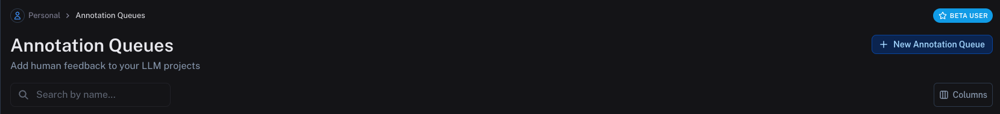
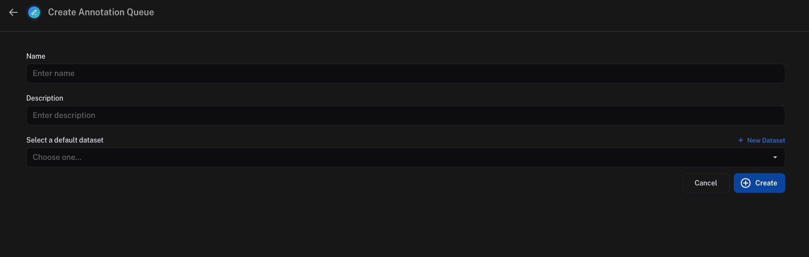
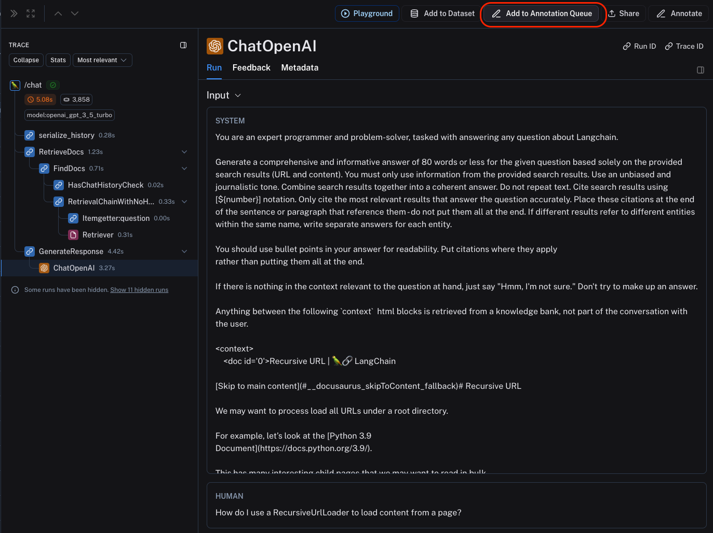
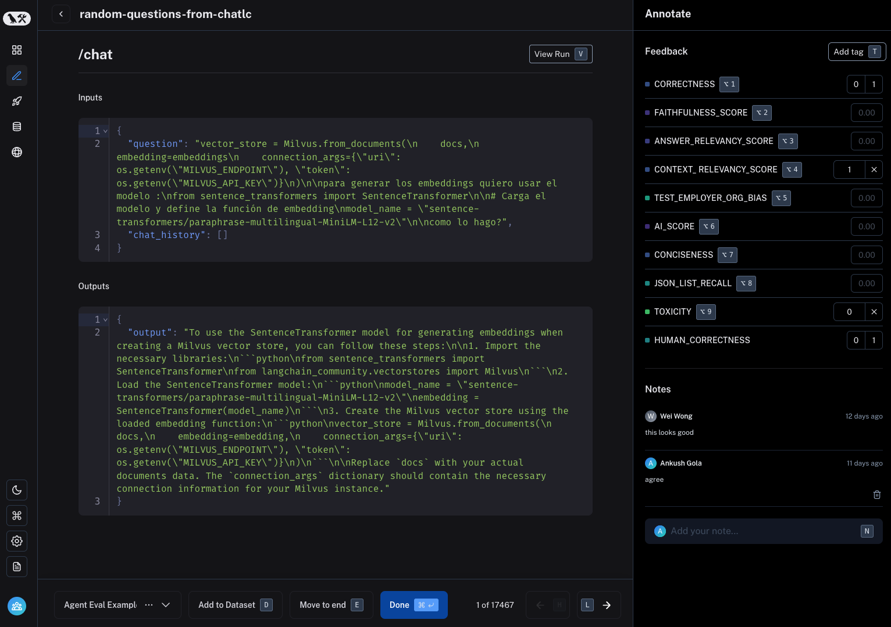

# Use annotation queues

Annotation queues are a powerful LangSmith feature that provide a streamlined, directed view for human annotators to attach feedback to specific runs.
While you can always [annotate runs inline](./annotate_traces_inline), annotation queues provide another option to group runs together, then have annotators review and provide feedback on them.

## Create an annotation queue

To create an annotation queue, navigate to the **Annotation queues** section through the homepage or left-hand navigation bar.
Then click **+ New annotation queue** in the top right corner.

Fill in the form with the **name** and **description** of the queue. You can also assign a **default dataset** to queue, which will streamline the process of sending the inputs and outputs of certain runs to datasets in your LangSmith workspace.

## Assign runs to an annotation queue

To assign runs to an annotation queue, either:

1. Click on **Add to Annotation Queue** in top right corner of any trace view. You can add ANY intermediate run (span) of the trace to an annotation queue, not just the root span.
   

2. Select multiple runs in the runs table then click **Add to Annotation Queue** at the bottom of the page.
   

3. [Set up an automation rule](../monitoring/rules) that automatically assigns runs which pass a certain filter and sampling condition to an annotation queue.

:::tip

It is often a very good idea to assign runs that have a certain user feedback score (eg thumbs up, thumbs down) from the application to an annotation queue. This way, you can identify and address issues that are causing user dissatisfaction.
To learn more about how to capture user feedback from your LLM application, follow [this guide](./attach_user_feedback).

:::

## Review runs in an annotation queue

To review runs in an annotation queue, navigate to the **Annotation Queues** section through the homepage or left-hand navigation bar.
Then click on the queue you want to review. This will take you to a focused, cyclical view of the runs in the queue that require review.

You can attach a comment, attach a score for a particular feedback criteria, add the run a dataset and/or mark the run as reviewed.

The keyboard shortcuts shown can help streamline the review process.

