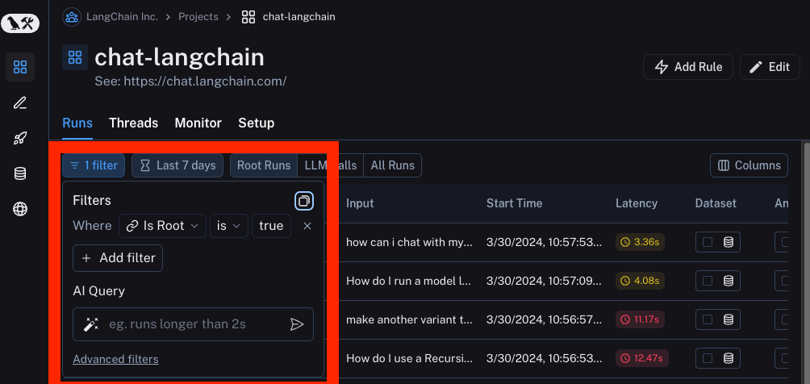
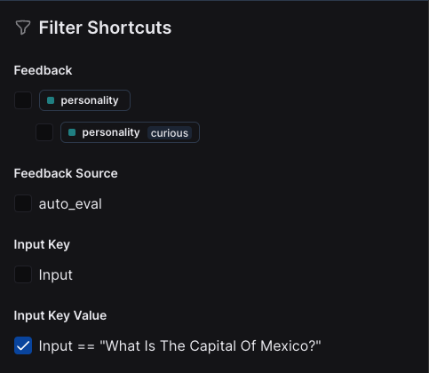

# Filter traces in the application

:::tip Recommended reading

Before diving into this content, it might be helpful to read the following to gain familiarity with the concepts mentioned here:

- [Conceptual guide on tracing](../../concepts/tracing)

:::

This page contains a series of guides for how to filter runs in the application. For a guide on how to accomplish something similar programmatically, please see [this guide](../tracing/export_traces).
Being able to accurately filter runs is important for both manual inspection and setting up automations.

## Create a filter

There are two ways to create a filter.
First, you can create a filter from the high level nav bar. By default, there is one filter applied: `IsRoot` is `true`. This restricts all runs to be top level traces.



You can also define a filter from the `Filter Shortcuts` on the sidebar. This contains commonly used filters.


## Filter for intermediate runs (spans)

In order to filter for intermediate runs (spans), you first need to remove the default filter of `IsRoot` is `true`. After that, you can apply any filter you wish. A common way to do this is to filter by name for sub runs.
This relies on good naming, or tagging for all parts of your pipeline. To learn more, you can check out [this guide](../tracing/add_metadata_tags)

## Advanced: filter for intermediate runs (spans) on properties of the root

A common concept is to filter for intermediate runs which are part of a trace whose root run has some attribute. An example is filtering for intermediate runs of a particular type whose root run has positive (or negative) feedback associated with it.

In order to do this, first set up a filter for intermediate runs (per the above section). After that, you can then add another filter rule. You can then click the `Advanced Filters` link all the way at the bottom of the filter. This will open up a new modal where you can add `Trace filters`. These filters will apply to the traces of all the parent runs of the individual runs you've already filtered for.


## Advanced: filter for runs (spans) whose child runs have some attribute

This is the opposite of the above. You may want to search for runs who have specific types of sub runs. An example of this could be searching for all traces that had a sub run with name `Foo`. This is useful when `Foo` is not always called, but you want to analyze the cases where it is.

In order to do this, you can click on the `Advanced Filters` link all the way at the bottom of the filter. This will open up a new modal where you can add `Tree filters`. This will make the rule you specific apply to all child runs of the individual runs you've already filtered for.


## Filter based on inputs and outputs

You can filter runs based on the content in the inputs and outputs of the run.

To filter either inputs or outputs, you can use `Full-Text Search` filter which will match keywords in either field. For more targeted search, you can use the `Input` or `Output` filters which will only match content based on the respective field.

You can also specify multiple matches, either by including multiple terms separated by whitespace, or adding multiple filters - which will try to match all terms provided.

Note that keyword search is done splitting the text and finding any partial matches on the search keywords, so it is not done in specific order. We exclude common stop words from the search (from the nltk stop word list along with a few other common json keywords).


Based on the filters above, the system will search for `python` and `tensorflow` in either inputs or outputs, and `embedding` in the inputs along with `fine` and `tune` in the outputs.

## Filter based on input / output key-value pairs

In addition to full-text search, you can filter runs based on specific key-value pairs in the inputs and outputs. This allows for more precise filtering, especially when dealing with structured data.

To filter based on key-value pairs, select the `Input KV` or `Output KV` filter from the Filters dropdown.

For example, to match the following input:

```json
{
  "input": "What is the capital of France?"
}
```

Select `Filters`, `Add Filter` to bring up the filtering options. Then select `Input KV`, enter `input` as the key and enter `What is the capital of France?` as the value.


You can also match nested keys by using dot notation to selected the nested key name. For example, to match nested keys in the output:

```json
{
  "documents": [
    {
      "page_content": "The capital of France is Paris",
      "metadata": {},
      "type": "Document"
    }
  ]
}
```

Select `Output KV`, enter `documents.page_content` as the key and enter `The capital of France is Paris` as the value. This will match the nested key `documents.page_content` with the specified value.


You can add multiple key-value filters to create more complex queries. You can also use the `Filter Shortcuts` on the right side to quickly filter based on common key values pairs as shown below:



## Copy the filter

Sometimes you may want to copy a filter that you have constructed. You may way to do this to share it with a co-worker, reuse it in the future, or use it in the SDK.

In order to copy the filter, you can first create it in the UI. From there, you can click the copy button in the upper right hand corner. If you have constructed tree or trace filters, you can also copy those.

This will give you a string in our query language, like `and(eq(is_root, true), and(eq(feedback_key, "user_score"), eq(feedback_score, 1)))` Please see [this reference](../../reference/data_formats/trace_query_syntax#filter-query-language) for more information on the query language.


## Filtering runs within the trace view

You can also filter runs in the trace view. This will allow you to easily sift through traces with large amount of runs. The same filters available in the main runs table view can be applied here.

By default, only the runs that match the filters will be shown. To see the matched runs within the context of the trace tree, switch the view option from "Filtered Only" to "Show All" or "Most relevant".


## Manually specify a raw query in LangSmith query language

If you have copied a previous filter (see above) you may want to manually specify that raw query in a future session. You may also find it easier to modify this filter than to use the UI.

In order to do this, you can click on `Advanced filters` on the bottom. From there you can paste a raw query into the appropriate box.

Note that this will add that query to the existing queries, not overwrite it.


## Use an AI Query to auto-generate a query

Sometimes figuring out the exact query to specify can be difficult! In order to make it easier, we've added a `AI Query` functionality. With this, you can type in the filter you want to construct in natural language and it will convert it into a valid query.

For example: "All runs longer than 10 seconds"

:::note Experimental feature

Note that this is an experimental feature and may not work for all queries.

:::


