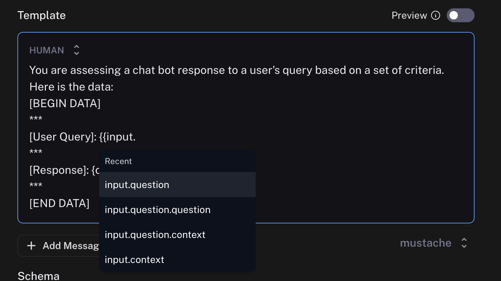

# Set up online evaluations

:::tip Recommended Reading
Before diving into this content, it might be helpful to read the following:

- [Set up automation rules](./rules)

:::

Online evaluations is a powerful LangSmith feature that allows you to run an LLM-as-a-judge evaluator on a set of your production traces. They are implemented as a possible action in an automation rule.

Currently, we provide support for specifying a prompt template, a model, and a set of criteria to evaluate the runs on.

After entering [rules setup](./rules), you can select `Online Evaluation` from the list of possible actions:

## Configure online evaluations

When selection `Online Evaluation` as an action in an automation, you are presented with a panel from which you can configure online evaluation.

You can configure the model, the prompt template, the template format, and the criteria.

### Model

You can choose any model available in the dropdown. Currently, we support **OpenAI**, **AzureOpenAI**, and models hosted on **Fireworks**.

### Prompt template

You can customize the prompt template to be whatever you want. We support two template formats: f-string and mustache.
- f-string: anything in `{...}` is treated as an f-string variable.
- mustache: anything in `{{...}}` is treated as a mustache variable. Mustache supports more robust templating, including nesting variables. See the [mustache documentation](https://mustache.github.io/) for more information.

Evaluator prompts can only contain the following root input variables:
- `input`: the input to the target you are evaluating
- `output`: the output of the target you are evaluating

In mustache templating, you can get more specific. For example, if you have a key `text` in the `input` dictionary, you can access it using `{{input.text}}`. When writing your prompt, you'll be shown suggestions based on your recent runs.

Previewing the prompt will show you an example of what the formatted prompt will look like. This preview pulls the input and output of the most recent run.

:::note
You can configure an evaluation prompt that doesn't match the schema of your recent runs, but the dropdown suggestions and preview function won't work as expected.
:::

### Criteria

An evaluator will attach arbitrary metadata tags to a run. These tags will have a name and a value. You can configure this in the `Criteria` section.
The names and the descriptions of the fields will be passed in to the prompt. Behind the scenes, we use tool calling to coerce the output of the LLM in to the score you specify.

## Set API keys

Online evaluation uses LLM-as-a-judge evaluation. In order to set the API keys to use for these invocations, navigate to the `Settings -> Secrets -> Add secret` page and add any API keys there.

