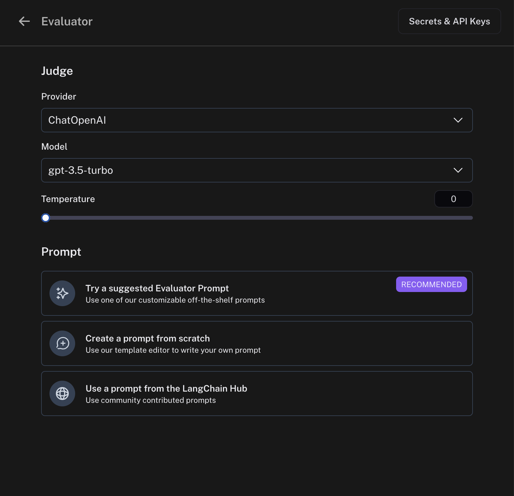
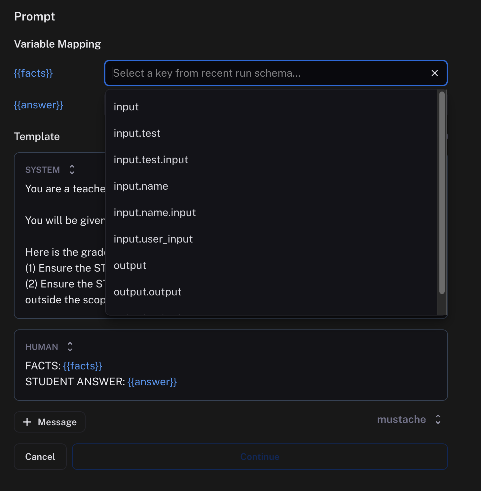

# Set up online evaluations

:::tip Recommended Reading
Before diving into this content, it might be helpful to read the following:

- [Set up automation rules](./rules)

:::

Online evaluations is a powerful LangSmith feature that allows you to run an LLM-as-a-judge evaluator on a set of your production traces. They are implemented as a possible action in an automation rule.

Currently, we provide support for specifying a prompt template, a model, and a set of criteria to evaluate the runs on.

After entering [rules setup](./rules), you can select `Online Evaluation` from the list of possible actions:

## Configure online evaluations

When selection `Online Evaluation` as an action in an automation, you are presented with a panel from which you can configure online evaluation.

### Model

You can choose any model available in the dropdown. Currently, we support **OpenAI**, **AzureOpenAI**, and models hosted on **Fireworks**.
In order to set the API keys to use for these invocations, click on the `Secrets & API Keys` button and add the necessary keys.

### Prompt template

For the prompt template, you can select a suggested evaluator prompt, create a new prompt, or choose a prompt from the LangChain Hub.

1. #### Suggested evaluator prompts

We provide a list of pre-existing prompts that cater to common evaluator use cases.

2. #### Create your own prompt

We provide a base template from which you can form your own prompt.

3. #### Pull a prompt from the LangChain Hub

You can pull any structured prompt, private or public.

You can't edit these prompts directly within the prompt editor, but you can view the prompt and the schema it uses.
If the prompt is your own, you can edit it in the playground and commit the version.
If the prompt is someone else's, you can fork the prompt, make your edits in the playground, and then pull in your new prompt to the online evaluator.

When you choose a hub prompt for your online evaluator, the prompt will be locked to the commit version it was at rule creation. If you want to update the prompt, you can go to edit the online evaluator and re-select the prompt in the dropdown.

### Mapping variables

Prompts can be crafted with any variable name you choose. To map what is passed into your evaluator prompt from your runs or experiments, use the variable mapping inputs. There's a dropdown with suggestions provided based on the schema of your recent runs.

### Preview

Previewing the prompt will show you an example of what the formatted prompt will look like. This preview pulls the input and output of the most recent run. In the case of a dataset evaluator, the preview will also pull reference output from an example in your dataset.

:::note
You can configure an evaluation prompt that doesn't match the schema of your recent runs, but the dropdown suggestions and preview function won't work as expected.
:::

### Output schema

An evaluator will attach metadata tags to a run. These tags will have a name and a value. You can configure these in the `Schema` section.
The names and the descriptions of the fields will be passed into the prompt. Behind the scenes, we use tool calling to coerce the output of the LLM into the score you specify.
:::note
The name of the schema cannot have spaces since it is used as the name of a tool.
:::
