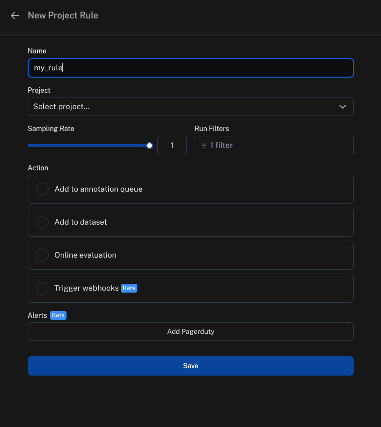
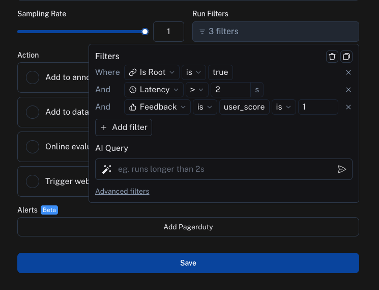

# Set up automation rules

While you can manually sift through and process production logs from our LLM application, it often becomes difficult as your application scales to more users.
LangSmith provides a powerful feature called automations that allow you to trigger certain actions on your trace data.
At a high level, automations are defined by a **filter**, **sampling rate**, and **action**.

Automation rules can trigger actions such as online evaluation, adding inputs/outputs of traces to a dataset, adding to an annotation queue, and triggering a webhook.

An example of an automation you can set up can be _"trigger an online evaluation that grades on vagueness for all of my downvoted traces."_

## Create a rule

We will outline the steps for creating an automation rule in LangSmith below.

### Step 1: Navigate to rule creation

To create a rule, head click on **Rules** in the top right corner of any project details page, then scroll to the bottom and click on **+ Add Rule**.

_Alternatively_, you can access rules in settings by navigating to [this link](https://smith.langchain.com/settings/rules), click on **+ Add Rule**, then **Project Rule**.

:::note

There are currently two types of rules you can create: **Project Rule** and **Dataset Rule**.

- **Project Rule**: This rule will apply to traces in the specified project. Actions allowed are adding to a dataset, adding to an annotation queue, running online evaluation, and triggering a webhook.
- **Dataset Rule**: This rule will apply to traces that are part of an experiment in the specified dataset. Actions allowed are only running an evaluator on the experiment results. To see this in action, you can follow [this guide](../evaluation/run_evaluation_from_prompt_playground).

:::

Give your rule a name, for example "my_rule":

### Step 2: Define the filter

You can create a filter as you normally would to filter traces in the project. For more information on filters, you can refer to [this guide](./filter_traces_in_application).

### Step 3: Define the sampling rate

You can specify a sampling rate (between 0 and 1) for automations. This will control the percent of the filtered runs that are sent to an automation action. For example, if you set the sampling rate to 0.5, then 50% of the traces that pass the filter will be sent to the action.

### Step 4: Define the action

There are four actions you can take with an automation rule:

- **Add to dataset**: Add the inputs and outputs of the trace to a dataset.
- **Add to annotation queue**: Add the trace to an annotation queue.
- **Run online evaluation**: Run an online evaluation on the trace. For more information on online evaluations, you can refer to [this guide](./online_evaluations).
- **Trigger webhook**: Trigger a webhook with the trace data. For more information on webhooks, you can refer to [this guide](./webhooks).
- **Extend data retention**: Extends the data retention period on matching traces that use [base retention](../../concepts/usage_and_billing/data_retention_billing).
  Note that all other rules will also extend data retention on matching traces through the
  [auto-upgrade](../../concepts/usage_and_billing/data_retention_billing#data-retention-auto-upgrades) mechanism,
  but this rule takes no additional action.

## View logs for your automations

You can view logs for your automations by going to `Settings` -> `Rules` and click on the `Logs` button in any row.

You can also get to logs by clicking on `Rules` in the top right hand corner of any project details page, then clicking on `See Logs` for any rule.

Logs allow you to gain confidence that your rules are working as expected. You can now view logs that list all runs processed by a given rule for the past day. For rules that apply online evaluation scores, you can easily see the output score and navigate to the run. For rules that add runs as examples to datasets, you can view the example produced.
If a particular rule execution has triggered an error, you can view the error message by hovering over the error icon.

