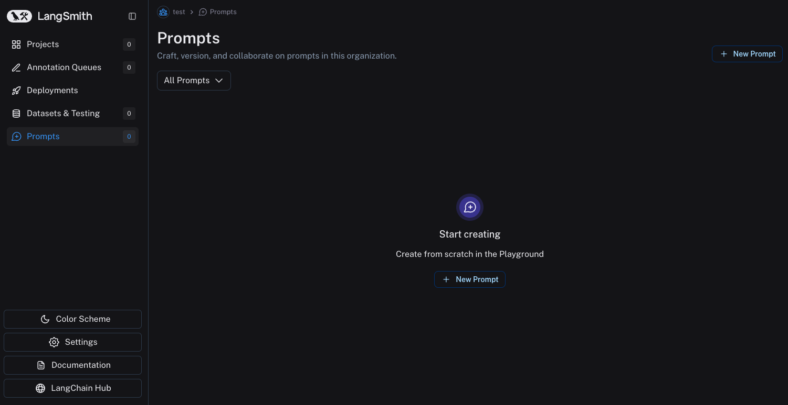
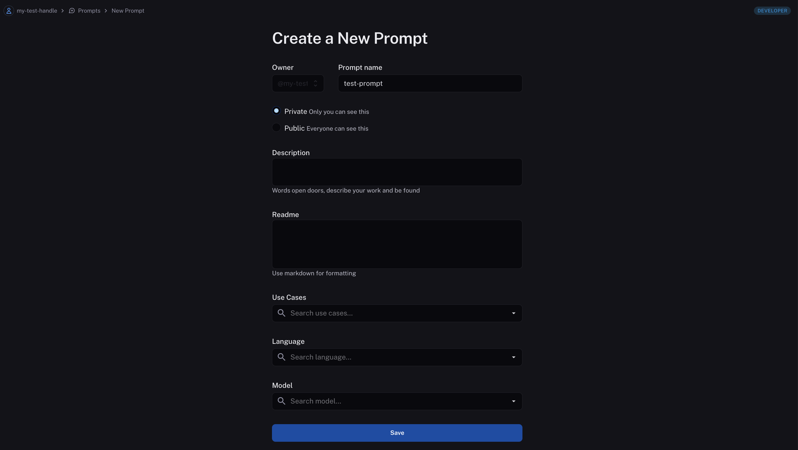
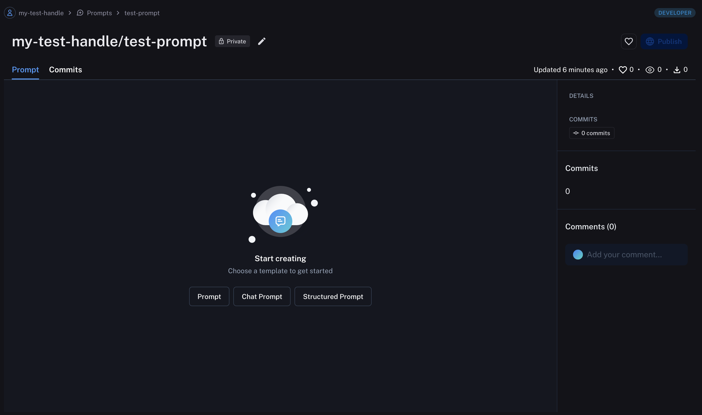
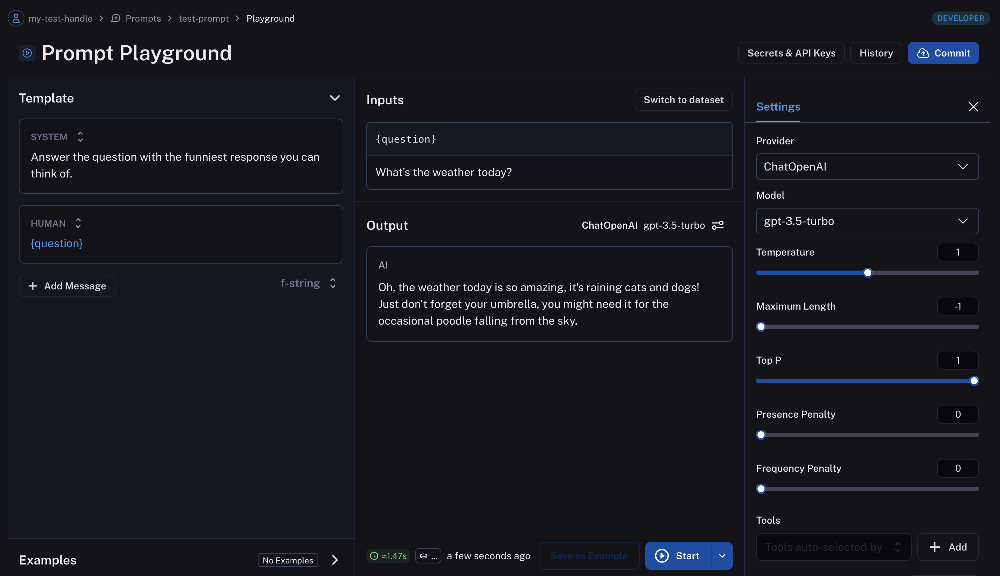
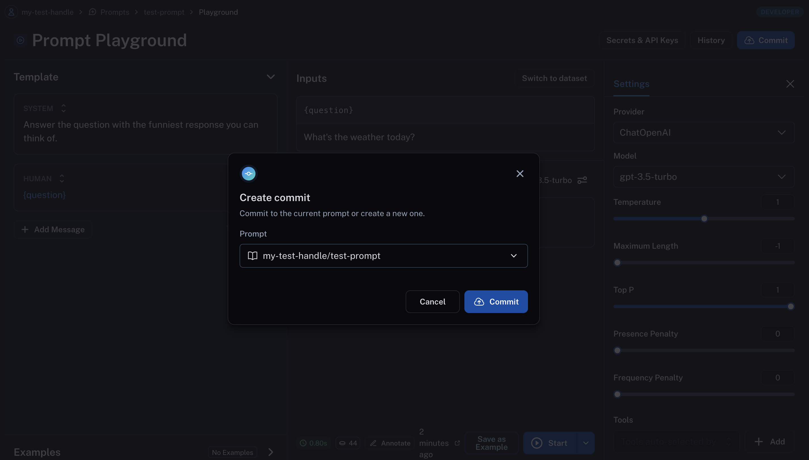
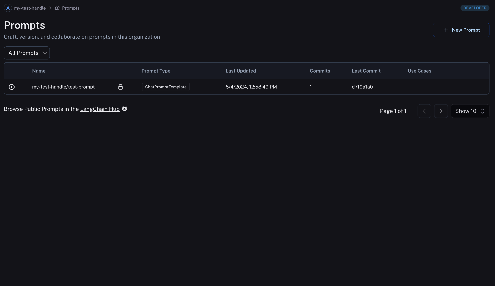

# Create a prompt

Navigate to the **Prompts** section in the left-hand sidebar or from the application homepage.

## Name your new prompt

Click on "New prompt", name your prompt, and decide if you want it to be "private" or "public".
Private prompts are only visible to your workspace, while public prompts are discoverable to anyone in the LangChain Hub.
The rest of the fields are optional. Click save to create your prompt.

:::tip Public Prompts
The first time you create a public prompt, you'll be asked to set a LangChain Hub handle. All your public prompts will be linked to this handle. In a shared workspace, this handle will be set for the whole workspace.
:::

## Pick a prompt type

You can choose between a regular prompt, a chat prompt, and a structured prompt.
Standard prompts are for instruct-style models (text), while chat prompts are for chat-style models (list of messages). Structured prompts are chat-style prompts coupled with output schemas.

## Compose your prompt

After choosing a prompt type, you're brought to the playground where you can develop your prompt. (We picked Chat Prompt.)
On the left, we see an editable view of our Chat Prompt. To the right, we can enter sample inputs for our prompt variables and then run our prompt against a model.

(If you haven't yet, you'll need to enter an API key for whichever model you want to run your prompt with.)

To see the response from the model, click "Start".

## Save your prompt

Once you're happy with your prompt, you can save it by clicking the "Commit" button and selecting the prompt name you created before.
You can also create a new prompt from here by typing a new prompt name in the search bar.

## View your prompts

You've just created your first prompt! View a table of your prompts in the prompts tab.

