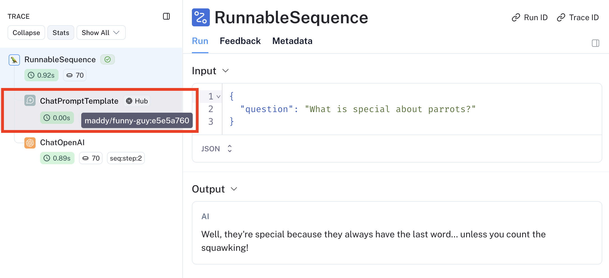

# Open a prompt from a trace

If you pull a prompt into your code and begin logging traces that use it, you can view the prompt in the Trace UI.
Navigate to a trace that uses a prompt in LangSmith.

In the run that used the prompt, hover over the Prompt tag. Clicking on this will take you to the prompt. (If you used a LangChain Hub prompt, this tag will say Hub)

]
