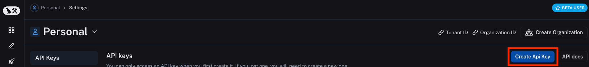

# Create an account and API key

## Create an account

To get started with LangSmith, you need to create an account. You can sign up for a free account [here](https://smith.langchain.com).
We support logging in with Google, GitHub, Discord, and email.

## API keys

LangSmith supports two types of API keys: Service Keys and Personal Access Tokens.
Both types of tokens can be used to authenticate requests to the LangSmith API, but they have different use cases.

Read more about the differences between Service Keys and Personal Access Tokens under [admin concepts](../../concepts/admin/admin.mdx)

## Create an API key

To log traces and run evaluations with LangSmith, you will need to create an API key to authenticate your requests.
Currently, an API key is scoped to a workspace, so you will need to create an API key for each workspace you want to use.

To create either type of API key head to the [Settings page](https://smith.langchain.com/settings), then scroll to the **API Keys** section. Then click **Create API Key.**
:::note
The API key will be shown only once, so make sure to copy it and store it in a safe place.
:::

