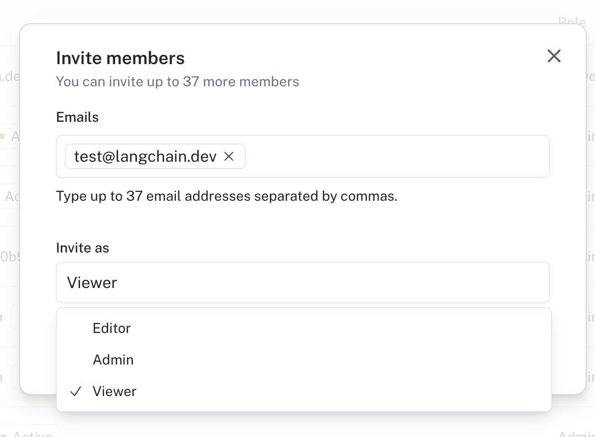

# Setup RBAC

:::note
RBAC (Role-Based Access Control) is a feature that is only available to Enterprise customers. If you are interested in this feature, please contact our sales team at sales@langchain.dev
Other plans default to using the Admin role for all users. Read more about roles under [admin concepts](../../concepts/admin/admin.mdx)
:::

LangSmith relies on RBAC to manage user permissions. This allows you to control who can access your LangSmith workspace and what they can do within the account.
Only users with the `workspace:manage` permission can can manage access control.

## Creating a Role

While there are several default roles that come with LangSmith, you can create custom roles to suit your needs.

To create a role, navigate to the `Roles` tab in the `Members` section of the [Settings page](https://smith.langchain.com/settings)

Click on the `Create Role` button to create a new role. You should see a form like the one below:

Assign permissions for the different LangSmith resources that you want to control access to.

## Assigning a Role to a User

Once you have your roles set up, you can assign them to users. To assign a role to a user, navigate to the `Members` tab in the `Members` section of the [Settings page](https://smith.langchain.com/settings)

Each user will have a `Role` dropdown that you can use to assign a role to them.

You can also invite new users with a given role.

