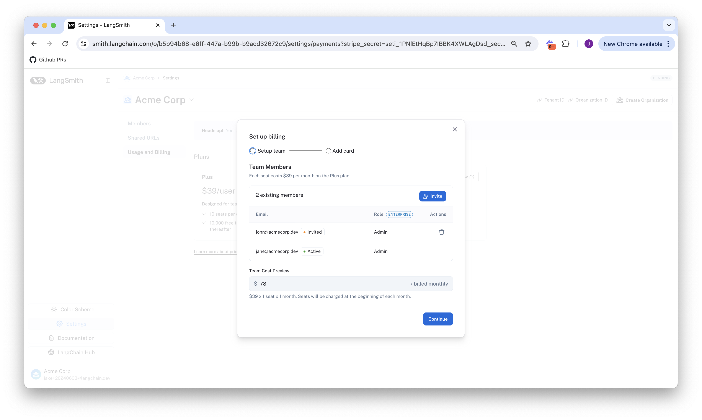

import { RegionalUrl } from "@site/src/components/RegionalUrls";

# Set up billing for your LangSmith account

:::note
If you are interested in the [Enterprise](https://www.langchain.com/pricing) plan, please [contact sales](https://www.langchain.com/contact-sales). This guide is
only for our self-serve billing plans.
:::

:::note
If you created your LangSmith organization before pricing was introduced on April 2nd, 2024, please [skip to the final section](#set-up-billing-for-accounts-created-before-pricing-was-introduced-on-april-2-2024).
:::

To set up billing for your LangSmith organization, head to the <RegionalUrl text='Usage and Billing' suffix='/settings/payments'/> page under Settings.
Depending on your organization's settings, you will be given a different walkthrough to get started.

## Developer Plan: set up billing on your personal organization

Personal organizations are limited to 5000 traces per month until a credit card is added. You can
add a credit card on the Plans and Billing page as follows:

### 1. Click `Set up Billing`

### 2. Add your credit card info

After this step, you will no longer be rate limited to 5000 traces, and will be charged for any excess
traces at rates specified on our [pricing](../../pricing) page.

## Plus Plan: set up billing on a shared organization

If you have not yet created an organization, please do so by following [this guide](./set_up_organization.mdx). This walkthrough assumes you are
already in a new organization.

:::note
New organizations are not usable until a credit card is entered. After you complete the following steps, you will
gain complete access to LangSmith.
:::

### 1. Click `Subscribe` on the Plus page

:::note
If you are a startup building with AI, please instead click `Apply Now` on our Startup Plan. You may be
eligible for discounted prices and a generous free, monthly trace allotment.
:::

### 2. Review your existing members

Before subscribing, LangSmith lets you remove any added users that you would not
like to be charged for.

### 3. Enter your credit card info

#### Enter business information, invoice email and tax id

If this organization belongs to a business. Please check the "This is a business" checkbox and enter the information accordingly.

For more information refer to [this guide](./update_business_info.mdx)

Once this step is complete, your org should now have access to the rest of LangSmith!

## Set up billing for accounts created before pricing was introduced on April 2, 2024

If you joined LangSmith before pricing was introduced April 2, 2024, you have the option to upgrade your
existing account to setup billing. If you do not set up billing by July 1, 2024, then your account will be
rate limited to a maximum of 5,000 traces per month.

### 1. Head to the <RegionalUrl text='Settings page' suffix='/settings'/> page under Settings

### 2. Click `Set up Billing`

### 3. Enter your credit card info

If you are on a Personal Organization, this will add you to the Developer plan. If you are on a shared Organization, this will add you to the Plus plan. For more information,
please view the above walkthroughs for Developer or Plus respectively, starting at step 2.

### 4. Claim free credits as a thank you for being an early LangSmith user
