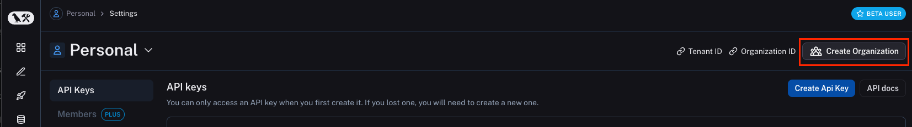
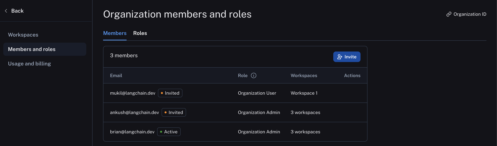

# Set up an organization

When you log in for the first time, a personal organization will be created for you automatically. If you'd like to collaborate with others, you can create a separate organization and invite your team members to join.

To do this, head to the [settings page](https://smith.langchain.com/settings) and click **Create Organization**.  
Shared organizations require a credit card before they can be used. You will need to [set up billing](./set_up_billing) to proceed.

## Manage workspaces
Once you've subscribed, [set up workspaces](./set_up_workspace) to collaborate more effectively and isolate LangSmith resources between different groups of users.  
To navigate between workspaces and access the resources within each workspace (trace projects, annotation queues, etc.), select desired workspace from the picker in the top left:

## Manage users
Manage membership in your shared organization in the [Settings page](https://smith.langchain.com/settings) `Members and roles` tab.  
Here you can
* Invite new users to your organization, selecting workspace membership and (if RBAC is enabled) workspace role
* Edit a user's organization role
* Remove users from your organization

Organizations on the Enterprise plan may set up custom roles in the `Roles` tab here. See the [access control setup guide](./set_up_access_control.mdx) for more details.

### Organization roles
These are organization-scoped roles that are used to determine access to organization settings. The role selected also impacts workspace membership as described here:
* `Organization Admin` grants full access to manage all organization configuration, users, billing, and workspaces. **Any `Organization Admin` has `Admin` access to all workspaces in an organization**
* `Organization User` may read organization information but cannot execute any write actions at the organization level. **An `Organization User` can be added to a subset of workspaces and assigned workspace roles as usual (if RBAC is enabled), which specify permissions at the workspace level.**

:::info
The `Organization User` role is only available in organizations on plans with multiple workspaces. In organizations limited to a single workspace, all users are `Organization Admins`.  
Custom organization-scoped roles are not available yet.
:::

See the table below for all organization permissions:

|                                             | Organization User | Organization Admin |
|---------------------------------------------|-------------------|--------------------|
| View organization configuration             | ✅                | ✅                 |
| View organization roles                     | ✅                | ✅                 |
| View organization members                   | ✅                | ✅                 |
| View data retention settings                | ✅                | ✅                 |
| View usage limits                           | ✅                | ✅                 |
| Admin access to all workspaces              |                   | ✅                 |
| Manage billing settings                     |                   | ✅                 |
| Create workspaces                           |                   | ✅                 |
| Create, edit, and delete organization roles |                   | ✅                 |
| Invite new users to organization            |                   | ✅                 |
| Delete user invites                         |                   | ✅                 |
| Remove users from an organization           |                   | ✅                 |
| Update data retention settings*             |                   | ✅                 |
| Update usage limits*                        |                   | ✅                 |

## Personal vs shared organizations
There are a few important differences between your personal organization and shared organizations:

| Feature             | Personal            | Shared                                         |
|---------------------|---------------------|------------------------------------------------|
| Maximum workspaces  | 1                   | Variable, depending on plan (see pricing page) |
| Collaboration       | Cannot invite users | Can invite users                               |
| Billing: paid plans | Developer plan only | All other plans available                      |
