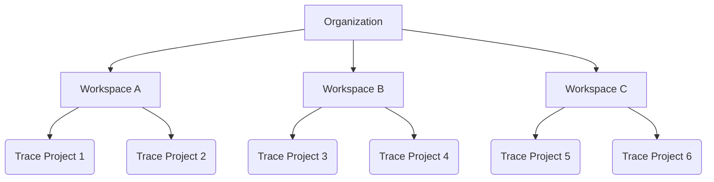
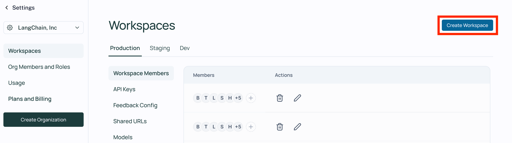

# Set up a workspace

:::info
Workspaces are launching June 2024.
:::

When you log in for the first time, a default [workspace](../../concepts/admin/admin.mdx#workspaces) will be created for you automatically in your [personal organization](./create_organization#personal-vs-shared-organizations).  
Workspaces are often used to separate resources between different teams, business units, or deployment environments. Most LangSmith activity happens in the context of a workspace, each of which has its own settings that are distinct from an organization's. 

 

To create a new workspace, head to the [Settings page](https://smith.langchain.com/settings) `Workspaces` tab in your shared organization and click **Add Workspace**.
Once your workspace has been created, you can manage its members and other configuration by selecting it on this page.

:::note
Different plans have different limits placed on the number of workspaces that can be used in an organization.
Please see the [pricing page](../../pricing) for more information.
:::

## Manage users

:::info
Only workspace `Admins` may manage workspace membership and, if RBAC is enabled, workspace roles.
:::

For users that are already members of an organization, a workspace admin may add them to a workspace in the `Workspace members` tab under [workspace settings](https://smith.langchain.com/settings/workspaces).  
Users may also be invited directly to one or more workspaces when they are [invited to an organization](./set_up_organization.mdx#manage-users). 