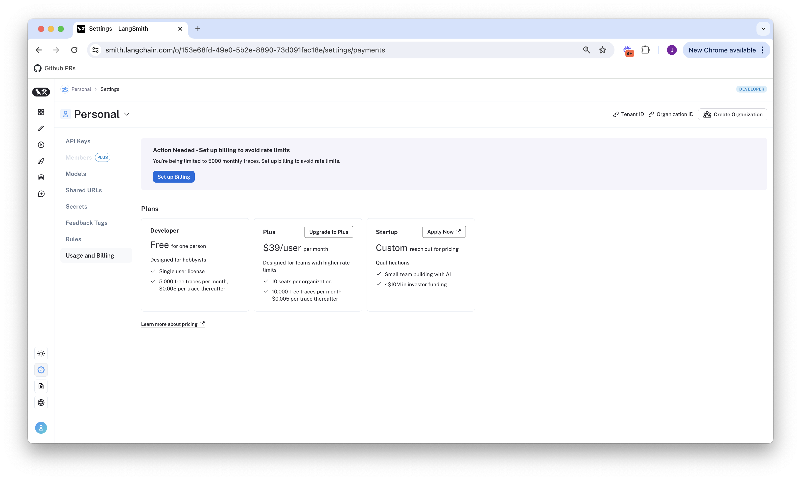
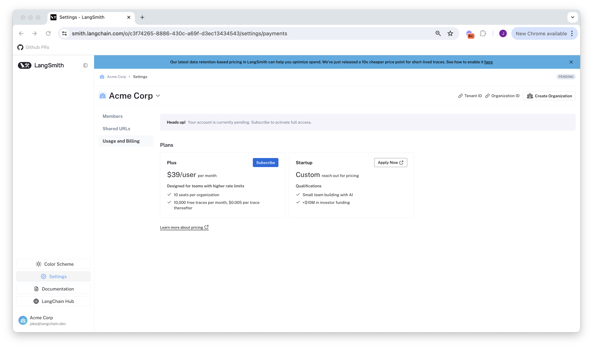

# Setup billing for your LangSmith account

To setup billing for your LangSmith organization, head to the
[Plans and Billing](https://smith.langchain.com/settings/payments) page under Settings. Depending
on your organization's settings, you will be given a different walkthrough to get started.

:::note
If you created your LangSmith organization before pricing was introduced on April 2nd, 2024, please [skip to the final section](#setup-billing-for-accounts-created-before-pricing-was-introduced-on-april-2-2024).
:::

## Developer Plan: setup billing on your personal organization

Personal organizations are limited to 5000 traces per month until a credit card is added. You can
add a credit card on the Plans and Billing page as follows:

### 1. Click `Set up Billing`

### 2. Optionally set a usage limit

On the modal that pops up, if desired, set a usage limit on the maximum number of traces you can send per month to LangSmith. This
is configureable in the future. See our [pricing Q&A](../../pricing#can-i-limit-how-much-i-spend-on-tracing) for more information on user defined Usage Limits.

### 3. Add your credit card info

After this step, you will no longer be rate limited to 5000 traces, and will be charged for any excess
traces at rates specified on our [pricing](../../pricing) page.

## Plus Plan: setup billing on a shared organization

If you have not yet created an organization, please do so by following [this guide](./create_organization). This walkthrough assumes you are
already in a new organization.

:::note
New organizations are not usable until a credit card is entered. After you complete the following steps, you will
gain complete access to LangSmith.
:::

### 1. Click `Subscribe` on the Plus page

:::note
If you are a startup building with AI, please instead click `Apply Now` on our Startup Plan. You may be
eligible for discounted prices and a generous free, monthly trace allotment.
:::

### 2. Review your existing members / set an optional usage limit

Before subscribing, LangSmith lets you remove any added users that you would not
like to be charged for. It also lets you, if desired, set a usage limit on the maximum number of traces you can send per month to LangSmith.
See our [pricing Q&A](../../pricing#can-i-limit-how-much-i-spend-on-tracing) for more information on user defined Usage Limits.

### 3. Enter your credit card info

Once this step is complete, your org should now have access to the rest of LangSmith!

## Setup billing for accounts created before pricing was introduced on April 2, 2024

:::note
A small subset of Beta Organizations do not have the upgrade flow enabled by default. If you do not see a
Plans and Billing page under your LangSmith settings, please reach out to support@langchain.dev, and we will
help you upgrade.
:::

If you joined LangSmith before pricing was introduced April 2, 2024, you will have the option to upgrade your
existing account to use pricing. You can do so by:

1. Heading to the [Plans and Billing](https://smith.langchain.com/settings/payments) page under Settings
2. Clicking `Set up Billing`
3. Following the modal to enter your credit card. If you are on a Personal Organization, this will add you
   to the Developer plan. If you are on a shared Organization, this will add you to the Plus plan. For more information,
   please view the above walkthroughs for Developer or Plus respectively, starting at step 2.
