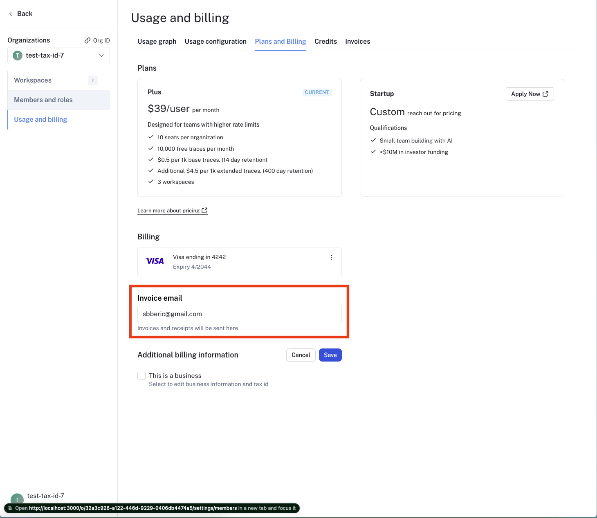

# Update invoice email, tax id and, business information

To update business information for your LangSmith organization, head to the
[Usage and Billing](https://smith.langchain.com/settings/payments) page under Settings and click on the [Plans and Billing](https://smith.langchain.com/settings/payments?tab=2) tab.

:::note
Business information, tax id and invoice email can only be updated for the plus and start up plans. Free and developer plans cannot update this information.
:::

## Update invoice email

To update the email address where your invoices are sent, follow these steps:

1. Navigate to the Plans and Billing tab.
2. Locate the section beneath the payment method, where the current invoice email is displayed.
3. Enter the new email address you want invoices to be sent to in the provided field.
4. The new email address will be automatically saved.

This ensures that all future invoices will be sent to the updated email address.

## Update business information and tax id

:::note
In certain jurisdictions, LangSmith is required to collect sales tax. If you are a business, providing your Tax ID may qualify you for a sales tax exemption.
:::

To update your organization's business information, follow these steps:

1. Navigate to the Plans and Billing tab.
2. Below the invoice email section, you will find a checkbox labeled Business.
3. Check the Business checkbox if your organization belongs to a business.
4. A business information section will appear, allowing you to enter or update the following details:
   - Business Name
   - Address
   - Tax ID for applicable jurisdictions
5. Tax ID field will appear for applicable jurisdictions after you select a country.
6. After entering the necessary information, click the Save button to save your changes.

This ensures that your business information is up-to-date and accurate for billing and tax purposes.
