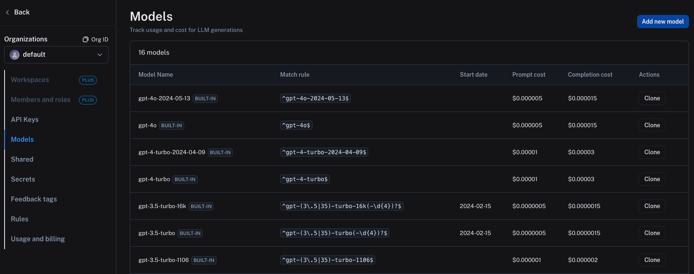
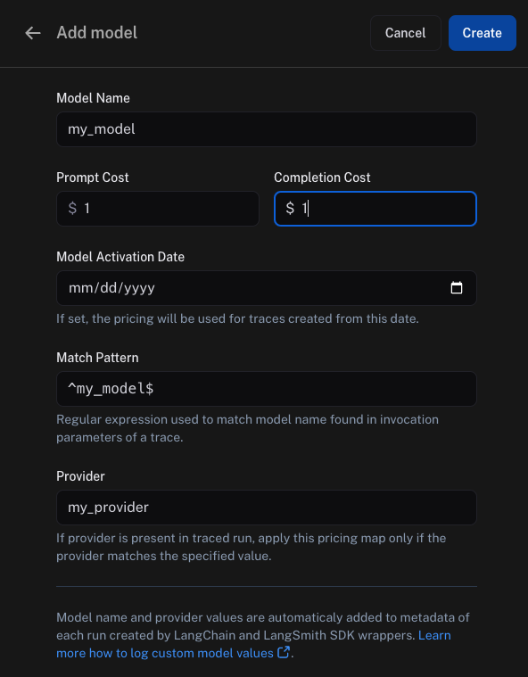

import {
  CodeTabs,
  PythonBlock,
  TypeScriptBlock,
} from "@site/src/components/InstructionsWithCode";
import { RegionalUrl } from "@site/src/components/RegionalUrls";

# Calculate token-based costs for traces

:::tip Recommended Reading
Before diving into this content, it might be helpful to read the following:

- [Providing token counts for LLM runs (spans)](./log_llm_trace#manually-provide-token-counts)

:::

LangSmith allows you to track costs for traces based on the number of tokens used for LLM invocations.
The costs are rolled up to the trace level and project level.

For LangSmith to accurately calculate token-based costs, you need to provide the token counts for each LLM invocation in the trace, along with sending up `ls_provider` and `ls_model_name` in the run metadata.

- If you are using the LangSmith Python or TS/JS SDK, you should carefully read through the [this guide](./log_llm_trace).
- If you are using LangChain Python or TS/JS, _`ls_provider` and `ls_model_name` along with token counts are automatically sent up to LangSmith_.

Once you are sending up the correct information to LangSmith, you must set up the model pricing map in LangSmith settings.
In order to do this, navigate to the <RegionalUrl text='model pricing map' suffix='/settings/workspaces/models' />.
Here, you can set the cost per token for each model and provider combination. This information is scoped to a workspace.

Several default entries for OpenAI models are already present in the model pricing map, which you can clone and modify as needed.

To create a _new entry_ in the model pricing map, click on the `Add new model` button in the top right corner.

Here, you can specify the following fields:

- `Model Name`: The name of the model, will also be used to name the entry in the model pricing map.
- `Prompt Cost`: The cost per input token for the model. This number is multiplied by the number of tokens in the prompt to calculate the prompt cost.
- `Completion Cost`: The cost per output token for the model. This number is multiplied by the number of tokens in the completion to calculate the completion cost.
- `Model Activation Date`: The date from which the pricing is applicable.
- `Match Pattern`: A regex pattern to match the model name and provider. This is used to match the value for `ls_model_name` in the run metadata.
- `Provider`: The provider of the model. This is used to match the value for `ls_provider` in the run metadata.

Once you have set up the model pricing map, LangSmith will automatically calculate and aggregate the token-based costs for traces based on the token counts provided in the LLM invocations.

To see the example above in action, you can execute the following code snippet:

<CodeTabs
  tabs={[
    PythonBlock(`from langsmith import traceable\n
inputs = [
    {"role": "system", "content": "You are a helpful assistant."},
    {"role": "user", "content": "I'd like to book a table for two."},
]\n
output = {
    "choices": [
        {
            "message": {
                "role": "assistant",
                "content": "Sure, what time would you like to book the table for?"
            }
        }
    ],
    "usage_metadata": {
        "input_tokens": 27,
        "output_tokens": 13,
        "total_tokens": 40,
    },
}\n
@traceable(
    run_type="llm",
    metadata={"ls_provider": "my_provider", "ls_model_name": "my_model"}
)
def chat_model(messages: list):
    return output\n
chat_model(inputs)`),
    TypeScriptBlock(`import { traceable } from "langsmith/traceable";\n
const messages = [
  { role: "system", content: "You are a helpful assistant." },
  { role: "user", content: "I'd like to book a table for two." },
];\n
const output = {
  choices: [
    {
      message: {
        role: "assistant",
        content: "Sure, what time would you like to book the table for?",
      },
    },
  ],
  usage_metadata: {
    input_tokens: 27,
    output_tokens: 13,
    total_tokens: 40,
  },
};\n
const chatModel = traceable(
  async ({
    messages,
  }: {
    messages: { role: string; content: string }[];
    model: string;
  }) => {
    return output;
  },
  { run_type: "llm", name: "chat_model", metadata: { ls_provider: "my_provider", ls_model_name: "my_model" } }
);\n
await chatModel({ messages });`),
  ]}
  groupId="client-language"
/>

In the above code snippet, we are sending up the `ls_provider` and `ls_model_name` in the run metadata, along with the token counts for the LLM invocation.
This information matches the model pricing map entry we set up earlier.

The trace produced will contain the token-based costs based on the token counts provided in the LLM invocation and the model pricing map entry.

