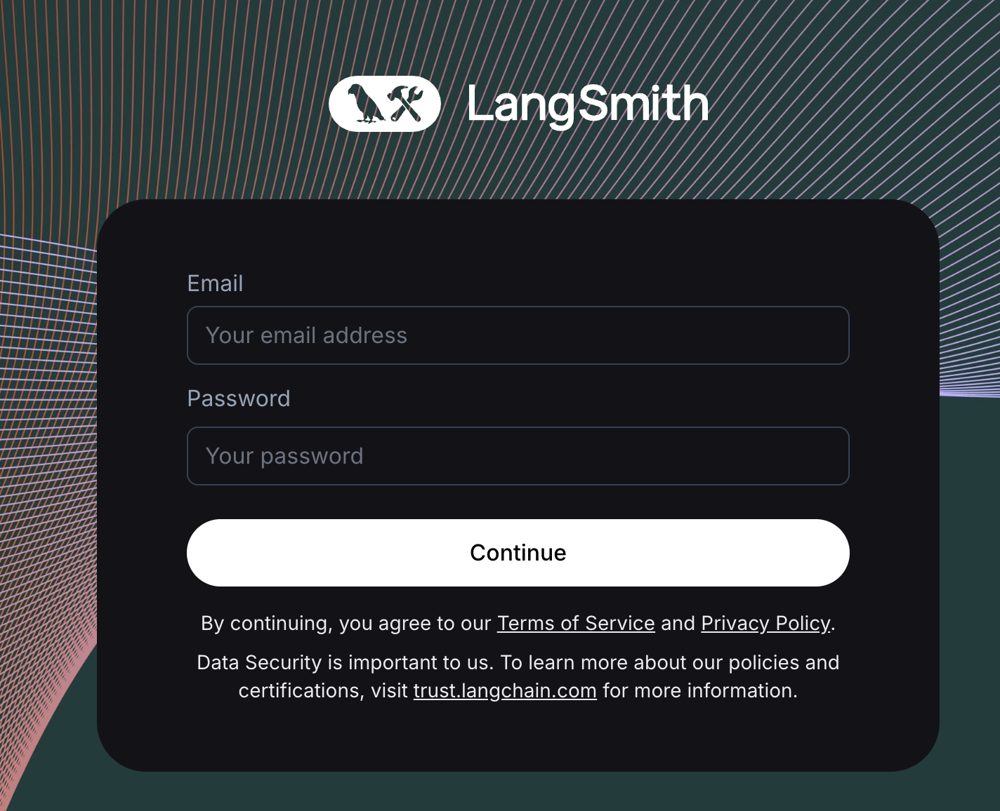

import {
  CodeTabs,
  DockerBlock,
  HelmBlock,
} from "../../../../src/components/InstructionsWithCode";

# Email/password a.k.a. basic auth (beta) {#title}

LangSmith supports login via username/password with a few limitations during the beta period:

- You cannot change an existing installation from basic auth mode to OIDC mode or vice versa - installations must be either one or the other
- Users must be given their initial auto-generated password once they are invited. This password may be changed later by any Organization Admin.

## Requirements and features

- Your initial password must be least 12 characters long and have at least one lowercase, uppercase, and symbol
- There are no strict requirements for the secret used for signing JWTs, but we recommend securely generating a string of at least 32 characters. For example: `openssl rand -base64 32`

:::note
Changing the JWT secret will log out your users
:::

<CodeTabs
  tabs={[
    HelmBlock(`config:
  authType: mixed
  basicAuth:
    enabled: true
    initialOrgAdminEmail: \<YOUR EMAIL ADDRESS\>
    initialOrgAdminPassword: \<PASSWORD\>
    jwtSecret: \<SECRET\>`),
    DockerBlock(
      `# In your .env file
AUTH_TYPE=mixed
BASIC_AUTH_ENABLED=true
INITIAL_ORG_ADMIN_EMAIL=\<YOUR EMAIL ADDRESS\>
INITIAL_ORG_ADMIN_PASSWORD=\<PASSWORD\>
BASIC_AUTH_JWT_SECRET=\<SECRET\>
    `
    ),
  ]}
/>

Once configured, you will see a login screen like this:

