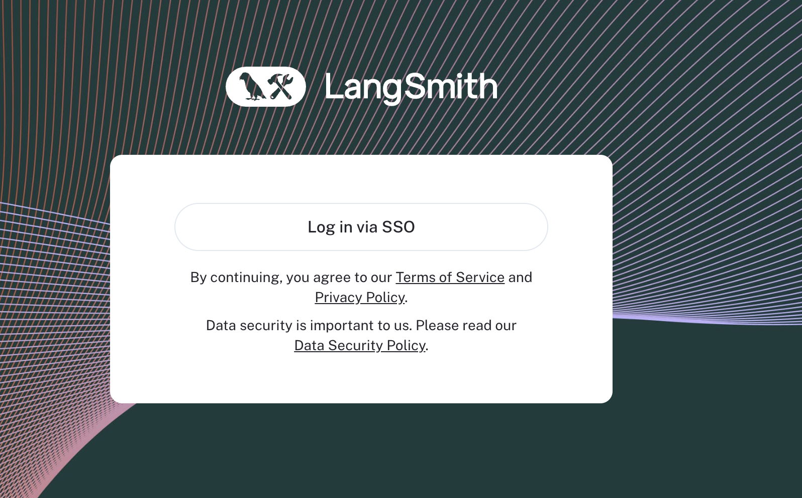

import {
  CodeTabs,
  DockerBlock,
  HelmBlock,
} from "../../../../src/components/InstructionsWithCode";

# SSO

## OAuth2.0 and OIDC (PKCE)

LangSmith Self-Hosted provides SSO via OAuth2.0 and OIDC. Once configured, this will delegate authentication to your Identity Provider(IdP) to manage access to LangSmith.

Our implementation supports almost anything that is OIDC compliant, with a few exceptions.

### Requirements

There are a couple of requirements for using OAuth SSO with LangSmith:

- Your IdP must support the `Authorization Code with PKCE` [flow](https://www.oauth.com/oauth2-servers/pkce) (Google does not support this flow for example, but see [below](#using-oauth10-and-oidc) for an alternative configuration that Google supports). This is often displayed in your OAuth Provider as configuring a "Single Page Application (SPA)"
- Your IdP must support using an external discovery/issuer URL. We will use this to fetch the necessary routes and keys for your IdP.
- You must provide the `OIDC`, `email`, and `profile` scopes to LangSmith. We use these to fetch the necessary user information and email for your users.
- You will need to set the callback URL in your IdP to `http://<host>/oauth-callback`, where host is the domain or IP you have provisioned for your LangSmith instance. This is where your IdP will redirect the user after they have authenticated.
- You will need to provide the `oauthClientId` and `oauthIssuerUrl` in your `values.yaml` file. This is where you will configure your LangSmith instance.

<CodeTabs
  tabs={[
    HelmBlock(`config:
  oauth:
    enabled: true
    oauthClientId: \<YOUR CLIENT ID\>
    oauthIssuerUrl: \<YOUR DISCOVERY URL\>`),
    DockerBlock(
      `# In your .env file
AUTH_TYPE=oauth
OAUTH_CLIENT_ID=your-client-id
OAUTH_ISSUER_URL=https://your-issuer-url
    `
    ),
  ]}
/>

Once configured, you will see a login screen like this:

## OAuth2.0 and OIDC (without PKCE)

For providers that do _not_ support `Authorization Code with PKCE`, LangSmith Self-Hosted supports the `Autorization Code` flow with a `Client Secret`.

### Requirements

:::note
You may upgrade a [basic auth](./basic_auth.mdx) installation to this mode, but not a [none auth](../../reference/authentication_authorization/authentication_methods.mdx#none) installation.
In order to upgrade, simply add the required configuration parameters as shown below. Users may then login via OAuth _only_.
:::

- Your IdP must support the `Authorization Code` flow _without_ PKCE.
- Your IdP must support using an external discovery/issuer URL. We will use this to fetch the necessary routes and keys for your IdP.
- You must provide the `OIDC`, `email`, and `profile` scopes to LangSmith. We use these to fetch the necessary user information and email for your users.
- You will need to set the callback URL in your IdP to `http://<host>/api/v1/oauth/custom-oidc/callback`, where host is the domain or IP you have provisioned for your LangSmith instance. This is where your IdP will redirect the user after they have authenticated.
- You will need to provide the `oauthClientId`, `oauthClientSecret`, `baseUrl`, and `oauthIssuerUrl` in your `values.yaml` file. This is where you will configure your LangSmith instance.

<CodeTabs
  tabs={[
    HelmBlock(`config:
  authType: mixed
  oauth:
    enabled: true
    oauthClientId: \<YOUR CLIENT ID\>
    oauthClientSecret: \<YOUR CLIENT SECRET\>
    oauthIssuerUrl: \<YOUR DISCOVERY URL\>`),
    DockerBlock(
      `# In your .env file
AUTH_TYPE=mixed
OAUTH_CLIENT_ID=your-client-id
OAUTH_CLIENT_SECRET=your-client-secret
OAUTH_ISSUER_URL=https://your-issuer-url
    `
    ),
  ]}
/>
