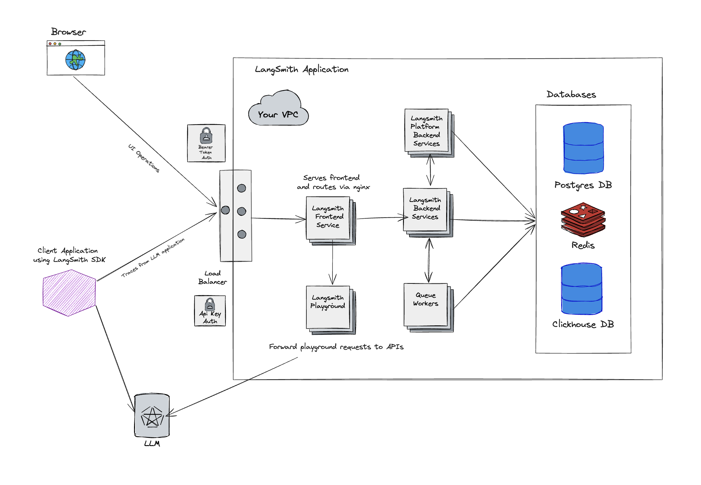

# Self-Hosted LangSmith

:::important Enterprise License Required
Self-Hosted LangSmith is an add-on to the Enterprise Plan designed for our largest, most security-conscious customers. See our [pricing page](https://www.langchain.com/pricing) for more detail, and contact us at sales@langchain.dev if you want to get a license key to trial LangSmith in your environment.
:::

LangSmith can be run via Kubernetes (recommended) or Docker in a Cloud environment that you control.

The LangSmith application consists of several components including 5 LangSmith servers and 3 stateful services:

- LangSmith Frontend
- LangSmith Backend
- LangSmith Platform Backend
- LangSmith Playground
- LangSmith Queue
- ClickHouse
- Postgres
- Redis

To access the LangSmith UI and send API requests, you will need to expose the LangSmith Frontend service. Depending on your installation method, this can be a load balancer or a port exposed on the host machine.

## Architectural overview

### LangSmith Frontend

The frontend uses Nginx to serve the LangSmith UI and route API requests to the other servers. This serves as the entrypoint for the application and is the only component that must be exposed to users.

### LangSmith Backend

The backend is the primary entrypoint for API requests and handles the majority of the business logic for the application. This includes handling requests from the frontend and sdk, preparing traces for ingestion, and supporting the hub API.

### LangSmith Queue

The queue handles incoming traces and feedback to ensure that they are ingested and persisted into the traces and feedback datastore asynchronously, handling checks for data integrity and ensuring successful insert into the datastore, handling retries in situations such as database errors or the temporary inability to connect to the database.

### LangSmith Platform Backend

The platform backend is an internal service that primarily handles authentication and other high-volume tasks. The user should not need to interact with this service directly.

### LangSmith Playground

The playground is a service that handles forwarding requests to various LLM APIs to support the LangSmith Playground feature. This can also be used to connect to your own custom model servers.

### ClickHouse

ClickHouse is used as the primary data store for traces and feedback(high-volume data).

We include an open-source, single node instance of ClickHouse that writes to a persistent volume that you supply as part of your configuration.

### Postgres

Postgres is used as the primary data store for operational data (almost everything besides traces and feedback).

By default, LangSmith Self-Hosted will use an internal Postgres database. However, you can configure LangSmith to use an external Postgres database (strongly recommended in a production setting). By configuring an external Postgres database, you can manage backups, scaling, and other operational tasks for your database.

### Redis

Redis is used to back our queuing/caching operations.

By default, LangSmith Self-Hosted will use an internal Redis instance. However, you can configure LangSmith to use an external Redis instance (strongly recommended in a production setting). By configuring an external Redis instance, you can manage backups, scaling, and other operational tasks for your Redis instance.

## Installation

To install, take a look at our [Kubernetes deployment guide](/self_hosting/installation/kubernetes) or our [Docker deployment guide](/self_hosting/installation/docker).

## FAQ

If you have any questions, please refer to our [FAQ](/self_hosting/faq). You can also reach out to us at sales@langchain.dev for more information.
